This document aims to provide a shortened summary of <strong><em>How Languages Work 2nd ed</strong></em> by Author <strong>

### Instructor
> 
<strong>Prof. Don Daniels</strong> 
> Office: 275 Straub Hall 
> Office Hours: Tuesdays 11:30–2:30 and by appointment 
> Email: <strong><ddaniels@uoregon.edu></strong>Unavailable 

### Graduate Employee
> 
<strong>Carissa Diantoro</strong> 
> Office: Straub 270 
> Office Hours: Thursday 11:30–1:30 
> Discussion Sections: Friday 10:00–10:50 | 11:00–11:50 | Allen 141 
E-mail: <strong><carissad@uoregon.edu></strong> 

## Chapter 1 - Introduction - Language, Languages and Linguistics
KEY TERMS
- Linguistics
- Linguist
- Linguistic structure
- The functional nature of language
- Language versus dialect
- Language change
- Linguistic analysis
- Language endangerment
- Language documentation and conservation
- The fields of linguistics

## 1.1.1 - Language and You; Language and Us:
Language is an essential and ubiquitous component of our lives. 

To see that this statement is true for yourself, take a moment to think about your day. Cast your mind back to when you first awoke.  What were your thoughts and how were they expressed? 

Trace the day in your mind and try to count how many people you spoke with, even if it was just a quick “hi” or “thank you.” Did you listen to a lecture? Watch television? Talk on the phone? Make an appointment? Sing a song? 

><strong>All of these activities centrally involve language.</strong>

Now think about what you read today. Perhaps a newspaper, pages on the Internet, email, advertisements, labels, signs, homework assignments? 

Now move on to thought itself. What thoughts and ideas have passed through your mind? Have you made explicit plans, imagined conversations, debated with yourself? 

If you are like most people, this brief exercise has revealed that language is both within and around you, a constant part of your internal and external existence. Language is the primary medium which you use to interact with people and institutions in our society. 

Your particular use of language is also a reflection of who you are as an individual; all of us use language as a means to build and portray our identities in the world around us. We also use language to shape and interpret the great and small experiences of our lives. 

Think about the broader world in which we live. Language is the principal means by which societies are constructed and cultures are developed. 

Think of the size of our society’s
great libraries, and how the majority of the volumes in those vast collections (14.6 million volumes in the Harvard University Library alone) are language in its written form. 

The intellectual achievements of humankind are essentially embodied in language. 

Not only is this true of the written works that formally encapsulate our knowledge, but it is also true of the huge body of indigenous knowledge held by the speakers of thousands of languages across the globe, from the Brazilian Amazon to the Mongolian steppes. 

Some may argue that music and art are non-linguistic, but note that they often incorporate language, as with lyrics. Even works that do not contain language are interpreted and understood through verbal thought, discussion, and critical analysis. 

Similarly, mathematics could be argued to be non-linguistic, but again language is used to teach, understand, and interpret it. 

Beyond the modern world, consider that language has been used by humans for at
least 30,000 years, by thousands of groups across the globe, wherever humans have ventured. Speakers of each generation endow their language with their own unique mark, their own contribution, changing it in myriad subtle ways. As language passes from generation to generation, it shifts and adapts to the ever-changing world in which it is embedded. 

The preceding paragraphs emphasized that language is a pervasive and essential
part both of your own life and of who we are as humankind. The goal of this book is to begin to address the question: How does language work? 

It is a simple question, and one that most people never think to ask. Language is so automatic – almost like breathing – that most people don’t realize the complexity that underlies it and the subtle and effortless skill with which they wield it. 

The question How does language work? may itself be simple, but the answer is highly complex. It can be broken down into many smaller questions. To begin with, one must ask: How do individual languages work? We really can’t understand the nature of language in its broad sense if we don’t understand the mechanisms underlying particular languages,
preferably of many and diverse kinds. 

Other key questions include: 

What are all the pieces of a language? 
How do the pieces combine and work together to allow for communication to occur? 
How are languages learned and transmitted? 
How do languages influence each other? 
How do languages change over time? 

These are but a small number of the many
questions that define the field of linguistics, the scientific study of language. But before
discussing the field in more detail, it is important to continue with our exploration of the
nature of language. 

## 1.1.2 - Language Is Human and All That Implies

Language is a defining trait of humankind. Language is tied up with our thought processes, our ability to reason, to self-reflect, and to develop advanced civilizations. 

Other animal species have developed communication systems, but they pale in comparison to human language. A simple illustration of this is the fact that no system of animal communication appears to be able to communicate events that occurred in the past or events that are imaginary. 

Neither are there animal communication systems that have adverbs or other
devices that allow for detailed descriptions of actions. Animals have nothing comparable in scale, complexity, subtlety, or adaptability to human language. 

The fact that language is human has a number of important implications for the nature of language. Language is embedded into our physiology, our cognition, and our thought processes. 

>Many of the details of linguistic structure are directly dependent on this.  

For example, the fact that no language makes sounds by curling the tip of the tongue back to touch the uvula (the small appendage hanging down in the middle of the back of the mouth) is directly explainable by the details of human anatomy. 

Less trivially, anatomical facts are also responsible for a number of features of sound systems, such as the common trend to pronounce a sequence of t and y as “ch” (e.g., gotcha from got you). 

More importantly, language processes are largely resident in the brain and so language shares characteristics with other cognitive functions; 

For example, language is both learnable and adaptable. 

Humans use language for a wide variety of purposes. We communicate everything from urgent warnings to random thoughts, proposals of marriage to complaints. 
We use it to cajole, threaten, placate, inform, entertain, and command. 

In other words, language is functional; it is a tool of human communication. The fact that language is used for a wide variety of tasks has direct implications for how it is structured. 

Linguistic structures are flexible and adaptable, able to express all that humans convey to each other in the course of a conversation, a day, a lifetime, a civilization. 

Language is also human in that language is a form of human social behavior. 

It can be used to build or break social bonds. It serves as a social cue to the formality or informality of a situation, and to the degree of social intimacy or distance among the people speaking. When children acquire language, they do so by using it as a tool of social interaction within particular social settings. 

The social component of human language is also reflected in how language is used and structured. Humans use language to interact, and using language is an inherently interactional task. 

Not only are we listening to our conversational partner and picking up on the many subtleties of word choice, sentence structure, rate of speech, and intonation, we are also constantly assessing when and how to take a turn, and how to communicate our message so that the person to whom we are speaking (the addressee) will correctly interpret what we are saying. 

To take a simple example, I wouldn’t say He is coming for dinner tonight if I didn’t think that the addressee had in mind the person I refer to as he. 
Otherwise, I could use a proper name like Mike or a more elaborate phrase like the guy from across the hall. I could also start off with an introduction, such as You know that guy I was telling you about that owns the cocker spaniels? 

All three of these strategies accomplish a similar end of introducing the idea
of the person I wish to discuss into the mind of the addressee. Once I am confident that the addressee can identify the correct individual, I can communicate the primary message He’s coming to dinner tonight. 

Thus, we see that the interactional component of language is both
deep and subtle. The structures of human language reflect our interactional needs. 

Humans are creative and language is structured to take advantage of human creativity. 

All languages are constructed in a way that allows for the creation of novel utterances; any language can produce an infinite number of sentences. 

Therefore we cannot describe a language by simply making a list of all the possible sentences it contains. Instead, our task is to describe the design principles underlying language that make that infinite number of sentences possible. 

Obvious instances of human creativity with language include word
games, puns, and puzzles. Humans also use language creatively when they innovate new expressions or use one or more words in a new way. 

For example, the English word way has been used for some time to intensify the meaning of certain types of quantifiers (way too much, way more than necessary) or prepositions (way up, way over). 

Younger speakers of some
English dialects can now use this intensifier with adjectives; e.g., way cool. The use of way with adjectives can have specific affective (emotional) implications, e.g., way unfair. We don’t know who first used way to intensify an adjective, but in doing so that person was performing a creative act, using the word in a new grammatical environment. People do this every day. Most of the time grammatical innovations are not repeated, but sometimes
particular innovations catch on. Other speakers hear the innovation and use it themselves,
spreading it wave-like across a significant portion of the speech community, a group of
people who share a common language or dialect and cultural practices. If an innovation
continues to spread, it could become a regular feature of the language and constitute a language change. Many instances of language change are direct reflections of human
creativity.

<strong>To summarize, just as language is deeply a part of humankind, the human element is
deeply a part of language. The structures of language take the form they do because language
is instantiated by the human body, as a tool of human communication, and is embedded in
human interaction within societies and cultures. Language is at the core of what it is to be
human, and humanity is at the core of language.</strong>

## 1.1.3 - Language Is Dynamic and Adaptable
Language is in a constant process of change. The language you speak with your friends
today is somewhat different from the way your grandparents spoke to their friends when
they were your age. Chances are good that your own grandchildren will probably think that
your speech sounds a little old-fashioned. While the difference between grandparents and
grandchildren may not be dramatic, over a longer time span, for example, that between
oneself and one’s grandchildren’s grandchildren’s grandchildren, the cumulative effect
of those generations becomes more noticeable. We can see this in the history of English.
Consider the following passage, written by William Shakespeare just over three hundred
years ago, and taken from the play King Henry V:
Now, fie upon my false French! By mine honour in true English, I love thee, Kate: by
which honour I dare not swear thou lovest me; yet my blood begins to flatter me that
thou dost, notwithstanding the poor and untempering effect of my visage.
While educated English speakers will be able to understand this passage, children and
adults with less formal education will find it difficult. It is easy to identify the linguistic features
that mark this as archaic: the use of the old second-person
familiar pronouns, thee and thou; the inflected verb
forms lovest and dost; and the use of now antiquated words
and expressions, such as fie upon and visage. When we look
further back, for example at The Canterbury Tales, written by
Geoffrey Chaucer more than six hundred years ago, the language
becomes even harder to decipher. Consider these lines
from “The Wife of Bath’s Tale”:
And if thou kanst nat tellen it anon
Yet shal I yeve thee leve for to gon
A twelf-month and a day to seche and leere
An answere suffisant in this mateere;
And suretee wol I han, er that thou pace,
Thy body for to yelden in this place.
While some of it seems familiar and suggestive of meaning, much is unclear to the eye of
the untrained modern English speaker. The passage is easier to decipher if one learns that
yeve means ‘give,’ seche and leere means ‘search and learn,’ suretee means ‘certainty,’ and
yelden means ‘surrender.’

## TEXTBOX 1.1 MODERN ENGLISH TRANSLATIONS OF THE CANTERBURY TALES
> Here is one translation of the excerpt from “The Wife of
Bath’s Tale,”  
Provided by the online bookshop Librarius
(www.librarius.com/canttran/wftltrfs.htm):
>>And if you cannot tell it me anon, then will I give
you license to be gone a twelvemonth and a day, to
search and learn sufficient answer in this grave concern.
And your knight’s word I’ll have, before forth
you pace, to yield your body to me in this place.
Of course, you would never speak this way to
someone in a conversation today. A more colloquial
current translation might be “And if you can’t tell
me soon, then I’ll give you permission to be gone
for a year and a day, to find the right answer to this
important question. I’ll have you promise as a knight,
before you leave, that you will give me your life in this
place.”
 
 
-> Of course, you would never speak this way to
someone in a conversation today. A more colloquial
current translation might be “And if you can’t tell
me soon, then I’ll give you permission to be gone
for a year and a day, to find the right answer to this
important question. I’ll have you promise as a knight,
before you leave, that you will give me your life in this
place.”

All aspects of language can undergo change. Sounds can enter a language or fall out of
use. Sentence structures can shift in interesting ways. Words can develop into prefixes,
suffixes, or other small linguistic units. Word meanings can be broadened, narrowed, or
otherwise shifted. The social implications of using particular words and phrases can change
over time, as can larger patterns, such as how we structure and present information.

Language adapts to the world around it. Think of all the vocabulary you use in daily life
that your grandparents did not use when they were your age. The words email, nanotechnology,
cell phone, and internet are just a few of the terms that reflect the technological changes
that swept over us in the late twentieth century. In the meantime, words like hogshead (a
large cask or barrel) and demijohn (a narrow-necked bottle enclosed in wicker) are not part
of the vocabulary of most people living today (although they might persist in certain subgroups
of the population). Changes in vocabulary can reflect social changes as well. The
English word spinster, meaning an unmarried woman past the age of marrying, has vanished
from everyday vocabulary in most of modern society, together with the idea that there is
an age of marrying and that marriage and family are the primary goals of a woman’s life.
While changes in vocabulary reflecting innovations or social change are probably the
most obvious examples of the adaptability of language, languages also undergo adaptations
under the influence of language contact. When speakers of two distinct languages interact
with each other in large numbers over a period of time, one or both languages generally
undergo change. An example of a language affected by language contact is English, which
adopted huge numbers of words from French after the Norman invasion. Indeed, in the
sentence you just read, the words example, adopt, huge, number, French, Norman, and invasion
all came into English from French!

Language contact can have a much greater effect than simply adding new vocabulary.
Sounds, word structures, and sentence structures can also take on qualities of adjacent languages. For example, in the Tibeto-Burman language family (comprising over three hundred
related languages distributed over Southeast Asia, Tibet, and the Himalayan region),
the majority of languages place the verb at the end of the sentence. A simplified and translated
version of a sentence with this word order might be, for example, John apple ate.
However, there is one group of Tibeto-Burman languages, the Karenic group, which places
the verb in the middle of the sentence. Thus, they would say John ate apple. Interestingly,
speakers of the Karenic languages have been interacting for centuries with the Thai and the
Chinese, and both groups speak languages that put the verb in the middle. It is clear that
over the centuries, bilingual Karenic speakers matched their sentence structures to those
of their neighboring languages. Thus, a significant change to Karenic grammar resulted
from language contact through the medium of bilingualism. We see that languages adapt
not only to the changing technological world but also to the broader social environments
in which they are embedded.

## 1.1.4 Language Is Structured and Systematic
When one begins to look closely at language, one is immediately struck by the fact that
regular and recurring patterns form the basis of linguistic structure. To begin to
explore this aspect of language, take a moment to work through the following small exercise
on English grammar:

Regular Patterning of the English Past-Tense Suffix
In English most verbs have a predictable past-tense form. It is written as -ed but has different
pronunciations. You can discover this in your own speech very easily. Pronounce the
following lists of words and listen closely to the sound at the end of each word:

List A: baked, blessed, heaped, puffed, crashed 
List B: rubbed, waved, lagged, billed, hummed 
List C: waited, faded, booted, coded, righted 

If you are a native English speaker and have a sensitive ear, you will have noticed that the
words in List A end in <"t">, the words in List B end in <"d">, and the words in List C end in
<"ed">. We can now refer to these as the T-List, the D-List, and the ED-List.
Now try pronouncing the following three nonsense words, again listening carefully to
how the suffix is pronounced in each word:

Word 1: smipped 
Word 2: croomed 
Word 3: pluted 

Notice that you don’t have to think for an instant which sound to put at the end, but that you
automatically end Word 1 with "t", Word 2 with "d", and Word 3 with "ed", even though
these are nonsense words which you are unlikely to have ever heard or pronounced before.
Take a minute to examine the consonants that directly precede the suffix (i.e., the
“pre-suffixal” consonants) in the T-List words. Now compare the pre-suffixal consonants in
the D- and ED-List words. Notice that the lists are distinct; you don’t find any of the T-List pre-suffixal consonants in D-List words, etc. Now determine which lists Words 1–3 fall into,
based on their pre-suffixal consonants.

You will see that Word 1 has a T-List consonant (p) and the suffix is pronounced as <"t">,
Word 2 has a D-List consonant (m) and the suffix is pronounced as "d", and Word 3 has an
ED-List consonant (t) and the suffix is pronounced as <ed>. You have discovered a systematic
fact of English: the pronunciation of the past-tense suffix depends upon the pre-suffixal
consonant. Even though Words 1–3 are nonsense words, they still follow the systematic
patterns of pronunciation that form a significant part of the English language. We can state
this pattern as follows:

(1) In English, the past tense -ed will be pronounced: as <t> following the consonants "k, s, p, f, sh",
as "d" following "b, v, d, l, m", and as "ed" following "t" or "d".

This is a statement of a pattern or systematic fact of English (sometimes referred to as a
rule). One can predict how the past tense -ed will be pronounced on any English verb as
long as one knows the pre-suffixal consonant.

Once we have observed a regular pattern in language, we ask the question: Why should
this pattern occur? 

This question is critical, because it takes us from recognition and description
of a pattern to a search for an explanation of the observed facts. In this case, the explanation
is physiological, based on how we produce sounds in our vocal tracts. Since this is
a topic covered in the next chapter, we will not go into detail here. The important point is
that patterns in language can be explained by the function of language as a system
of human communication. In this case, the explanation comes from the embedding of
language in our human physiologies; in other cases, other aspects of the functional role of
language explain linguistic patterns.

Regular patterns such as this occur in every language many times and at many levels.
Some patterns are concerned exclusively with sounds, other patterns are found at other levels,
such as word structure or sentence structure. 

One of the fascinating aspects of language
is the interaction of these patterns, which at times can be quite complex. All the patterns in
a language that explicitly involve sounds make up the “sound system” or phonology of a
language; the patterns which involve word structure make up the morphology, while the
patterns which involve sentence structure make up the syntax. Each of these subsystems
of language is independent, but each is also interwoven with the others. In the example
above, both the phonology (in this case, which sound is pronounced where) and the morphology
(the past-tense suffix -ed) are involved. The morphology and syntax of a language
are together referred to as the language’s grammar. 

For further discussion of the sub-areas
examined in linguistic analysis, see Textbox 1.2.

## TEXTBOX 1.2 LINGUISTIC ANALYSIS

Many examples of systematicity in language will
be presented throughout the following chapters.
One of the goals of this book is to teach you how
to recognize and analyze systematic patterns in a
wide variety of languages, that is, how to perform
linguistic analysis. This requires learning the
common – and sometimes the rare – linguistic
categories that are found in the languages of the
world, the terminology that accompanies those
categories, and the theories underlying them.
Linguistic analysis requires logical thought, a clear
understanding of linguistic concepts, and concise
description and argumentation.

Once linguistic structures are accurately described,
the analysis is completed by explanation. The critical
question is: What motivates the linguistic structures to
be formed in precisely that way? This question goes
to the very core of linguistic theory. The answer will
depend crucially upon the particular structure being
explained. There are a number of distinct domains that
may contribute to it, including meaning (semantics),
how the structure is used in context (function), factors
related to history (language change), the physical
properties of sound (phonetics), and the structure
of the human brain and how we learn and process
knowledge (neurology, cognition).

On the other hand, no language is perfectly systematic. Although there are sometimes
patterns within patterns within patterns, there are often pieces that don’t fit into any regular
pattern, but which have idiosyncratic, or irregular, behavior. This is in large part due to
language change. The irregularities are leftovers from older patterns that have been obliterated,
as new structures emerge and spread through the language.

As an example, consider the English verb shine. This verb is a bit irregular as it has two
forms of the past tense, shined and shone. The form shined is constructed by adding the
regular past-tense suffix to the verb stem and following the rule of past-tense formation
we just discovered (shine ends in a D-List consonant). The form shone is a reflection of an
old pattern where past tense was indicated by changing the vowel in a verb’s root. This
pattern was inherited from an earlier stage in the language. It has largely died out, but
traces of it remain in a handful of verbs, especially those that are used frequently and are
therefore resistant to change (for example, take/took, drive/drove). In the development of
English, the marking of past tense by -ed gradually spread through the vocabulary, supplanting
the older forms. This process has not been completed with the verb shine, and
both past-tense forms coexist in the modern tongue. Thus, this irregularity of the language
has a historical explanation. Irregularities in language usually result from language
change.

## 1.2 Languages
## 1.2.1 Languages of the World Today
Languages are spoken – and signed (see Textbox 1.3) – across the globe. People are spread
over the earth from the tip of Tierra del Fuego to the Arctic North, and wherever there are
people, there are languages. Think for a minute about each of the continents and their
communities. How many languages do you think there are in the world?

## TEXTBOX 1.3 SIGN LANGUAGES
Sign languages are natural languages that have
arisen wherever deaf people have come together
to form a community. Ethnologue (2016) lists 138
sign languages in the world. Like spoken languages,
sign languages are structured, systematic, change
over time, and can be used to communicate all the
complex concepts that people convey to one another
over the course of a lifetime. Like spoken languages,
many sign languages are endangered and need
people to document them.

The question is more difficult than it first appears. The truthful answer is that we don’t
have an exact count, although we are able to make an educated guess. There are two primary
reasons why counting up languages is tricky. One is that linguists haven’t identified
all the languages of the world yet. There are still speech (and sign-language) communities
that follow their traditional ways of life and who have had little interaction with larger
population groups or researchers. The languages of these groups are still undescribed.
However, there is also a more fundamental problem in counting up languages, which is
that it is difficult to decide which speech varieties should be counted as languages and
which should be counted as dialects of a single language.

Let’s consider possible criteria for distinguishing languages from dialects. One obvious
place to start is mutual intelligibility: Can the speakers of the two language varieties
understand each other? The criterion of mutual intelligibility, taken to its logical conclusion,
suggests that if they can understand each other, the two varieties are to be considered
dialects of a single language; if they cannot understand each other, the varieties are to be
considered distinct languages. One problem with this criterion is that there are often multiple
varieties of a language, and while speakers of adjacent varieties can understand each
other, speakers of geographically separated varieties have a much harder time. This situation
is schematized in Figure 1.1:

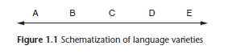

In Figure 1.1, each letter represents speakers of different varieties and the arrow represents
geographic distance. While speakers of A might easily understand speakers of B and C, it
might take effort to understand speakers of D, and it might be
quite difficult to converse with speakers of E. Similarly, speakers
of E might have no problem speaking with those of D and C but
might have more difficulty with speakers of A. So, are A and E
different languages? If so, where does one draw the dividing line?
This situation is known as a dialect continuum, and it represents
a common situation throughout the world.

Of course, Figure 1.1 is highly idealized. Communities aren’t usually ranged along a
straight road with distinct boundaries, and there is often movement and intermarriage between the various groups. However, the problem remains of whether mutually unintelligible
A and E should be counted as one or two languages. We can see that the question itself
is overly simplistic and obscures the more complex reality of the dispersion of language
varieties and their speakers.

Another problem with the criterion of mutual intelligibility is the word “mutual.” This
implies that speakers of both speech communities are equally at ease or equally perplexed
when hearing the speech of the other. However, there are many cases of unidirectional intelligibility, that is, speakers of Group A can understand the speech of Group B, but not the
other way around. This situation especially occurs when the Group A variety is spoken by
a minority group and the Group B variety is a standard language, taught in schools and
used in print and broadcast media. In this situation, the Group A speakers have repeated
exposure to the B variety and so can understand it. The Group B speakers, on the other
hand, may never have heard the speech of Group A, so they find it surprising and difficult.
It is not always clear whether these varieties are different dialects or different languages.

Another reason for the difficulty in counting up languages is that there is a complex
relationship between language and ethnic identity. Consider the case of the Newars, an
ethnic group which traditionally ruled the Kathmandu Valley in Nepal. While the largest
concentration of Newars is in the Kathmandu Valley itself, there are other Newar communities
scattered throughout the country. One variety of Newar is spoken in a village called
Dolakha, quite a distance to the east. The Dolakha and Kathmandu speech varieties are
truly mutually unintelligible. People from these two Newar communities cannot speak to
each other in Newar but must use the national language Nepali to converse. 

If the question of language versus dialect were to be based solely on mutual intelligibility, then these two varieties would count as separate languages. However, the Dolakha Newars are ethnically
Newars in every sense of the word. They have the same customs, social structures, festivals,
and traditions, and they intermarry with Newars from other parts of Nepal. Crucially, their
language, even though mutually unintelligible with the other varieties, still serves to distinguish
the group ethnically from non-Newars, so it is a marker of Newar ethnic identity.

The language is thus Newar in a very real and relevant sense to the speakers of the language
itself. The function of the language as a marker of ethnic identity would suggest that the
Dolakha variety is a Newar dialect, not an independent language. The criteria of mutual
intelligibility and ethnic identity thus lead us to different conclusions on the question of
language versus dialect.

The opposite situation can be found with Swedish and Norwegian, two of the Scandinavian
“languages.” These two speech varieties are easily mutually intelligible. However, a national
boundary and ethnic identity divide the two groups; hence, they
are considered to speak distinct languages rather than dialects of a
single language. Such circumstances motivated the famous quip by
the Yiddish linguist Max Weinreich: “A language is a dialect with an
army and a navy.” Sociopolitical and ethnic considerations clearly
have significant weight in the language/dialect debate.

While acknowledging that there are inherent difficulties in counting up the languages of
the world, we still want to know roughly how many there are. The most current compilation of statistics on the world’s languages is found in Ethnologue: Languages of the World (available
online at www.ethnologue.com). My source for the statistics in the following discussion
is the internet version of the nineteenth edition (Lewis et al. 2016), which puts the total
number of known languages at 7,097. How close was that to your own estimate?
The distribution of languages across continents is given in Table 1.1 (note that “the
Americas” include North, South, and Central America, and “the Pacific” includes Australia, New Zealand, and the Pacific Islands). Table 1.1 shows the number and percentage of the
world’s languages spoken or signed on each continent.

Note that the languages of Europe account for only 4 percent of the total number of languages
of the world, while Asia and Africa have more than 30 percent each.
Table 1.2 presents statistics on the world’s languages in relation to the size of the speech
communities of native speakers.

[Table 1.2] shows that there are very few languages with very large numbers of speakers;
only 5.6% of the world’s languages have more than a million speakers. 

On the other hand, 53% of the world’s languages have fewer than 10,000 speakers. When we combine
these numbers with population statistics, the results are quite striking. Roughly 94% of
the world’s population speaks only 6% of its languages. The remaining 94% of the
languages are spread over only 6% of the population. 

Thus, we have a handful of
languages with enormous speech communities and a very large number of languages with
quite small speech communities.

###### Figure 1.2 Newars at the temple complex in Patan, Nepal

TABLE 1.1 Distribution of languages across continents: 
Area Number/ Percentage: 

>Africa 
>Languages: 2139 
>Percentage: 30.1 

>The Americas 
>Languages: 1062 
>Percentage: 15.0 

>Europe 
>Languages: 287  
>Percentage: 4.0 

>The Pacific 
>Languages: 1313 
>Percentage: 18.5 

>Asia 
>Languages: 2296 
>Percentage: 32.4 

>Total 7097 100.0 

## 1.2.2 Languages of the World Tomorrow
While there are around 7,000 languages spoken or signed on the globe today, not all languages
are equally robust. Over time patterns of language use in multilingual communities
can shift so that a socially dominant language comes to be used more frequently and
less-dominant languages are used in fewer social contexts and among fewer people. Such
languages are described as endangered, at risk of ceasing to be spoken in the absence of
conscious efforts to keep them vital. According to Ethnologue, about 35 percent of the world’s languages can be classified as losing speakers or being further along the
endangerment process.

The endpoint of the language endangerment process is language death, which occurs
when a language ceases to have speakers and no longer serves as a symbolic marker of identity
for the community. Normally the process of endangerment occurs gradually, over three
or more generations. It involves a cessation in language transmission, the passing on of
a language from one generation to the next. When children don’t learn the language, the
only remaining speakers are adults. That population naturally ages and declines until only
a handful of speakers remains. In the absence of community efforts to reverse the trend, the
language can cease to be spoken. If it ceases to be a cultural resource for the community, it
is classified as extinct. (For a discussion on what is lost when a language ceases to be spoken,
see Textbox 1.4.)

## TEXTBOX 1.4 WHAT IS LOST WHEN WE LOSE A LANGUAGE?

Does language death matter? Linguists and members
of many speech communities answer with a resounding
“yes.” Each language is a testament to the ways in which
a unique group of people has understood and interacted
with their environment and has come to terms with the
human condition. Each is a unique inheritance from
countless generations of forebears, the encapsulation of
their wisdom and knowledge. Each language reflects and
instantiates the culture of the speakers. Each contains
knowledge, traditions, and history. Each represents what
a language can be and so enriches our understanding of
this central aspect of our humanity.

>“Surely, just as the extinction of any animal species
diminishes our world, so does the extinction of
any language. Surely we linguists know, and the
general public can sense, that any language is
a supreme achievement of a uniquely human
collective genius, as divine and endless a mystery
as a living organism. Should we mourn the loss of
Eyak or Ubyky any less than the loss of the panda or
California condor?”

##### (Professor Michael Krauss, Alaska Native Languages Center)

There are a number of reasons why languages become extinct. Sometimes the process of
language death has been brought about by explicit government policies designed to keep
children from learning their native language. However, language extinction is not limited
to communities targeted by such policies. Language endangerment and death appear to be
primarily fueled by the broader process of globalization, including a shift from agrarian to
urban lifestyles, and the increasing dominance of a small number of languages for the purposes
of commerce, education, and the media. These include both the truly widely spoken
languages, like Mandarin Chinese, English, Spanish, Hindi-Urdu, and Arabic, and smaller
national languages, like Nepali, Greek, Georgian, and Thai. Often acquisition of such languages
is necessary for anyone wanting to pursue an advanced education or a career in
modern society. Thus, parents are under pressure to have their children educated in these
languages and therefore choose to transmit these languages as opposed to those of the heritage
communities.

Another element that can contribute to the loss of a language is the loss of the coherence
and vitality of the speech community. If the members of a small speech community become absorbed into a larger group through intermarriage, the community can become dispersed.
Where there is no viable speech community, there is little reason to pass the language on to
the children; neither will the children hear the language spoken with sufficient frequency
to acquire it.

The recognition of the scope of the problem of language endangerment has led to significant
work by members of endangered-language speech communities and linguists to
record, preserve, and revitalize languages. Language documentation, the creation of
an extensive record of a language and its community, is an important part of this process.
Language conservation is also being undertaken in many communities, which are
developing materials to be used in the education of children and to promote language use
in the speech community. Language revitalization is undertaken by speech communities
whose language has been entirely lost or significantly reduced. Such projects can do
much more than simply teach the language; they can play significant roles in strengthening
communities and in promoting the preservation of traditional knowledge, practices,
cultural values, and institutions.

##### Figure 1.3 Members of the Gusii community in Kenya record traditional songs and dances as a component of their documentation of the Ekegusii language and Gusii culture (photo by Kennedy Bosire)

## 1.3 Linguistics
## 1.3.1 The Scientific Study of Language
Now that we have learned a bit about language and about the world’s languages, we turn
at last to the topic of linguistics. Linguistics is the scientific study of language. By “scientific,” we mean that the study is both empirical (based on observable data) and objective. Empirical data is critical for any scientific discipline, as it ensures that others can verify or replicate the findings. The term linguist refers to a person who examines the structures and principles underlying languages. Note that this is different from a polyglot, a person who speaks many languages. For more on this distinction, see Textbox 1.5.

## TEXTBOX 1.5 LINGUIST VERSUS POLYGLOT
The longer you study linguistics, the more likely it is
that someone will ask you the question: “How many
languages do you speak?” This question illustrates
the commonly held misconception that linguists are
polyglots. It is important to distinguish between the
two. 

A linguist is a person who examines the structures
of languages and the principles underlying those
structures. 

A polyglot is a person who speaks many
languages. 

-> Many linguists are, indeed, polyglots, but
you don’t have to be a polyglot to study linguistics.

A nice analogy can be made to pilots and airplane
mechanics. A pilot knows how to fly an airplane, based
both on training and on an instinctive sense of flight
and how a plane responds to a particular manipulation
of the controls. An airplane mechanic looks inside a
plane and knows how each part contributes to the
workings of the whole. One doesn’t need to be an
airplane mechanic to be a pilot. Neither does one need
to be able to fly a plane in order to be a mechanic. A
linguist is like a mechanic, looking inside to see how the
parts of the language fit together so that the language
can function in human communication. The speaker
is the pilot, able to use the language efficiently and
effectively, but without necessarily knowing how it
works.

Probably the best airplane mechanics are also pilots,
and in the same way, the most insightful analysis of the
language will come from someone who speaks it, but a
linguist can make a tremendous amount of headway on
the analysis of a language without speaking it.

In linguistics, empirical data are recordings of spoken or written language, collected into
a corpus. The nature of the recordings and how they are collected will depend on the goals
of the study. For example, if one wishes to study the physical properties of sounds, the best
recordings might be those produced in the isolation of a sound booth. If one wishes to
study sentence structures and how they are used, the best recordings are likely to be natural
conversations or narratives, supplemented by the comments of native speakers that reflect
their intuitions about the structures and their meanings in that particular context.

If one is studying language and society, one might choose to make video recordings of authentic
interactions. In any case, recorded data, preferably of speech or writing produced in a
natural setting, and not constructed by or for a linguist, are
the most highly empirical and can be verified by subsequent
researchers. This is not to say that this is the only type of useful
data in linguistics. Speakers’ intuitions about their language,
particularly regarding subtle distinctions in meaning,
add a depth to our understanding that we could not possibly
obtain otherwise.

When we say that a science is objective, we mean that our analysis is not biased by any
preconceived notions, or judgments of “good” and “bad.” Human beings are prone to prejudice,
and this can be directed at speakers of languages just as it is directed at ethnicities, religions, sexualities, styles of dress, or any other characteristic by which people are subgrouped.

It is not uncommon to find languages described as “primitive,” “corrupt,” “illogical,”
“ugly,” or just plain “bad.” By contrast, other languages can be described as “perfect,”
“logical,” or “beautiful.” To take an example from the United States, some speakers of
American English believe that the dialect of English spoken in certain African-American
communities (referred to as African-American English, or AAE) is “corrupt” or “ungrammatical.”

People with this view cite AAE sentences like She sick and She be sick, and claim
that they are “incorrect,” since they differ from the Standard American English sentence
She is sick. In actuality, AAE is making a grammatical distinction in these two sentences that
is not marked in the grammar of Standard American English. The sentence She sick refers
to a present situation; it simply states that the person is sick now. This sentence could be
used, for example, to explain why someone is unexpectedly absent. 

The sentence She be sick means that she is often sick or has a long-term illness. The implication is that the illness
is ongoing and lasts for an extended period of time. This meaning distinction between a
present state and an ongoing state is systematically made by the grammar of AAE (as well as
by many other languages in the world). 

Of course, speakers of Standard American English can still signal this meaning if they want to, for example, by using an adverb such as always, but its use is not grammatically required. This doesn’t mean that AAE is any “better” than Standard American English; the two dialects are just different. Every language or dialect
is unique in the types of distinctions it makes. Every language is equally able to convey all of the complex meanings
that humans communicate to each other in the course of a lifetime. 

Languages differ in which distinctions they grammatically
require their speakers to make, and in which meanings can
be expressed by other, non-grammatical, means.
An important distinction can be made between prescriptive and descriptive approaches
to language. A prescriptive approach to language is one that teaches people the “proper
way” to speak or write. Many children are exposed to prescriptive grammar in school,
where they are taught, for example, not to split infinitives (e.g., to boldly go) or to end
a noun phrase with a preposition (e.g., the man I saw you with). 

Prescriptive grammarians
choose a set of forms that they enjoin others to adhere to. These forms represent a
(slightly) older stage of the language when the rules were regular, so the establishment of
prescriptive rules reflects a resistance to the natural forces of change. In actuality the set of
forms chosen for prescription are ultimately arbitrary; there is no logical reason why one
should not split an infinitive or end a sentence with a preposition. Prescriptive rules may
still have social ramifications, however, and there are environments (such as academic
writing) where ignoring these conventions can have negative social consequences (such
as lower grades).
A descriptive approach to language is one that describes how people actually use language.
Descriptivists are not interested in telling people what is right or wrong, but in
observing, describing, and explaining actual linguistic behavior. In line with the objective
nature of linguistic science, linguistics is a descriptive enterprise.

## 1.3.2 Fields of Linguistics
The field of linguistics is as broad and multifaceted as language itself. The following paragraphs
provide a very brief orientation to the primary subfields of the discipline. As in the
rest of this book, this presentation will take the traditional hierarchical approach to language,
beginning with the smallest units and working up to larger and larger levels.
We will begin with the study of speech sounds. The physical properties of sounds – how
they are articulated and perceived, and the acoustic signatures of the sounds themselves –
are the subject of study in the field of phonetics. We will then examine the systematic use
of speech sounds in language, or phonology.

## STOP AND REFLECT 1.3 VOWEL-LENGTH DIFFERENCES
Try saying the English words lack and lag. If you pay attention to your mouth and listen carefully, you will
notice that the vowels in these words are produced with the same tongue position, but that the vowel in lack
is a bit shorter than that in lag. This is a phonetic observation, which could be verified by measuring the vowel
durations in an acoustic display on a computer screen. Now say lake/leg, pick/pig, and lock/log; you will find
that the vowel is always shorter before /k/ and longer before /g/. The same pattern is found before /p/ and
/b/ (lap/lab) and /t/ and /d/ (fat/fad). We see that these sounds pattern in a systematic way. Such systems of
sounds form the phonology of a language.

From the study of sounds we move to the study of words themselves. The ways in which
words are structured and created are the purview of the field of morphology. Morphologists
look at all the pieces of words (roots, prefixes, suffixes, etc.), their sounds and meanings,
and the principles of their combination. The study of how words combine into phrases,
clauses, and sentences is the study of syntax. Morphology and syntax are tightly integrated
and are often referred to as morphosyntax or (in some uses) grammar.

## STOP AND REFLECT 1.4 MARKERS OF NEGATION
Languages differ in how they mark negation. In some languages, markers of negation are independent
words (English not, Italian non), while in others they are prefixes (Dolakha Newar ma-na ‘didn’t eat’), suffixes
(English didn’t), or a combination (French n’est pas). Think of another language that you are familiar with. Is
negation marked by an independent word or an affix?

Languages also differ in the number of negation markers they have. Wayampi, a language of northern
Brazil, has four markers of negation. The study of the forms, meanings, and uses of these markers falls under
the field of morphology.

A critical aspect of language that interacts with all of these levels is semantics, meaning
in language. The study of semantics includes the study of word meanings (lexical semantics)
and the study of how meanings combine in clauses and sentences (propositional
semantics).

When we look at how speakers use linguistic structures in larger stretches of speech, we
are studying discourse. This field takes into account the interactional nature of language,
for example, how speakers need to present their ideas in a way that allows hearers to understand
them. With the help of computers, linguists can now look at statistically significant patterns over very large sets, or corpora, of discourse data; this methodology is referred to as corpus linguistics.

The role of the broader context in interpreting linguistic form
and meaning is examined in the field of pragmatics. A large part of the context of speech
comes from its embedding in the society and culture of its speakers. This field of study is
sociocultural linguistics.

## STOP AND REFLECT 1.5 CONVEYING AND INTERPRETING SOCIAL MEANINGS
You are studying in the library. Two people come in talking loudly. They sit at the table next to you and
continue to talk loudly about the party they went to. They ignore your glares and those of other people in
the room. Finally you say, “Hey, could you speak up? I missed that last part.” How is it that the people can
interpret this as a request to be quiet? 

The answer lies in the field of pragmatics. Our linguistic capabilities are critically embedded in our neurology and our ability to think. The field of language and the brain examines the physical and neurological
basis of language, while cognitive linguistics looks at how language is instantiated by
our broader cognitive processes. A related field is language acquisition, which studies
how language is learned by children (first language acquisition) and by adults (second
language acquisition).

## TEXTBOX 1.6 HISTORICAL LINGUISTICS SHEDS LIGHT ON PREHISTORIC MIGRATIONS
Historical linguistics can tell us much about human
prehistory. In many cases, we can trace how populations
have migrated across the globe. For example, most of
the languages of the Athabascan family are spoken by
native communities located between the Yukon region
of Alaska down the Pacific coast of North America to
northern California. However one branch of the family,
which consists of Apache and Navajo, is spoken in the
southwest of the United States. Linguists were able to
use principles of historical linguistics to discover that
the Apachean languages are, indeed, members of
the Athabascan family, and to therefore deduce that
speakers migrated from the Pacific Northwest to the
American Southwest in a prehistoric time period.

The field of historical linguistics examines how languages change over time. This historical
perspective can be applied to all levels of language: sounds, words, structures, and
meanings. Historical linguists are also interested in determining which languages are related
and how they have descended from a mother language, which was spoken in the distant past
(see Textbox 1.6 for one such example). But languages don’t evolve in isolation. Instead, they
often influence each other as their speakers interact over time. The study of such language
contact is a subfield of historical linguistics.

Computational linguistics is a field at the intersection of linguistics and computer
science that deals with the statistical or rule-based modeling of natural language. It is concerned
with applying methods from artificial intelligence and machine learning to problems
involving language. The recent acceleration of our technological abilities has led to a
greater application of computational methods to a wide range of linguistic questions, such
as how languages are learned.

## TEXTBOX 1.7 ORDERINGS OF SUBJECTS, VERBS, AND OBJECTS ACROSS THE GLOBE
When we look at sentence structures across languages,
we notice that languages differ in the relative ordering
of the subject 

(Chris in Chris ate the apple), the object
(the apple), and the verb (ate).

There are six logically
possible orderings of these three categories:

Subject-Object-Verb Subject-Verb-Object 
Object-Subject-Verb Object-Verb-Subject 
Verb-Subject-Object Verb-Object-Subject 

However, all six orderings are not equally instantiated
in the world’s languages. A famous study of these
orderings found that languages which put the subject
first are very common, those that put the verb first
are much less common, and those that put the object
first are very few indeed. Why this should be, and
the theoretical implications of this fact, is a question
addressed in linguistic typology.

We find languages throughout the world. The field of linguistic typology looks at
how the world’s languages are similar and different. See Textbox 1.7 for an example of this.
Typologists are interested in developing a classification of languages based on how they are
structured, and in looking for relationships between certain structural language types.

There are many applications of linguistics to situations in the world around us. The field
of applied linguistics includes a number of subfields, including language teaching and
forensic linguistics. Recently, there has been a strong move toward language documentation,
the creation of a record of a language that can be used by speech communities
and others in the face of possible endangerment or language death. Of course, linguistics
is also a key part of the field of speech pathology and speech and hearing sciences.

Thus, the study of linguistics can lead to a wide range of careers, as discussed in Textbox 1.8.
This list of subfields of linguistics is fairly representative but is certainly not exhaustive.
While we will not be able to touch on all of these fields in this book, we will cover most of
them. The fields are diverse enough that there is usually something to interest everyone,
and some readers will find that they are interested in everything.

## TEXTBOX 1.8 LINGUISTICS AS A GATEWAY TO CAREERS
Because language is a pervasive aspect of human
life, a degree in linguistics can lead to a wide variety
of careers. Linguistics majors develop important
professional skills that would be valued by any
employer: data analysis, reasoning, argumentation,
communication, writing, cultural sensitivity, and an
appreciation of diversity. Many linguistics students
also gain experience in teamwork, collaboration, and
leadership, and many speak multiple languages.

A background in linguistics is especially well
suited for speech pathology (which trains speech
therapists to work with children or adults with
speech disorders), language teaching, and speech
technologies. Linguistics students also go on to
careers in translation, education, law, government,
journalism, publishing, lexicography, and a wide
variety of industries, including marketing and data
analytics. Many students also go on to doctoral study
in linguistics, anthropology, psychology, or related
fields, which opens the door to research and teaching
at the college and university level, in addition to the
careers listed above.

## CHAPTER SUMMARY
Human languages are complex, structured, and dynamic systems of human
communication, which change over time under a variety of influences. While it is
impossible to exactly count the number of languages of the world, our current estimate
is in the range of 7,000. However, these are not evenly distributed, as most of the world’s
population speaks one or more of a small number of dominant languages, while a small
percentage of the population speak one of many languages with comparatively few
speakers, many of which are endangered.

Linguistics is the scientific study of language. It is empirical and objective. Linguists
seek to describe succinctly the structural properties of languages, and to understand their
interactions, how they change, and how they serve the broader functions of language as
a tool of communication that is embedded in human physiology, cognition, interaction,
society, and culture. Explaining how individual languages work and how language works
more broadly constitutes the aim of linguistic theory.

### EXERCISES
1. For each of the following statements, determine whether the facts stated are diachronic (indicating how
language has changed over time) or strictly synchronic (true of a language now). 
    a. To negate a sentence in English, the word not is used. 
    b. Many words in English were borrowed from French, then adapted to the English sound system. 
    c. Chinese differentiates words by changing the pitch. 
    d. In Mexican Spanish, the word pollo ‘chicken’ has a “y” sound represented by the letters ll; this developed from an “ly” sound that is still present in other dialects. 
    e. The word silly in the twelfth century had a meaning of ‘happy,’ ‘blessed,’ ‘pious,’ and ‘innocent,’ which over time was extended to ‘pitiable,’ ‘weak,’ and its current meaning. 
    f. The word fie is rarely used in contemporary English. 
     
2. Provide an example of each of the following: 
    a. arbitrariness in language 
    b. mutually intelligible dialects 
    c. an endangered language 
    d. a factor which might contribute to language endangerment 
    e. an example of language change 
f. a systematic fact of English that is not discussed in Chapter 1 
 
3. Which of the following statements are descriptive and which are prescriptive? 
    a. The sentence Who did you give it to? is incorrect since it ends with a preposition. 
    b. The sentence Who did you give it to? ends with a preposition. 
    c. Always say John and I, never John and me. 
    d. In English, numerals are never placed between an adjective and a noun, so black three dogs is ungrammatical. 
    e. Ain’t is used in a variety of English dialects. 

## Chapter 2 - Phonetics - Physical Dimensions of Speech Sounds

KEY TERMS
- Subglottal system
- Voicing
- Voiced vs. voiceless consonant
- Orthography
- Fundamental frequency vs. pitch
- Supralaryngeal vocal tract and its
subparts (lips, alveolar ridge, etc.)
- Places of articulation (bilabial,
labiodental, etc.)
- Manners of articulation (stop, fricative,
etc.)
- Obstruent vs. sonorant
- International Phonetic Alphabet
(IPA)
- Vowel
- Co-articulation
- Suprasegmental

## CHAPTER PREVIEW
Phonetics is the branch of linguistics that is concerned with the scientific study of speech
sounds. The study of phonetics can provide answers to many questions that you might have
wondered about at one time or another. For example, what does it mean to say that someone
has a higher-pitched voice than someone else? What makes a tone language like Mandarin
Chinese different from a non-tonal language such as English or Spanish? How do English pairs
of words such as the verb import and the noun import differ?

Several areas of phonetics have been the focus of research into the features of speech.
Articulatory phonetics is concerned with how the vocal organs produce speech. Acoustic
phonetics deals with the physical characteristics of speech, such as the duration, frequency,
and intensity of sounds. Auditory phonetics examines the perception of speech by the
auditory system. Acoustic, articulatory, and auditory phonetics are all interrelated, since
changing the articulatory configuration of the vocal tract results in acoustic changes which
in turn potentially influence the perception of a sound. In this chapter, we will consider the
first of these areas of phonetic research, providing an overview of the field as well as answers
to the questions posed above. Students will be introduced to the tasks of discerning different
speech sounds, describing them in phonetic terms, and accurately recording them using the
International Phonetic Alphabet.

## 2.1 The Speech Organs
The physical production of speech requires intricate coordination between several
parts of the upper body, from the stomach all the way up to the nose. It is common to
divide the speech organs into three subsystems (see Figure 2.1): the subglottal system, the
larynx, and the supralaryngeal (or supraglottal) system.

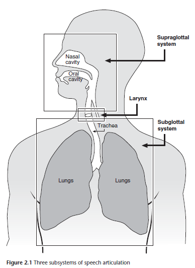

## 2.1.1 The Subglottal System
The subglottal system includes the lungs and the trachea (or windpipe), which provide
the air that the upstream articulators manipulate to produce sound. The lungs function
like balloons, recoiling after inspiration and setting the air molecules in the vocal tract in
motion.

## 2.1.2 The Larynx
Moving up from the lungs and trachea, the larynx is the source for many of the sounds
produced in speech. It is located behind the thyroid cartilage (or Adam’s apple), which is
the bump you can feel on the front of the neck if
you lean your head back. 

The larynx contains two
vocal folds that vibrate during voiced sounds
such as z or v. To feel the vocal folds vibrate, try
placing your fingers on the thyroid cartilage in the
front of your neck while making a prolonged [zzzzzz]
sound.

You will feel the cartilage vibrating. Compare
this to what happens when you make a long [ssssss]
sound. There is no vibration. Vocal fold vibration,
otherwise known as voicing, does not require any
active motion beyond positioning the vocal folds
close enough together that the passage of air between
them causes them to vibrate. As long as the air pressure
below the larynx is less than the pressure above
the larynx, you can sustain a voiced sound. When
you produce the sound [zzzzz], you are producing a
voiced consonant.

As you have already learned when you made the
[ssssss] sound, it is also possible to make the same
sounds without vocal fold vibration, in which case,
you produce a voiceless consonant. For example,
by turning off voicing in z you get s and by turning
off voicing during v you get f. (See Sidebar 2.3.)
Physically, devoicing of these sounds is achieved
by opening the larynx wider than for their voiced
counterparts.

In English there are two sounds that only
involve the larynx and not any articulators
above the larynx. One is the h sound in words like
hat or ahead. The other is the glottal stop found in
the middle of the expression uh-oh. Try saying uhoh
emphatically while your hand is on your larynx
and your head is leaned back. You will feel an abrupt stoppage of voicing during the glottal stop between the two vowels as the vocal folds come together to block off all airflow through the larynx. This is called a glottal stop, as you stop the airflow by closing the glottis (the space between the vocal folds).

By adjusting the tension of the vocal folds during voicing, you can change the
fundamental frequency, and hence the pitch, of a sound. The fundamental frequency
of a sound is commonly referred to as pitch, though the two terms are technically not synonymous.
Fundamental frequency refers to the physical property of rate of vocal fold
vibration, whereas pitch refers to the perception of the sound on a scale of low to high.

Increasing fundamental frequency also typically increases the pitch. Someone with a relatively
high-pitched voice thus has a relatively high fundamental frequency or a fast rate of
vocal fold vibration. Conversely, someone with a low-pitched voiced has a relatively slow
rate of vocal fold vibration. Try making the sound [ahhhhhh]. Now try raising the pitch of
the sound while your fingers are on your larynx. You will feel the larynx tense up and rise.
Now try lowering the pitch of the sound. You will feel the larynx relax and lower. In this
way, you can see how an individual can easily change the fundamental frequency of his or
her voice.

## 2.1.3 The Supralaryngeal Vocal Tract and Place of Articulation
Above the larynx is the supralaryngeal vocal tract, which contains most of the structures
that are manipulated in speech. The articulators of the supralaryngeal vocal tract are
shown in Figure 2.2. When you use different articulators to produce speech sounds, you are
changing the place of articulation of the sound.

In discussing different places of articulation, it is useful to move from the front to the
back of the mouth (see Figure 2.2), starting with the most visible organs. The lips play an
important role in producing many sounds, including p, b, m, w, f, and v in English. Sounds
that involve a narrowing or a complete closure of the upper and lower lip are called bilabials.
The bilabial sounds of English include p, b, m, and w. Sounds involving the upper teeth
and the lower lip are referred to as labiodentals. These include f and v. For labiodentals,
the lower lip is the active articulator, since it moves to meet the upper teeth. The upper
teeth are thus the passive articulator, since they are stationary. Most consonant articulations
involve both an active and a passive articulator. As we will see, for most consonants,
the tongue is the active articulator, while the upper surface of the mouth is the passive
articulator.

The structures just behind the lips are relatively immobile compared to the lips. These
rigid structures include the teeth, the alveolar ridge (the hard ridge just behind the teeth
before the upper surface of the mouth becomes more domed in shape), and the hard palate
(the domed part of the roof of the mouth). The teeth are involved in the production
of the English th sounds in the words think and this. 

These sounds are produced by either sticking the tip of the tongue between the upper and lower teeth, in which case the sounds are said to be interdental, or placing the tip of the tongue against the back of the upper teeth, in which case the sounds are simply called dentals. Try saying think with an interdental th and then with a dental th. In order to make the comparison fair, be careful that you are not completely blocking air from leaving the mouth when making the dental th.

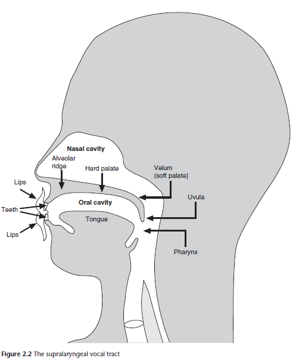

You will not notice much of a difference in the sound from making this small articulatory
adjustment.

You may notice that the first sounds of think and this are different even though they
are both spelled as th. The two versions of th differ in voicing, just as z and s were shown
earlier to do: the th in think is voiceless, whereas the th in this is voiced. We will see shortly
that there is a system for transcribing speech in which the voiceless and the voiced th are
represented differently.

## STOP AND REFLECT 2.1 TONGUE POSITION AND ALVEOLAR SOUNDS
You may note that not all of the alveolar sounds have the exact same point of contact for your tongue. This type of variation is quite common; in particular, l often involves quite a bit of contact with the back of the upper teeth, at least for many speakers of American English. Try making an extended [llll] sound and feel where the tip of the tongue is contacting the upper surface of the mouth. 

Now try making a [nnnnnn] sound and feel where the contact is. Does it occur at the same place as for the [llllll] sound? Even if there is a difference, you should be aware that it is common for t, d, n, and l to all be treated as alveolars in discussing the sounds of English.

Just behind the teeth is the alveolar ridge, which is the contact point between the tongue
and the roof of the mouth for several sounds, including t (a voiceless sound), d (voiced), s
(voiceless), z (voiced), n (voiced), and l (voiced). Another sound r (voiced) is also typically
assigned to this same group, since r is produced with a narrowing in the vocal tract below
the alveolar ridge, even though the tongue may be raised only slightly toward the roof of
the mouth without touching it. See Stop and Reflect 2.1 for more discussion of alveolar
sounds.

There are also sounds that are produced with the tongue contacting the area just behind
the alveolar ridge. These are the postalveolar (or palato-alveolar) sounds, which include
the sh sound in ship (which is a voiceless postalveolar) and the last sound in rouge (which
is a voiced postalveolar), as well as the first sounds in jug (voiced) and chug (voiceless). To
understand the relationship between alveolars and postalveolars, make an sss sound and
then switch to a shh sound. You will feel the tongue sliding backwards along the upper
surface of the mouth as it moves from an alveolar to a postalveolar place of articulation.
Sounds involving contact with the roof of the mouth in the center of the hard palate are
simply termed palatals. English has a single palatal sound: the y sound in words like yellow
and young.

Now drag your tongue backwards from the hard palate. You will notice that the upper
surface of the mouth becomes softer. This area of the mouth is called the soft palate, or
velum. Sounds produced by contacting the tongue and the soft palate are termed velars.
These include the k (a voiceless velar sound) in words like cat, bucket, and crib, the g (a
voiced velar) in words like gas, go, and bag, and the final ng sound (voiced) in words like sing
and lung. The sound w also involves some raising of the back of the tongue toward the soft
palate in addition to rounding of the lips; for this reason w is often labeled a labial-velar.

The soft palate, or velum, is important for distinguishing sounds involving airflow
through the nose and those lacking nasal airflow. Try looking in the mirror while saying
ah and you will see the velum rise. This raising of the velum ensures that no air escapes
through the nose while you are producing the vowel. To see this, hold your finger under
your nose while saying ah. Now try lowering the velum, holding the same tongue position
for ah while your finger is still in place under your nose. You will feel air passing through
your nose and will hear a nasal-sounding ahn, which is found in many languages of the
world, such as French.

English also has nasal sounds, but they are consonants rather than vowels. Place your
finger under your nose while you are making the sounds m, n, and the ng sound in sing and
lung. You will feel air passing through your nose. Nasality is a separate dimension from place
of articulation, since sounds can have the same place of articulation but differ in whether
they are nasal or non-nasal (i.e., oral). The sounds m and b differ in nasality; both are
voiced and both are bilabial, but only m is nasal. 

Try saying an [m] with your finger under
your nose and then immediately switch to a [b]. You will feel airflow through the nose
during the [m] but not during the [b] even though the lips remain closed throughout both
sounds. The sounds n and d also differ only in nasality; n is nasal and d is oral. Similarly, ng
and g differ in nasality; ng is the nasal member of the pair. Note that it is common to omit
the term oral when describing oral sounds, since oral is assumed to be the default case. (See
also Stop and Reflect 2.2 for a brief discussion of nasals and voicing.)

## STOP AND REFLECT 2.2 NASAL SOUNDS
In most languages all nasals are voiced, since it is difficult to produce a voiceless nasal that is clearly audible.

Try making an [m] sound and then turning off vocal fold vibration. You will wind up with a voiceless nasal, which sounds identical to the sound made when breathing through your nose.

Practice producing voiced and voiceless nasals and listen to how they sound. You will notice that it is much harder to hear a voiceless nasal than a voiced nasal. Although they are rare in the world’s languages, voiceless nasals are found as consonants in some languages, such as Burmese.

## 2.2 Manner of Articulation
Thus far we have discussed three dimensions relevant for describing speech sounds: the
voicing dimension (voiced vs. voiceless), the place of articulation dimension, and the nasality
dimension (nasal vs. oral). 

There is one other dimension that we must consider: the
narrowness of the constriction in the vocal tract. Differences in constriction narrowness are
referred to as differences in manner of articulation.

Some sounds involve a complete closure of the vocal tract. These are called stops.

English stops include p, b, m, t, d, n, k, g, and the ng sound. Of these sounds, p, b, t, d, k, and g are oral stops since there is no nasal airflow, while m, n, and ng are nasal stops. 

All stops involve two phases: a closure phase, during which the airflow through the mouth is completely blocked, and a release phase, when the constriction is released. 

To see this, produce just the closure for the voiceless stop t without releasing the tongue from the alveolar ridge. You will notice that there is complete silence, since there is no voicing.  This means that voiceless stops are only identifiable through their release, which provides crucial information about place of articulation. 

There is another type of sound found in certain varieties of English, including for most speakers of American and Australian English, that resembles an alveolar stop in that it is produced with a complete closure at the alveolar ridge. 

This sound is called a flap and occurs in the middle of words like pity, butter, lady, and ladder. The key difference between a stop and a flap (sometimes also referred to as a tap) is the extreme shortness of the closure for the flap. The tongue briefly taps the roof of the mouth before rapidly returning to position for the following sound.

It is also possible to produce sounds in which the two articulators are close
together, but not so tightly occluded that no air can escape through the mouth.
Sounds produced by a tight narrowing of articulators are termed fricatives. 

Fricatives are
characterized by turbulence created through the random collision of air molecules either at
the constriction location or, in the case of alveolar or postalveolar fricatives, by funneling
air to hit the back of the teeth. 

Try making an emphatic [ssssss] sound while holding your
hand palm down against your chin. You will feel air striking the back of your hand because
the air is being directed downward after it hits the back of your upper teeth. You will also
feel air striking your hand if you produce a prolonged and emphatic sh sound. 

Now try
making a [hhhhhh] sound while holding your hand in the same position. You will not feel
any air striking your hand. This is because the noise in [hhhhhh] is being produced directly
in the larynx and not by directing air against the back of the teeth. You will also notice that
the noise of h is much quieter than that associated with s or sh. Sounds like s and sh, which
involve funneling of air against the back of the teeth are particularly noisy. These sounds
are called stridents.

There are two sounds in English that are produced by combining a stop with a
following fricative in rapid succession. These are the affricates, which include the j
sound in jug (which is voiced) and the ch sounds word-initially and word-finally in church
(which are voiceless). Since affricates have a stop phase, they are often grouped together
with other stops.

Additionally, sounds can be produced through a slight narrowing of the vocal
tract, but not enough to cause noise or a complete obstruction. These sounds are
called approximants. Approximants in English include the y sound in yellow and the w
sound in water. Also included in the class of approximants in English is the r sound in words
like red, brick, and car.

A final approximant to consider is the sound l, which resembles t and d in involving
a complete closure in the middle of the alveolar ridge. There is, however, a crucial difference
between l and these other sounds (besides the fact that l differs from t in being
voiced). 

The l sound is produced with a closure only in the center of the mouth.
At least one side of the tongue (if not both, depending on the speaker) is pulled down
slightly, away from the roof of the mouth. 
The lowering of the side part of the tongue
allows air to escape the mouth, whereas the true stops t and d have a complete closure
around the upper surface of the mouth. 

Try making an [llllll] sound and put your hand
first on the left side of the mouth and then on the right side. Is the air escaping from just
one or both sides of the mouth? 

The sound l has a lateral articulation in opposition to all
of the other sounds of English, which have central articulations. Note that it is common
to omit the term central when describing central sounds, since central is assumed to be
the default case.

There are a couple of additional useful terms for grouping together certain types of
sounds. 

One of these is the term liquids, which includes lateral approximants and r-type
sounds. 

Another common descriptor is the term obstruent, which refers to the combined set of oral stops and fricatives. Sounds that are not obstruents are the sonorants, which
include the nasals and all of the approximants, both lateral and central.

It is important to recognize that our discussion of places and manner of articulation has
focused on sounds occurring in English. In reality, there are many more sounds found in
languages other than English, as you know already if you speak or have studied other languages.

Some of these sounds are discussed below.

## 2.3 The International Phonetic Alphabet
Up to now, we have referred to the different sounds of English using the traditional symbols
used in English spelling. While this strategy has worked for the most part, there are some
limitations of using spelling (orthographic) characters to represent sounds.

One
problem we have already encountered concerns the English letters th, which can represent
either a voiceless dental fricative as in think or a voiced dental fricative as in this. 

Another
issue is the use of two letters to represent a single sound in English. For example, the voiced
velar nasal at the end of sing is represented by the combination ng.

Similarly, the voiceless
postalveolar fricative is written as the sequence sh. 

While it is possible to use two letters to
represent a single sound, it is more efficient to use a single symbol to represent a sound that
behaves phonetically as a single entity. 

Furthermore, there is the potential for confusion
between a single phonetic sound written with two letters and a sequence of two phonetic
sounds also written with two letters. 

For example, if one sees ng, how can one be sure without
listening to the word, whether ng refers to a single voiced velar nasal, or the phonetic
sequence n (voiced alveolar nasal) plus g (voiced velar oral stop), as occurs in a careful pronunciation of the compound rain gauge?

There is an even more serious problem with the use of English spelling to represent phonetic
sounds. Many individual English letters or combinations of letters represent multiple
phonetic sounds depending on the particular word. 

For example,
the letter x can represent either a voiced alveolar fricative, z,
as in xylophone, or the phonetic sequence of voiceless velar stop,
k, plus voiceless alveolar fricative, s, as in ox. 

Similarly, the letter
o has three different qualities in the words ton, pond, and drone.

Using orthography to represent phonetic pronunciation is thus
bound to cause confusion.

Fortunately, this problem is remedied by the existence of a special phonetic alphabet
designed to reflect pronunciation: the International Phonetic Alphabet, abbreviated IPA.

A crucial principle guiding the International Phonetic Alphabet is its universal
one-to-one correspondence between symbols and pronunciation. Thus, whenever
you see an IPA symbol, you can be sure of its pronunciation, regardless of the language
being transcribed. 

For example, whenever you see an IPA m, it will refer to a voiced bilabial
nasal stop in any language. The IPA thus provides a useful tool for linguists who are
transcribing words and who plan to share these transcriptions with other researchers.

It is not the case, however, that all linguistic data are transcribed in IPA at all times; see
Textbox 2.1.

## TEXTBOX 2.1 THE IPA AND REGIONAL TRANSCRIPTION PRACTICES
As noted, the IPA has been designed to transcribe the
sounds of every spoken language. However, it is not
the case that all linguists use the IPA at all times. In
many parts of the world, the transcription practices of
linguists reflect the orthographic practices of the local
region. 

In some cases, particular orthographic practices
are widespread in a given region, such as the use of the
symbol š in the transcription of North American Indian
languages for the sound written with “sh” in English
spelling and transcribed as [∫] in IPA.

In this volume, which takes data from many sources –
historical and contemporary – from all over the world,
the transcription system of the original source is used.

Interpreting transcriptions requires careful attention;
transcription notes are provided throughout the book
to aid readers in this task. Learning these different
systems, and how to interpret a variety of transcription
practices, is part of the task of learning linguistics.

As it happens, the IPA bears close resemblance to English orthography in many respects.
There are only a few major points of departure between the two systems. 

First, the IPA symbol
for a voiceless (inter)dental fricative (as in think) is [􀈙]
(IPA symbols will henceforth be written in brackets),   While
the symbol for its voiced counterpart (as in this) is [ð].   
The IPA symbol for a voiceless postalveolar fricative (as in ship) is
[∫],    While the symbol for its voiced counterpart (as in rouge)
is [􀝤]. 
The IPA represents the voiceless postalveolar affricate
(as in church) as [t∫] 
and the voiced postalveolar affricate (as
in jug) as [d􀝤].

The IPA symbol for a voiced velar nasal stop
(as in sing) is [ŋ]. 

The IPA symbol for glottal stop (as in uh-oh)
looks like a question mark but with a horizontal base rather
than a period [􀝦].

In addition, the IPA symbol for a voiced
palatal approximant (as in young) is [j], 

While the symbol for
a central alveolar approximant (as in red) is an upside-down
[􀝋]. 

Finally, the flap occurring in American English in the
middle of words like city and buddy is represented with the
symbol [ɾ].

We are now ready to see the entire list of IPA consonant symbols relevant for describing English in Table 2.1.

In the chart, places of articulation appear as columns across the top of the chart, while
manner, nasality, and lateralness are captured in rows. Sounds differing only in voicing are
adjacent with the voiceless sound on the left and the voiced counterpart on the right. 

There
are many possible combinations where no consonant is represented; this reflects the lack
of such sounds in English, but does not mean that they are unattested in other languages.

Note that [w] appears in both the bilabial and the velar columns, since, as we have seen, it
involves constrictions simultaneously at the lips and at the velum. 

The flap [ɾ] appears in
parentheses reflecting the fact that it is present for only certain varieties of English, such as
American and Australian English.

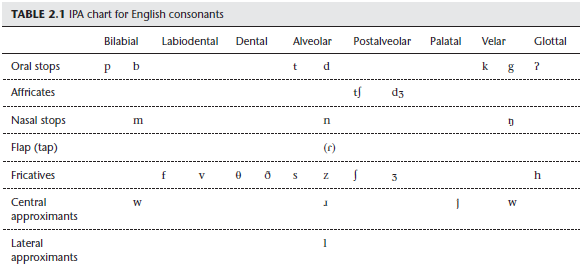

There are also IPA symbols for vowels. Vowels fundamentally differ from consonants
in being produced with a relatively open vocal tract, though of course there
is some movement of the tongue necessary to make different vowel sounds. 

The IPA
chart for American English appears in Table 2.2 followed, in Table 2.3, by its counterpart
for the variety of British English commonly referred to as BBC English.

## STOP AND REFLECT 2.3 VOWELS IN ENGLISH VARIETIES
Recordings of the words in Tables 2.4 and 2.5 can be found on the How Languages Work website. For consistency,
all transcriptions in this chapter will be based on recordings from these, as are the exercises and online resources.

You should learn to hear the distinctions these speakers make and transcribe them accurately. our pronunciation of English might be different from these in some respects. 

Try pronouncing the words in
Tables 2.4 and 2.5. Are your vowels the same as these or different? If different, you can find the full IPA chart
online and determine which vowels you have in your own speech (your instructor can help you with this).
Textboxes 2.2 and 2.3 discuss some of the variation in vowels found across English dialects.

As the tables show, the dimensions used to describe vowels differ from those used to
classify consonants. 

Vowels can be described in terms of three core dimensions: backness,
height, and tenseness. 

In addition, vowels can differ in whether they are produced
with lip rounding, as with the vowel in boat, or not, as with the vowel in beet.

There are three degrees of height in English: high, mid, and low. Example words illustrating
the vowels of American and British English are shown in Tables 2.4 and 2.5, respectively.

The mid-central vowel [ə], also known as schwa, is confined to unstressed syllables
in English.
 
It is pronounced with a higher tongue position than the mid-central vowel [ʌ],
which is only found in stressed syllables (you can hear both of these vowels in the word
above; the first is [ə] and the second is [ʌ]).

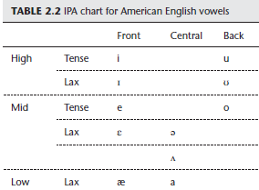

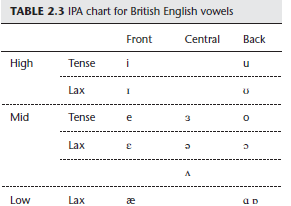

TEXTBOX 2.2 [ɔ] AND [a] IN AMERICAN ENGLISH
Many speakers of American English, including most
from California, lack the vowel [ɔ]. 

For speakers who do not have [ɔ], it is because it has merged with the low vowel [a]. 

Speakers who have undergone this merger
typically (at least in California) produce a low central
vowel in words like caught, dawn, and law. Speakers
who have a contrast between [ɔ] and [a] have pairs of
words differing only in the vowel, e.g., caught with [ɔ]
versus cot with [a] and dawn with [ɔ] versus don with
[a].

 Try asking several Americans to say the words cot
and caught. Do any of them have a different vowel in
the two words? Now try asking a speaker from Great
Britain how they pronounce these words. How does
their pronunciation compare with yours?

Vowels can also be described in terms of backness. 

The front vowels of English are [i, ɪ, e, ɛ, æ]. The back vowels of English (both dialects combined) are [u, ʊ, o, ɔ, ɑ, ɒ], while the central vowels are [ə, ɜ, ʌ, a]. Several of the back and central vowels vary considerably
between dialects and between speakers in their pronunciation (Textbook 2.2). 

The vowel [a] for American English speakers varies widely in its backness from speaker to speaker, so you
may note that you have a somewhat backer pronunciation than central [a]. British English has a low back unrounded [ɑ] that corresponds to American English [æ] in words like half and to American English [a] in words like father. 

British English also has a low back rounded [ɑ] that corresponds to American English [a] in words like hot and pot. And British English has an additional central vowel in words like purr and learn that corresponds to a syllabic [ɹ̩]
or rhotacized (i.e., r-colored) schwa [ɚ] (see Textbox 2.3) in American English.

<strong>Vowels can also differ in terms of their tenseness. There are several pairs of vowels in
English differing only in tenseness. For example, the pair of vowels [i] as in seat, and [ɪ]
as sit differ along this dimension; [i] is a tense vowel and [ɪ] is a lax vowel. 

Similarly, [e] is
tense and [ɛ] is lax, [u] is tense and [ʊ] is lax, [o] is tense and [ɔ] is lax, and [ɜ] is tense and [ə] is lax. 

Tense vowels in English are longer than their lax counterparts and, for front and back vowels, also typically have a slightly more peripheral tongue position (i.e., higher and fronter in the case of front vowels, and higher and backer in the case of back vowels). 

You can verify this by producing an [i] sound and then changing it to an [ɪ]. You will feel the
tongue lowering slightly and retracting. Now try the same exercise by switching from [e] to
[ɛ]; you will once again notice the tongue lowering and retracting.

The final parameter along which English vowels can be described is whether they are
produced with lip rounding or not. The rounded back vowels of English are [u, ʊ, o, ɔ, ɒ],
whereas [ɑ] is unrounded. All the front and central vowels in English are unrounded. To see
that rounding is a separate parameter from tongue height and backness, try making
an [i] sound while looking in the mirror. You will notice that the corners of the mouth are
drawn back and that there is no lip rounding. Now without moving your tongue, round
your lips by protruding them. 

The sound you wind up producing is a high tense front
rounded vowel, a sound that does not occur in English but that is found in many languages
of the world, such as German and French. As a point of interest, this sound is transcribed as
[y] in the IPA. This is why we use [j] and not the [y] symbol to transcribe the palatal approximant
found in English words like yam and yellow.

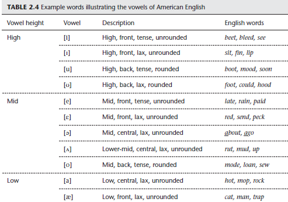

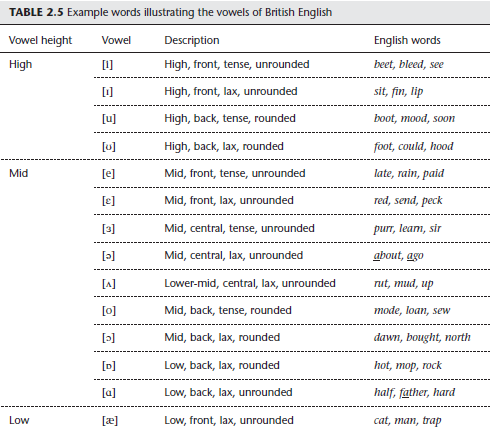

## TEXTBOX 2.3 VOWELS BEFORE “r” IN ENGLISH
Combinations of vowels plus “r” in English tend to be
pronounced very differently from other vowel-plusconsonant
sequences. Speakers of many dialects drop
the “r” entirely at the end of a word or syllable, as in
the stereotypical pronunciation of the phrase [pak
ðə ka ɪn 􀞖havəd jad] ‘Park the car in Harvard Yard’
by speakers of Boston or British English. 

After certain
vowels, as we have seen, the “r” may leave a residual
schwa-like vowel that combines with the preceding
vowel to form a diphthong as in the words peer, pear,
and poor, as produced by speakers of British English.

The number of vowels occurring before “r” (where it
survives) is also typically reduced. Many speakers of
American English thus have only one or two of the
vowels [e, ɛ, æ] before “r”. The words Mary, merry, and
marry are homophonous for many people, as are the
names Karen and Keren. Likewise, the words pour and
poor are identical for many speakers.

In addition to the English vowels in Tables 2.2 and 2.3, there are also combinations
of vowels in English that function as a single unit in the sound system. These vowel
sequences are called diphthongs, in contrast to monophthongs, which are produced with
a single articulatory configuration. Diphthongs may be regarded as the vocalic equivalent to affricates, since they involve two phases. 

There are three clear diphthongs in American
English. One is [aɪ], which starts off as [a] and then rapidly sequences into [ɪ]. 

The diphthong
[aɪ] is found in many words in English including write, lie, and mine. 

The second
diphthong is [aʊ], which is found in words like cow, town, and bout. 

Finally, the diphthong
[ɔɪ] occurs in words like boy, soy, and toil. 

British English has a few additional diphthongs
corresponding to sequences of vowel plus [ɹ] for most speakers of American English. These
diphthongs, which all end in schwa, include [ɪə] in words like peer and fear, [eə] in words
like pear and care, and [ʊə] in words like poor and tour. Textbox 2.4 describes some of the
other diphthongs that occur in English, which are a little less clear.

## TEXTBOX 2.4 DIPHTHONGS IN BROAD AND NARROW PHONETIC
### TRANSCRIPTIONS

Students with a careful ear will notice that most
pronunciations of the English tense mid vowels [e] and
[o] are actually diphthongs, with the tongue moving
from the position of [e] to the position of [ɪ] in a word
like lay or either [o] to [ʊ] (American English) or [ə]
to [ʊ] (British English) in a word like show. 

A broad
phonetic transcription would transcribe these words
as [le] and [∫o]. A narrower phonetic transcription,
one which seeks to record as much detail as possible,
would transcribe them as [leɪ] and either [∫oʊ] or [∫əʊ].

## 2.4 Using the IPA to Transcribe Words
Now that you are familiar with the IPA, we can try using it to transcribe English words.

One of the most important aspects of doing phonetic transcription is not to be
biased by the spelling of a word. Since spelling symbols often differ from IPA symbols,
as we have seen, blindly following the English orthography can lead to transcription
mistakes. 

In doing transcription, you may find it useful to first
think about how many sounds are in the word you are transcribing.

To take a simple example, the English word do has
two sounds. 

The first sound is a voiced alveolar stop [d], while
the second sound is a high back rounded vowel [u]. 

>(Don’t be influenced by the spelling of the vowel as “o.”) If we put the
two sounds together, we get [du] as the phonetic transcription.

Let’s take a slightly trickier example now. 

In the spelling of the
word checks, there are six letters. 
In terms of phonetic transcription,
however, there are only four sounds.

The first sound
is the voiceless postalveolar affricate [t∫]. 
The vowel is the lax mid-front vowel [ɛ]. 
The final consonant sequence consists of
a voiceless velar stop [k] and a voiceless alveolar fricative [s].

>(Note that these are only two sounds [k] and [s], even though there are three letters, “cks,” in the spelling.) With a little practice, you should be able to phonetically transcribe any English word, or even words in
other languages containing sounds that have been introduced in this chapter. 

It is also possible to go in reverse and sound out the word from the phonetic transcription. For example, if you saw the IPA transcription [tʌf], you would know that it was the transcription
for the English word tough. Try out the transcriptions in Stop and Reflect 2.4, then
check your answers on the following page.

## STOP AND REFLECT 2.4 IPA TRANSCRIPTION PRACTICE
Try transcribing the following English words in the IPA, then check your transcription against the answers in
Sidebar 2.8 on the next page.
1. yellow
2. lamb
3. wreath
4. beige
5. mission
6. sixth
7. xylophone
8. judge

## 2.5 Co-articulation
So far we have been considering sounds in isolation, but it is important to recognize that
there is overlap between sounds in actual speech. While one sound is being pronounced,
the speech organs are preparing to produce the next sound. This articulatory overlap
between sounds is termed co-articulation. It is easiest to observe co-articulation between
adjacent sounds that have different articulators. 

For example, during the production of a
bilabial consonant like [b], the tongue is free to move into position from the preceding
vowel into the following vowel, as in the word reboot, in which the tongue must move
backer to transition from the high front vowel /i/ to the high back vowel /u/. 

Consonants
other than bilabials may even be subject to co-articulation with adjacent vowels. 

For example,
the body of the tongue is relatively free to transition between vowels during alveolar
consonants, since alveolars primarily involve the tongue tip but do not involve posterior
parts of the tongue, which play a crucial role in producing vowels.

Figure 2.3 contains a sequence of MRI images showing co-articulation between adjacent
sounds in the word leap, extracted from the phrase pea leap. 

During the first three images,
the tongue tip is raised toward the alveolar ridge and the back of the upper teeth to produce
the lateral approximant /l/. 

Already by the fourth image, the middle part of the tongue
has begun to rise in preparation for the high vowel /i/ even as the tongue tip is still curled
upward for the /l/. 

>(It may be noted that the tongue body is already in a relatively high position for the high vowel preceding the /l/.) The tongue body continues to rise through the fifth frame, reaching its target position by the sixth frame, as the tongue tip gesture for /l/ completely ends. In the seventh frame, while the /i/ is still being articulated, the lips are already starting to close in preparation for the final bilabial stop /p/. The lips make a
complete closure by the eighth frame, before gradually opening in the tenth and eleventh frames.

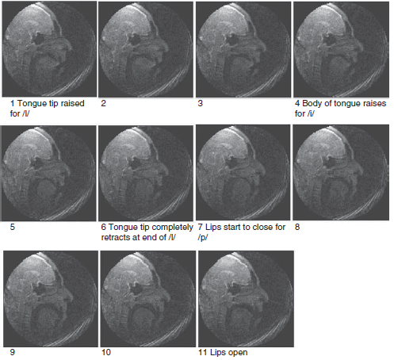

###### Figure 2.3 Sequenced MRI images of the word leap /lip/ extracted from the phrase pea leap. [The MRI images in this chapter were generously made available by Shri Narayanan of the University of Southern California Speech Production and Articulation Knowledge Group (SPAN). More MRI images (in video format with accompanying sound files) for other English sounds are available on SPAN’s website: http:// sail.usc.edu/span/mri-timit/.]

It is clear from Figure 2.3 that there is substantial co-articulation
between adjacent sounds. The tongue body is already preparing
for /i/ during the production of /l/, and the lips are already
moving into position for the /p/ during the /i/. Co-articulation is
an essential characteristic of all speech.

## 2.6 Phonetic Typology
Although English has a relatively large number of sounds,
it lacks many sounds that are found in other languages of
the world. Many of the gaps in the English IPA chart are filled
by symbols representing sounds which occur in other languages.
See Textbox 2.6 for an example of one such type of sound.

On the full IPA chart (see Sidebar 2.9), you will see a number of
new symbols that represent sounds not attested in English. For
example, the symbol [x] refers to a voiceless velar fricative, as
found in the final consonant in the German name Bach. 

There
are also places of articulation not found in English. For example,
many languages have uvular consonants, produced by the
back of the tongue coming into contact with or approximating
the uvula (the appendage which hangs down in the back of the
oral cavity). Uvular consonants are found in many languages,
such as French, which has a voiced uvular approximant as the
initial sound of rouge.

Another interesting category of sounds found in many languages
of the world are the retroflex consonants, which
are often produced with the tip of the tongue curled backwards toward the roof of the
mouth behind the alveolar ridge. One language containing this type of retroflex consonant
is Tamil, a Dravidian language spoken primarily in southern India. In this language the
retroflex consonants are described as “subapical,” since the underside of the tongue makes
contact with the roof of the mouth. 

The MRI images in Figure 2.4 compare a retroflex lateral
approximant / ɭ􀀃/ with a dental / l̪ 􀀃/ (indicated by a subscripted ̪to distinguish it from an
alveolar / l /), as produced by a Tamil speaker.

The place of articulation is much farther back in the mouth for the retroflex than for the
dental, and the tongue tip is clearly curled back during the retroflex so that the underside
of the tongue, rather than the upper surface, makes contact. For a description of some of
the methods linguists use to explore tongue position and other phonetic features of speech
sounds, see Textbox 2.5.

There are many other types of speech sounds in languages. While we cannot introduce
all of them here, there are now excellent resources for phonetics on the Internet. If you are
interested in hearing other types of sounds from the IPA, the website put together by the
great phonetician Dr. Peter Ladefoged contains links to sound files from languages examined
during years of phonetic research throughout the world: Vowels and Consonants (2nd
edition) companion website.

## TEXTBOX 2.5 INSTRUMENTAL PHONETIC TECHNIQUES
There are a number of instrumental techniques available
for learning about the phonetic properties of speech.
These include non-invasive procedures such as making
audio or video recordings to analyze acoustic features
and collecting airflow and air pressure data to study
aerodynamic properties. Other techniques for directly
analyzing articulatory gestures can be more complex
(and invasive) and include magnetic resonance imaging
(shown in Figures 2.3 and 2.4), electromagnetic
articulography, electroglottography (for studying the
larynx), and ultrasound, which is used to track tongue
position and is illustrated in the photograph below.
The book by Bryan Gick et al., cited in the Suggestions
for Further Reading at the end of the chapter, provides
an overview of a number of techniques used to gain
insight into articulatory properties of speech.

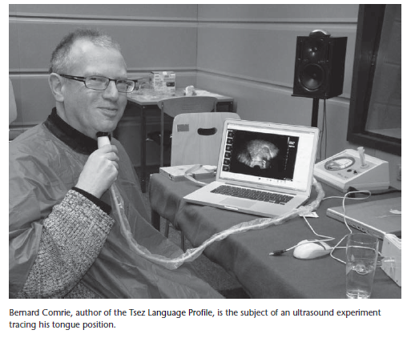

One relatively low-tech method for examining
articulation is static palatography. 

Palatography data are
collected by painting the tongue with a viscous mixture
of activated charcoal and olive oil and then producing
a sound, typically a consonant articulated somewhere
between the teeth and the soft palate. (Alternatively,
cocoa may be used instead of activated charcoal.) The
contact between the tongue and the roof of the mouth
leaves a residue of the olive oil and charcoal mixture
on the upper surface of the mouth at the point of
contact.

This contact pattern, or palatogram, can be
examined and photographed for comparison with other
palatograms, by holding a mirror under the roof of the
mouth.

The picture below contains two palatograms
illustrating a contrast between a dental stop (on the
left) and a postalveolar stop (on the right) in Ndumbea,
a language of New Caledonia whose phonetic system
is described in an article by Matthew Gordon and
Ian Maddieson (1999: 66–90). 

The palatograms are
photographs of the roof of the mouth made after the
consonant has been articulated. In the palatogram on the
left, there is black residue from the olive oil–charcoal mix
on the upper teeth, indicating that the consonant was a
dental. In the palatogram on the right, on the other hand,
the teeth are clean, indicating that the point of contact
was farther back in the mouth, in the postalveolar region.

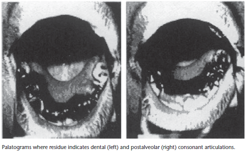

TEXTBOX 2.6 EJECTIVE STOPS
Ejective stops are common in indigenous languages
of North America. For example, Navajo, an Athabaskan
language spoken in the southwestern United States, has
ejective stops at several places of articulation.
To produce the ejective [k’], emphatically say the
English word cake without releasing the final velar stop.
While you are holding the stop closure, close your
glottis just as if you were making a glottal stop. Now
release the velar closure before releasing the glottal
stop and you should hear a popping sound much like
in the Navajo velar ejective. Sometimes it takes practice
to learn new sounds, so don’t be discouraged if you
don’t produce an ejective on your first try. Everyone
finds certain sounds easier to make than others.
Ejectives may come naturally to one person, while clicks
may come more naturally to someone else.

2.7 Suprasegmentals
In addition to describing individual speech sounds, phonetics is also concerned
with patterns over groups of sounds. Phonetic properties above
the level of individual sounds (otherwise known as segments) fall under
the heading of suprasegmentals.
2.7.1 Syllables
One unit larger than the segment is the syllable. The syllable is a
linguistic grouping that consists of a single peak, which may be
flanked on one or both sides by consonants. The syllable peak (or
nucleus) is so called because it is the most prominent (or loudest) part
of the syllable. The syllable peak typically comprises a vowel, the most prominent type
of sound. Consonants that precede the syllable peak within the syllable are referred to as
the syllable onset, while consonants that follow the peak are called the syllable coda.
Since consonants are less prominent than vowels, syllables typically first increase in prominence
(from the onset to the peak), then decrease (from the peak to the coda). Textbox 2.7
describes the less frequent occurrence of consonants as syllable peaks.
The IPA has a symbol for representing syllable boundaries. It is a period that is positioned
between syllables. For example, the name Mississippi has four syllables and would be transcribed
as [mɪ.sə.sɪ.pi].

TEXTBOX 2.7 SYLLABIC CONSONANTS
Although most syllables have vowels as the peak of the
syllable, it is also possible to have consonantal peaks.
For example, the words little and button each have two
syllables, the second of which usually does not have
a true vowel. The syllable peak in the second syllable
of little is [l] while the peak in the second syllable of
button is [n]. Both of these sounds are sonorants, the
most prominent type of consonant, so they are natural
syllable peaks. The nasal [m] can also function as a
syllable peak in English as in prism. In most varieties
of American English, [ɹ] also occurs as a syllable peak
as in learn and the second syllable of butter. In British
English, the vowel [ɜ] rather than [ɹ] is the syllable
peak in words like learn and butter, though it is often
possible to hear a rhotic coloring to the vowel.
Consonants that function as syllable peaks are known
as syllabic consonants. In phonetic transcriptions,
they are indicated by the symbol [ 􀡦􀀃] appearing under
a consonant letter, e.g. [ɹ̩], [l􀡦 ], [n􀡦 ]. You may also
encounter [ɚ] (or [ɝ]), the symbol for a rhotacized
central vowel, instead of [ɹ̩] in varieties of English, e.g.,
American English, that have syllabic [ɹ̩].

2.7.2 Stress
Another important suprasegmental property is stress. Stress is the relative prominence of different
syllables in a word. Stressed syllables typically have some combination of longer duration,
greater loudness or higher pitch relative to unstressed syllables. In languages that have stress,
there is one syllable per word that carries the main or primary stress. For example, the first
syllable in sofa carries stress, while the second syllable in relax is stressed. The IPA symbol for
primary stress is [ˈ], which goes above and to the left of the first sound in the primary stressed
syllable. The transcriptions of sofa and relax would thus be [􀞖sof􀔥] and [ri􀞖læks], respectively.

It is also possible for a word, particularly a long word, to have secondary stresses that
are not as strong as the primary stress but are stronger than completely unstressed syllables.
The IPA symbol for secondary stress is [ˌ], which goes below and to the left of the secondary
stressed syllable. To take an example of secondary stress from English, the word Mississippi
has a secondary stress on the first syllable in addition to the primary stress on the third
syllable, thus [ˌmɪ.sə.ˈsɪ. pi].
English uses stress to differentiate some pairs of words with different meanings. For example,
the word insight is stressed on the first syllable, while the word incite is stressed on the
second syllable. English has several noun and verb pairs that differ in the location of stress.
For example, the noun convert has initial stress, while the verb
convert has stress on the second syllable. Similarly, the noun import
has stress on the first syllable, while the verb import has stress on
the second syllable. We can see that in English the position of
the primary stress cannot be predicted (for more on stress crosslinguistically,
see Textbox 2.8).

TEXTBOX 2.8 STRESS SYSTEMS AROUND THE WORLD
Stress patterns display considerable diversity
cross-linguistically.
One of the major distinctions between stress systems
is whether stress falls a consistent distance from the
word edge across words of different shapes. In many
languages, the primary stress of a word falls on a
predictable syllable. For example, in Latvian, the first
syllable of a word receives primary stress, whereas in
Polish, primary stress falls on the second-to-last syllable,
also called the “penultimate” syllable, of the word.
This type of stress pattern, where the location of stress
can be predicted by its position in the word, is called
weight-insensitive stress. The three most common
locations of stress in weight-insensitive stress systems
are the initial syllable, the penultimate syllable, and
the final syllable, although other stress sites such as
the peninitial (second syllable from the left) and the
antepenultimate (third syllable from the right) are
also attested. Other languages, such as Yup’ik, display
weight-sensitive stress because they preferentially
stress intrinsically more prominent (termed “heavy”)
syllable types, e.g., syllables with long vowels or closed
syllables.
Another way in which stress systems differ crosslinguistically
is in whether they have only a single
primary stress per word or whether they place rhythmic
secondary stresses in longer words, as in the Florida
place name Apalachicola, phonetically [ˌæ.pə.ˌlæ.
tʃə.ˈkʰo.lə]. To learn more about the distribution
of stress systems cross-linguistically, the interested
reader is encouraged to refer to the four chapters and
accompanying maps (features 14–17) dealing with
stress in The World Atlas of Language Structures (http://
wals.info/feature).

2.7.3 Tone
In some languages, stress plays much less of a role than in English. This includes tone languages
(see Textbox 2.9 for a discussion of the distribution of tone languages worldwide).
In tone languages, fundamental frequency (or its perceptual correlate, pitch) plays
an important part in distinguishing between words with different meanings. For
example, in Dida, a Kru language spoken in the Ivory Coast, Africa, the same string of
segments can have different meanings depending on the tone pattern associated with the string. To take one minimal pair, the word [su] with a mid tone means ‘tree,’ while the same
sound sequence with a low tone means ‘hot.’ (Dida also has other tones besides mid and
low tone.) English does not use tone to contrast words. Rather, in English fundamental frequency
plays an important role in signaling stress and also in the last of the suprasegmental
properties to be discussed here, intonation.
TEXTBOX 2.9 TONE LANGUAGES AROUND THE WORLD
In some regions of the world the great majority of
languages have tone. This is particularly true of China,
Southeast Asia, and sub-Saharan Africa. (A discussion of
why linguistic features like tone cluster geographically
can be found in Section 13.6.) However, tone is not
restricted to these regions and, in fact, tone languages
are found in many parts of the world. To see the
distribution of tone languages, visit the excellent online
resource, The World Atlas of Language Structures, go to
the page on tone (http://wals.info/feature/13A), and
click on the “show map” button.
Tone languages include Mandarin, Cantonese,
and virtually every other Chinese language; Thai,
Vietnamese, Cambodian, and Tibetan in Southeast
Asia and the Tibetan Plateau; Zulu, Shona, Igbo,
Hausa, and Somali in Africa; Hopi and Cherokee in the
United States; Mixtec, Huave, and Otomí in Mexico;
and Kubeo and Pirahã in South America. Although
quite rare in Europe, simple tone systems are found
in Norwegian and Latvian. Two tone languages,
Manange and Seneca, are described in Language
Profiles 3 and 13.

2.7.4 Intonation
Intonation refers to the changes in fundamental frequency (pitch) that occur during a phrase
or an utterance. All languages (even tone languages) use differences in intonation patterns
to mark differences in meaning that are not conveyed by segmental differences.
For example, English statements are typically marked by a pitch fall at the end, while English
yes/no questions often have a pitch rise. The English sentence So, you don’t think that’ll work
can be uttered with either a rising or a falling pitch pattern, with very different connotations
(see Stop and Reflect 2.5). The pitch fall indicates that the speaker is summarizing the opinion
of the person he or she is talking to, whereas the pitch rise would be used to question whether
the person thinks something will work or not. Intonation patterns and their functions are
language-specific, with interesting variations across languages, as illustrated by Chickasaw in
Textbox 2.10.
STOP AND REFLECT 2.5 INTONATION PATTERNS
Relatively small differences in intonation patterns can dramatically change the connotation of an utterance.
Try figuring out the meaning when the sentence So, you don’t think that’ll work is produced with three
different intonation patterns. Several alternative pronunciations can be found in sound files on the website.
What others can you produce and what meanings do these variations convey?

TEXTBOX 2.10 INTONATION IN STATEMENTS AND QUESTIONS
Most languages of the world have falling pitch as the
unmarked intonation contour at the end of declarative
sentences. Languages display more variation in whether
they employ rising or falling intonation at the end
of questions, with the possibility that different types
of questions, for example, questions requiring a yes
or no answer as opposed to those requiring specific
information (such as when something happened), can
differ in their intonation within the same language.
Chickasaw, a highly endangered American Indian
language of Oklahoma, is typologically unusual in that
many speakers employ a rise at the end of statements
and a fall at the end of questions.

Intonation is a very complex area of phonetics since it is used for many functions. These
functions may include, among others, to signal that someone has finished speaking or is
going to continue speaking after a brief pause, to convey emotions, or to mark emphasis.
Intonation is further discussed in Chapter 10, on prosody.

CHAPTER SUMMARY
In this chapter, we have discussed articulatory phonetics, which deals with how the
vocal organs produce speech. The speech organs can be divided into three regions. The
subglottal system, which comprises the lungs and the trachea, provides the air that the
upstream articulators manipulate to produce sound. The larynx is the gateway to the
supralaryngeal system; vibrations of the vocal folds in the larynx produce voicing, which
is a key component of many speech sounds. The supralaryngeal system includes the lips,
teeth, velum, and tongue, all of which can be moved to produce different speech sounds.
These sounds can all be classified according to manner and place of articulation, voicing,
and whether they are nasal or oral. We have also learned about the ways in which speech
sounds can be transcribed using the IPA. In addition to describing individual sounds,
phonetics includes the study of suprasegmental properties such as syllable structure, stress,
tone, and intonation. Taken together, the key features of speech production introduced in
this chapter on phonetics can be used to describe the sounds of a language; examining the
patterns of behavior for sounds within a language falls within the area of phonology, the
topic of the next chapter.

EXERCISES
1. Using English prose, succinctly describe how the articulators move in the pronunciation of each of the
following words given in the left column. Then describe how the movement of the articulators changes in
the pronunciation of the word in the right column. (Hint: Pronounce these words slowly and feel how your
own articulators are moving.)
a. much muck
b. stick slick
c. shy she
d. rings reeks
e. jog dog
Example answer for pan and pat:
In pan the word begins with the lips closed and vocal cords still. After the lips are released, the vocal cords
begin to vibrate while the tongue is in a low position in the front of the oral cavity. The velum is lowered
so air passes through the nasal cavity. The tongue raises and makes contact with the alveolar ridge, closing
off the oral cavity entirely, but air continues to pass through the nose. In pat, the articulation differs in that
the velum remains raised, so the air is only expelled through the oral cavity. When the tongue contacts the
alveolar ridge, the air is fully stopped.

2. Provide succinct answers to each of the following questions:
a. How does the articulation of a nasalized vowel differ from the articulation of an oral vowel?
b. How does the articulation of a voiced stop differ from the articulation of a voiceless fricative?
c. How does the articulation of a fricative differ from the articulation of an affricate?
d. How does the articulation of a central approximant differ from the articulation of a lateral approximant?
e. How does the articulation of a labiodental fricative differ from the articulation of an interdental fricative?

3. Identify whether or not each of the following transcriptions is a word in American English. If so, write the
word. If not, make a change or changes in the transcription to produce an accurate IPA transcription of the
American English word that the transcription suggests.
Note: The symbol [ˌ] under a consonant letter means that it is syllabic; it forms the peak of the syllable, as
the orthographic vowel is not pronounced, e.g., the second syllable of center [ˈsɛntɹ̩ ].
a. [proˈdus]
b. [ˈtʃæmpjən]
c. [ˈkɹɪstl̩]
d. [ˈdʒɪngl̩]
e. [ˈspɪtʃ]
f. [əˈlaʊ]
g. [ɪmˈpeʃənt]
h. [ˈfɹæntɪc]
i. [fʌdge]
j. [heŋɹ ̩]
k. [ˈkɹiki]
l. [ˈlək]
m. [ˈshɪp]
n. [sʌppɹ ̩]
o. [ˈʃedz]
p. [ˈpætʃd]
q. [ˈkoms]
r. [ʃʌtl̩]
s. [kɪttn̩ ]
t. [yan]

4. Transcribe the following words using the International Phonetic Alphabet. Sound files of speech by
American and British speakers are available on the website.
Sound
files for
Exercise 3
a. telephone
b. yoyo
c. maneuver
d. phonetics
e. shrink
f. forget
g. slapped
h. creams
i. baked
j. loudly
k. risky
l. obvious
m. hopefully
n. cradle
o. sprinkle
p. thank
q. bathes
r. feathers
s. puppies
t. buoyant

5. Mark the positions of primary stress in the following pairs of words; sound files are available on the
website:
a. electric electricity
b. tangent tangential
c. fluid fluidity
d. pragmatic pragmatist
e. fortunate unfortunately
f. emphasis emphatic
g. mercury mercurial
h. constitution constitutionality
i. industry industrialization
j. fantastic fantastical

6. Transcribe the following words using the IPA. Be sure to listen carefully to the words so as not to be misled
by standard English orthography. Mark the primary stress; sound files are available on the website.
a. paper
b. ride
c. kitchen
d. lemony
e. violet
f. measure
g. yes
h. honorable
i. attacked
j. cupid
k. good
l. crushed
m. button
n. yearling
o. philosophy
p. chunkier
q. bathes
r. bath
s. ploughed
t. chef
u. thought
v. contribute
w. machine
x. Celtic
y. whale
z. jelly

7. Indicate which of the four alternative transcriptions represents an accurate IPA transcription of the given
word.
a. phones
i. [phons]
ii. [fons]
iii. [fonz]
iv. [fonez]
b. attract
i. [aˈtrækt]
ii. [əˈtɹækt]
iii. [ʌˈtrækt]
iv. [əˈtræct]
c. beauty
i. [byuti]
ii. [ˈbyuti]
iii. [ˈbjuti]
iv. [ˈbjuɾi]
d. singer
i. [ˈsɪŋɹ̩ ]
ii. [ˈsingɹ̩ ]
iii. [singr̩ ]
iv. [siŋger]
e. otherwise
i. [ˈʌθɹ̩ waɪse]
ii. [ˈʌθɹ̩ waɪz]
iii. [ˈʌðɹ̩ waɪz]
iv. [ˈʌðɹ̩ wayz]
f. spiked
i. [spaiked]
ii. [spaɪkt]
iii. [spaykt]
iv. [spikt]
g. xray
i. [ˈɛksray]
ii. [ˈeksɹe]
iii. [ˈexre]
iv. [ˈexɹe]

8. The International Phonetic Alphabet was developed in the late nineteenth century by language teachers in
France interested in creating a transcription system for teaching the pronunciation of foreign languages.
Since its origination, the phonetic alphabet has been dramatically expanded to include sounds found in
languages throughout the world, with the goal of representing all the sounds that are used to differentiate
words in all languages. In addition, the group responsible for developing the IPA, the International
Phonetic Association, has grown substantially and now has thousands of members throughout the world.
Besides developing and maintaining the phonetic alphabet, the International Phonetic Association also
produces a journal containing research articles on phonetics and phonetic descriptions of languages. The
Journal of the International Phonetic Association (or JIPA) was originally published exclusively using the IPA,
although it now publishes articles primarily in English. Below are two versions, one in American English
and one in British English, of a brief passage (in the IPA) from a fable that has been translated into many
different foreign languages in JIPA. Read it aloud and write the passage in standard English orthography.

American English
ðə noɹθ wɪnd ænd ðə sʌn wɹ̩ dəspjuɾəŋ wɪtʃ waz ðə stɹaŋgɹ̩, wɛn ə tɹævəlɹ̩ kem əlaŋ ɹæpt ɪn ə waɹm klok.
ðe əgɹid ðæt ðə wʌn hu fɹ̩st səksidəd ɪn mekəŋ ðə tɹævəlɹ̩ tek hɪz klok af ʃʊd bi kənsɪɾɹ̩d stɹaŋgɹ̩ ðæn ðə
ʌðɹ̩. ðɛn ðə noɹθ wɪnd blu æz haɹd æz hi kʊd, bʌt ðə moɹ hi blu ðə moɹ klosli dɪd ðə tɹævəlɹ̩ fold hɪz klok
əɹaʊnd hɪm; ænd æt læst, ðə por noɹθ wɪnd gev ʌp ðə ətɛmpt. ðɛn ðə sʌn ʃaɪnd aʊt waɹmli, ænd əmiɾiətli
ðə tɹævəlɹ̩ tʊk af hɪz klok. ænd so ðə noɹθ wɪnd waz əblaɪdʒd tu kənfɛs ðæt ðə sʌn wʌz ðə stɹangɹ̩ ʌv ðə tu.

British English
ðə nɔθ wɪnd ænd ðə sʌn wɜ dəspjutəŋ wɪtʃ wɒz ðə stɹɒŋgɹ̩, wɛn ə tɹævələ kem əlɒŋ ɹæpt ɪn ə wɔm
klok. ðe əgɹid ðæt ðə wʌn hu fɜst səksidəd ɪn mekəŋ ðə tɹævələ tek hɪz klok ɒf ʃʊd bi kənsɪdɜd stɹɒŋgɹ̩
ðæn ðə ʌðɜ. ðɛn ðə nɔθ wɪnd blu æz hɑd æz hi kʊd, bʌt ðə mɔ hi blu ðə mɔ klosli dɪd ðə tɹævələ fold
hɪz klok əɹaʊnd hɪm; ænd æt læst, ðə nɔθ wɪnd gev ʌp ðə ətɛmpt. ðɛn ðə sʌn ʃɔn aʊt wɔmli, ænd
əmidiətli ðə tɹævələ tʊk ɒf hɪz klok. ænd so ðə nɔɵ wɪnd wɒz əblaɪdʒd tu kənfɛs ðæt ðə sʌn wɒz ðə
stɹɒngə ɒv ðə tu.
9. This exercise asks you to phonetically transcribe a short stretch of natural connected speech. For American
English, the How Languages Work website includes a video clip of Daniel Hieber, a UC Santa Barbara
doctoral student in linguistics, presenting a prize-winning three-minute talk on revitalizing the Chitimacha
language. For British English, a set of BBC radio programs on language matters in different locations around
the world produced by British anthropologist Dr. Mark Turin, can be found at http://markturin.arts.ubc.ca/
bbc-series/. Alternatively, you can choose a different clip, but make sure it is: (1) publically accessible on the
Internet with a simple URL and not in a site that is password-protected or requires an account; and (2) of
good quality with clearly audible speech (excluding singing) by a single person. Choose a short segment of
the recording consisting of at least 25 spoken words.
a. Provide the URL where you found your clip and any additional details needed to direct your instructor
to the specific clip that you used.
b. Note the start and end times of your clip in minutes and seconds.
c. Transcribe that stretch of speech in normal English spelling.
d. Transcribe the words using the IPA. If there is more than one intonation unit, you may place them on
separate lines.
e. Make a list of the first sound from each word and describe those sounds in articulatory terms: place,
manner, and voicing (for consonants) or height/backness/rounding/tenseness (for vowels).
Example
a. https://hlw.id.ucsb.edu/ch02/index.html
b. Starts at 0:25; ends at 0:32
c. I want you to imagine for a moment what that’s like – to be the last speaker of your language, knowing that
when you pass away, your language will fall silent.
d. [aɪ wantʃ ju tu əˈmædʒɪn foɹ ə ˈmomənt wʌt ðæts laɪk, tə bi ðə læst ˈspikɹ̩ əv joɹ ˈleŋgwədʒ ˈnowɪŋ
ðæt wɛn ju pæs əˈwei yoɹ ˈleŋgwədʒ wɪl fal ˈsaɪlənt]
e. First sound of each word:
n: voiced alveolar nasal stop
a1: diphthong – low central lax unrounded vowel moving to a high front lax unrounded vowel
w: voiced labiovelar central approximant
j: voiced palatal central approximant (glide)
etc.

10. Find a speaker of a language which you have never spoken or studied and ask if they would be willing
to pronounce some words for you. Transcribe the words for the parts of the hand: hand, palm, finger,
fingernail, knuckle, wrist, and any other vocabulary the language might have. (It can be particularly
interesting to ask for the words for each finger – pinky finger, ring finger, etc. – as these are often
compounds with interesting meanings.) Do your best to transcribe each word in IPA. Be sure to mark any
stress, tone, length, and/or nasalization that you hear.
If you come across a sound you haven’t heard before, try to produce it yourself, using the speaker’s
feedback to improve your pronunciation. Then pay close attention to the positioning of your articulators
and describe the sound using the descriptors for place of articulation, manner of articulation, voicing,
vowel height, vowel backness, rounding, and tenseness. You can use the IPA chart in this book and
the interactive IPA chart online as an additional resource. Your report on this study should include the
following:
a. Name of the language
b. Name of your speaker
c. One paragraph biography of the speaker (where they grew up, schooling, what other languages they
learned, when)
d. At least ten words transcribed in IPA, with the English translations in single quotation marks
e. Phonetic descriptions of any sounds that are not also found in English, together with their associated
IPA symbols.

Note: This is a challenging exercise for someone who is just beginning to study linguistics. The goal is to
expose you to other languages, to give you the experience of working with a speaker of a language that
is unknown to you, to teach you to listen carefully, and to begin to train you to hear and produce sounds
in other languages. We don’t expect perfect accuracy, but do your best! If you go on to study more
linguistics, you may have an opportunity to do a fuller study of this type in a course on phonetics.

Note: This is a challenging exercise for someone who is just beginning to study linguistics. The goal is to
expose you to other languages, to give you the experience of working with a speaker of a language that
is unknown to you, to teach you to listen carefully, and to begin to train you to hear and produce sounds
in other languages. We don’t expect perfect accuracy, but do your best! If you go on to study more
linguistics, you may have an opportunity to do a fuller study of this type in a course on phonetics.

3 Phonology
Organization of Speech Sounds
KEY TERMS
- Natural class
- Minimal pair
- Phoneme
- Near minimal pair
- Allophone
- Complementary distribution
- Contrastive distribution
- Phonological rule
- Free variation
- Allomorphy
CHAPTER PREVIEW
Phonology is the study of how sounds systematically behave. We will see in this chapter that
sounds often pattern together in groups with respect to where they occur and how they interact
with other groups of sounds. We will learn how to analyze the phonological systems of languages
by examining the distribution of sounds in words. We will see that sounds have different statuses
in language: some sounds (called phonemes) differentiate meanings while other sounds (called
allophones) do not. These and other complex sound patterns can be represented by formal
phonological rules. We will also explore some of the competing phonetic motivations driving
phonological patterns. This will allow us to understand the ways in which phonological rules are
grounded in both the phonetic and the functional bases of human language.
LIST OF AIMS
At the end of this chapter, students will be able to:
- identify natural classes of sounds;
- find minimal and near-minimal pairs in a data set;
- locate sounds in complementary distribution;
- describe the environments in which allophones occur;
- argue for the phonemic status of sounds of a language;
- compare and contrast allophonic and allomorphic variation;
recognize common phonological processes;
- discuss functional and phonetic reasons for allophones.
3.1 Natural Classes
The notion of groups or classes of sounds was introduced earlier in Chapter 2. For consonants,
we saw that phonetic features describing voicing and place or manner of articulation
can be used to divide sounds into groups. For example, the alveolars of English are [t, d, n,
s, z, ɹ, l], while the nasals of English are [m, n, ŋ]. For vowels, phonetic terms for height,
backness, tenseness, and rounding can be used to divide vowel sounds into classes. Thus, [i,
ɪ, e, ɛ, æ] are front vowels and [i, e, u, o] are tense vowels.
These same phonetic features can be used to describe groups of sounds that
behave together in a phonological system. Groups of sounds
that pattern together are called natural classes. Recall the discussion
of the forms of the English past tense from Chapter 1.
We saw that the past tense of regular verbs in English is formed
through addition of the suffix spelled -ed in the orthography.
Phonetically, the -ed suffix has three realizations. One realization
is as a voiceless alveolar stop [t] in such words as walked [wakt],
trapped [tɹæpt], washed [wa􀝕t], laughed [læft], and poached [pot􀝕t].
Another realization is as a voiced alveolar stop in words such
as rubbed [􀝋ʌbd], wagged [wægd], buzzed [bʌzd], judged [d􀝤ʌd􀝤d],
rhymed [􀝋a􀜼md], and planned [plænd]. The third realization is to
pronounce -ed as [􀔥d] in words like seated [sitəd/siɾəd] (depending
on your dialect), baited [bet􀔥d/beɾəd], padded [pædəd/pæ􀝐əd], needed [nidəd/niɾəd],
rented [ɹɛnt􀔥d], and landed [lændəd].
The choice of how to pronounce the past-tense suffix when associated with a particular
word is not an arbitrary or unpredictable one that requires rote memorization of the past
tense for every English word. Rather, there is a pattern that governs the selection of the
realization. The [t] realization is used when the base verb form (or root) ends in a voiceless
consonant, the [d] realization with verb roots ending in a voiced consonant, and the [əd]
variant with verb roots ending in an alveolar stop (or, in American English, a flap).
The relationship between the root-final consonant and the selection of a past-tense
variant is sensible from a phonetic standpoint. The realization [t] is voiceless, as are the
consonants that trigger the [t] past tense; the realization [d] is voiced, as are the consonants
that trigger the [d] past tense. The general pattern is thus one of voicing agreement
between the root-final consonant and the past-tense suffix. Voicing harmony is one type
of assimilation process, whereby two sounds come to share some property or cluster
of properties. Assimilation is the most common type of phonological process and
comes in many guises, for example, place-of-articulation assimilation, manner assimilation,
nasal assimilation, and rounding assimilation. Like other assimilation phenomena,
voicing assimilation is phonetically motivated. It is articulatorily easier to maintain
the same laryngeal setting (either voiced or voiceless) throughout the entire cluster that consists of the root-final consonant and the past-tense suffix than it is to rapidly change
from voiced to voiceless or vice versa.
The final realization [əd] also has phonetic grounding. It would be difficult to produce the
past-tense alveolar stop immediately after another alveolar stop or flap without an intervening
vowel. The schwa [ə] is the perfect “filler vowel” for such cases, because it requires
relatively little phonetic effort since it is produced with the tongue near its resting position.
The variation in the realization of the past-tense suffix illustrates one of the fundamental
principles guiding many phonological alternations: the drive toward minimizing articulatory
effort. Both voicing assimilation and schwa insertion reduce the amount of articulatory
exertion required to produce the past-tense form of English verbs. As your study of
phonology progresses, the attempt to minimize articulatory effort will emerge as a recurring
theme in the organization of phonological systems. The goal of the phonologist is not
merely to describe the patterns found in languages but also to explain the forces motivating
these patterns, which are often (though not always) phonetically driven.
Given the importance of phonetic considerations in shaping phonological systems, it is
not surprising that natural classes play a crucial role in the study of phonology. Consequently,
recognizing natural classes is an important analytical skill to develop. In order for a set of
sounds to form a natural class, two criteria must be met: first, the sounds must all
share one or more phonetic features; second, the sounds must be the complete set
of sounds sharing those features in the given data. To demonstrate the application of
these two criteria, consider the IPA chart for English consonants in Table 3.1.
Keeping in mind the two criteria for a natural class, consider the following sets of consonants
and determine whether or not they constitute natural classes.
1. p t k ʔ
2. m n ŋ
3. t d n ɾ s l ɹ
4. b m

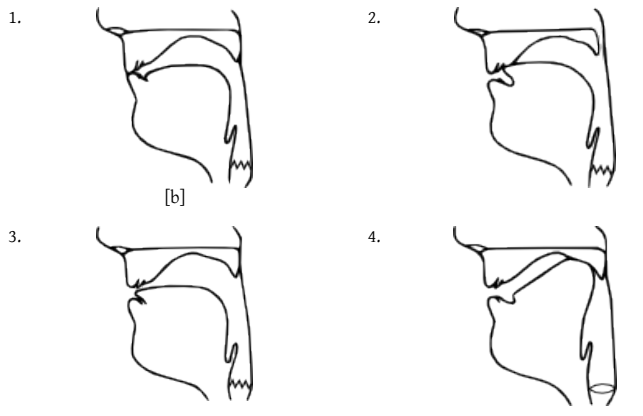

The first group of sounds satisfies the first condition for being a natural class, since all
of the sounds are voiceless stops. They also meet the second criterion, since the data set
comprises the entire set of voiceless stops in the English IPA chart. Set (1) is thus a natural
class. Notice that we need the two phonetic features “voiceless” and “stop” to correctly
define this natural class. If we said only that the natural class is the set of voiceless sounds,
this would not be adequate since there are many voiceless sounds in the data set that are
not in Set (1), e.g., the voiceless fricatives. Nor could we simply describe the natural class as
“stops,” since Set (1) is missing all of the voiced stops, both oral and nasal.
The second group of sounds also satisfies the first condition since all of the sounds are
nasals. Set (2) also meets the second condition, since the sounds constitute the entire group
of nasals in the data set.
The third group is a little trickier. It is true that the sounds in Set (3) satisfy the first
condition for being a natural class, since they are all alveolars. However, Set (3) is not an
exhaustive set of the alveolars in the data: it is missing [z]. For this reason, the third group
is not a natural class.
The fourth group is a small set of sounds, which have in common that they are voiced
bilabial stops. Set (4) is also the complete set of voiced bilabial stops in English, so we have
a natural class. Notice that we need all three descriptive features, “voiced,” “bilabial,” and
“stop,” to describe this natural class. The omission of any of these descriptors would mean
that the second criterion for being a natural class, that the sounds be an exhaustive set for
the given data, would not be met.
STOP AND REFLECT 3.1 NATURAL CLASSES IN ENGLISH
Use the two criteria of sharing one or more phonetic features and of comprising all of the sounds with those
features in the language to determine whether the following groups of consonants constitute natural classes
in English. You can check your answers in Sidebar 3.2 on the next page.
a. ɹ, l
b. g, ŋ, w
c. p, b, t, d, k, g
d. v, ð, ʒ
e. ʃ, ʒ, tʃ, dʒ
The requirement that a natural class be the exhaustive set of sounds sharing the specified
features for a given data set means that the same set of sounds can be a natural class
in one language but not in another language. Consider the inventory of consonants in
Chickasaw, an American Indian language spoken in Oklahoma (Table 3.2).
Most of the consonants in Chickasaw also occur in English, with the exception of the
voiceless lateral fricative [ɬ]. This sound is similar to the lateral approximant [l], except that
[ɬ] is voiceless and is produced with turbulence at the constriction point. It has a sound
much like that of English [l] when it occurs immediately after a voiceless stop, such as in
the word play.

Consider the following set of sounds: [p, b, t, k, 􀝦]. In English, this set of sounds would
not be a natural class; it is missing [d] and [g], which would be necessary to form the complete
set of oral stops in English. However, this same set of sounds is a natural class for
Chickasaw, since it is the exhaustive set of Chickasaw oral stops.
Now let us consider the set of sounds [t, s]. These sounds have in common that they are
voiceless. This is insufficient for describing a natural class in either English or Chickasaw,
however, since there are other voiceless sounds in both languages. If we add the feature
“alveolar,” we fare better in English at least, since [t, s] is the exhaustive set of English
voiceless alveolars. However, [t, s] still does not constitute a natural class in Chickasaw,
since Chickasaw has a third voiceless alveolar that English does not, namely the voiceless
alveolar lateral fricative [ɬ]. For this reason, [t, s] is a natural class in English but not in
Chickasaw.
3.2 Phonemic Analysis
3.2.1 Phonemes and Minimal Pairs
Different kinds of phonological relationships can hold between sounds in a language.
First, some sounds can be used to distinguish words with different meanings. For
example, the voiceless bilabial stop [p] and the voiceless alveolar stop [t] in English can be
used to differentiate words. There are thus many pairs of words such as pan vs. tan, pill vs. till,
spill vs. still, pop vs. pot, and lip vs. lit, which are differentiated only by whether they have [p]
or [t] in a particular position. The occurrence of these sounds is unpredictable and simply an
arbitrary property of individual words. In other words, speakers must memorize each word as
having either [p] or [t] in the proper place. This is different from the situation with the English
past-tense suffixes, where one could predict the past-tense realization based on the root-final consonant. There is no need for speakers to memorize the past-tense form of each word, with
the correct variant of the past-tense suffix.
STOP AND REFLECT 3.2 PHONEMES ARE UNPREDICTABLE
In English, [p] and [t] distinguish words with different meanings. Thus, we cannot predict which sound will
occur in a particular environment. For example, consider the environment [__ost] (written in IPA). Will this
word begin with [p] or [t]?
Both sounds work equally well in this environment. Using [t] will give us toast, while [p] will give us post.
Thus, the occurrence of [p] and [t] is unpredictable in English.
Pairs of words like pan vs. tan, pill vs. till, spill vs.
still, pop vs. pot, and lip vs. lit are called minimal pairs.
Minimal pairs consist of two words which have
different meanings and differ in only one sound
occurring in the same environment. In this case, the
minimal pairs differ only in the presence of [p] or [t] in
a certain position in the word. In the first two pairs, pan
vs. tan and pill vs. till, [p] and [t] occur word-initially. In
spill vs. still, [p] and [t] occur between [s] and [ɪ]. In the
last two pairs, pop vs. pot and lip vs. lit, [p] and [t] occur
word-finally.
Minimal pairs can be found for many different pairs of sounds in English. For example,
the minimal pair rain vs. raid differs only in the final consonant, [n] vs. [d]; the minimal
pair boot vs. suit differs only in the initial consonant, [b] vs. [s]; the minimal pair seat vs. sit
is differentiated only by the vowel, [i] vs. [ɪ]; and the minimal pair made vs. mood is distinguished
only by the vowel, [e] vs. [u].
It is also possible to find minimal triplets, in which three words are distinguished by a
single sound, e.g., made [e] vs. mood [u] vs. mode [o]. In English, one can even find quadruplets
(e.g., seat vs. sit vs. sat vs. suit) as well as sets consisting of even more members that
are distinguished by single sounds. All of these minimal sets are useful for illustrating
that certain sounds in a language are used to differentiate words.
The requirement that minimal pairs have a single sound difference in the same environment
excludes certain pairs of words from constituting minimal pairs. For example, the pair
of words mat [mæt] and mole [mol] are not a minimal pair. Even though these words have
different meanings and even though the first consonant is the same in both words, they
differ with respect to two sounds: the vowel and the final consonant. The pair of words slot
[slat] and late [let] is also not a minimal pair, since there are two sound differences between
the words. The first word has an [s] not present at the beginning of the second word, and the
vowels in the two words also differ. Finally, even though there is only one sound difference
between the two words pat and nap, they are not a minimal pair since the sounds that differ
occur in different environments.

STOP AND REFLECT 3.3 MINIMAL PAIRS PRACTICE
Determine whether each of the following pairs of words constitutes a minimal pair. You can check your
answers in Sidebar 3.3 on the next page.
1. sled vs. slayed
2. face vs. case
3. hot vs. shot
4. grout vs. clout
5. remain vs. restrain
6. singer vs. finger
7. stamper vs. scamper
8. devil vs. revel
9. attack vs. aback
The concept of minimal pairs is important in phonology, since minimal pairs demonstrate
the contrastive nature of sounds. Thus, [p] and [t] are contrastive, as they contrast
words with different meanings. The sounds [n] and [d], [e] and [u], and so on, are also
contrastive. Sounds that are used to contrast words with different meanings have a
special status in phonology: they are called phonemes. Phonemes form the building
blocks of minimal pairs (or minimal sets of words). For this reason, changing the phonemes
in a word often produces completely different words. For example, if you replace the [p]
in the beginning of pile with a [t], the result is a different word, tile. Phonemes are thus an
arbitrary property of individual words: in order to know a word, you must know which
phonemes occur in it and how they are ordered.
Given the relationship between minimal pairs and phonemes, we can use minimal pairs
to diagnose whether or not sounds are phonemes in a language. If two sounds in question
are phonemes, we expect to find minimal pairs differentiated only by the two target
sounds. In reality, though, sometimes it is not possible to find perfect minimal pairs differentiated
by only a single sound for every phoneme. Sometimes it is necessary to settle
for near-minimal pairs. To illustrate the usefulness of near-minimal pairs, consider the
pair of sounds [ð] and [􀝤] in English. It is difficult to find minimal pairs to demonstrate the
phonemic status of these two sounds in English. One possible minimal pair is bathe vs. beige
in which the relevant contrast occurs in final position.
However, some speakers pronounce the second word with a voiced postalveolar affricate
[d􀝤] rather than the fricative [􀝤]. For these speakers, there are probably no true minimal
pairs for [ð] and [􀝤]. Does this mean that these two sounds are not separate phonemes in
English? No, because it is possible to find a near-minimal pair for the two sounds: leather
vs. pleasure. Clearly, this is not a minimal pair as there is more than one difference between
the two words. Not only do the words differ in whether they have a [ð] or a [􀝤], but pleasure
also has an extra sound at the beginning of the word that leather does not. Still, pleasure and
leather qualify as a near-minimal pair, since the sounds immediately adjacent to the target
sounds, [ð] and [􀝤], are the same in both words: [ɛ] before the target sound and [ɹ] (American English) or [ɜ] (British English) after it. Like minimal pairs, near-minimal pairs are usually
sufficient to demonstrate that two sounds are separate phonemes in a language.
3.2.2 Allophones and Complementary Distribution
Phonemes have different phonetic realizations depending on where they occur. For
example, [p] is not pronounced identically in the words pin and spin. If you hold your hand
in front of your mouth while saying the two words, you will notice that the [p] in pin has
a very clear puff of air upon release, while the [p] in spin largely
lacks this salient puff of air. The puff of air associated with the
[p] in pin is called aspiration. The [p] in pin is thus an aspirated
stop, represented as [p􀞀] in the IPA. A [p] occurring immediately
after an [s], as in spin, on the other hand, is an unaspirated stop
and is simply represented as [p].
Aspiration, in fact, is a regular feature of voiceless stops in
English when they occur in word-initial position. As with the
bilabial stop in spin, the alveolar and velar stops [t] and [k] also
have variants differing in aspiration depending on context.
Thus, we have aspirated stops word-initially in take and come but
unaspirated stops after [s] in stake and scum.
Crucially, the [p] in both pin and spin is associated with the
same phoneme in English, since there are no minimal pairs differentiated
solely on the basis of whether they have unaspirated
[p] or aspirated [p􀞀] in the same position. Rather, the two kinds of
[p] are variants of each other that are predictable from the context.
When [p] occurs word-initially, it will always be aspirated;
when [p] occurs after [s] it will always be unaspirated. Therefore,
there is no need to memorize whether a given word has an aspirated
or an unaspirated [p], since aspiration is predictable from
the context. The relationship between aspirated and unaspirated
[p] in English is an allophonic one, in which aspirated [p􀞀] and
unaspirated [p] are allophones of the same phoneme. Two
sounds are allophones if they occur in mutually exclusive environments, i.e., if one
allophone occurs in one set of contexts and another allophone occurs in another
set of contexts. Stop and Reflect 3.4 illustrates this by demonstrating that the occurrence
of allophonic variants is predictable. There is no single environment in which both allophones
can occur. This basic criterion for allophones is called complementary distribution.
So far we have seen that pairs of sounds may occur in two types of distribution. One
possibility is for two sounds to have a contrastive distribution, meaning that they can
occur in the same environment, in words with different meanings. This describes the type
of distribution found in minimal pairs, which proves that two sounds are separate phonemes.
The second type of distribution is complementary distribution, which arises
when two sounds occur in a different set of environments from each other. Complementary
distribution indicates that two sounds are allophones of the same phoneme.

STOP AND REFLECT 3.4 ALLOPHONES IN COMPLEMENTARY DISTRIBUTION
ARE PREDICTABLE
Can you predict whether the voiceless stops in the following words will be aspirated or unaspirated?
1. pore
2. tore
3. core
4. pool
5. tool
6. cool
7. spore
8. store
9. score
10. spool
11. stool
12. school
You can check your answer by pronouncing each word with your hand in front of your mouth. Notice that
words 1–6 all have the puff of air referred to as aspiration while words 7–12 do not.
Now consider two nonsense words: tobe and stobe. Can you predict which will have an initial aspirated
stop and which will have an unaspirated stop? Check your answer by pronouncing each of these two words.
If your prediction was that the stop in tobe would have aspiration and stobe would not, you were right. Any
word, even a nonsense word, will conform to the pattern we’ve established. This is why we say that the
presence of aspiration on voiceless stops in English is predictable.
In phonology, there are conventions for representing phonemes and allophones. It is
customary to represent separate phonemes between slashes // and allophones in brackets
[ ]. Brackets are also used in order to remain neutral about whether a sound is a phoneme
or merely an allophone; for example, if you are examining new data and haven’t yet determined
the status of a sound, or if the status of a sound as a phoneme vs. an allophone is not
crucial to the point being made.
We may now summarize the relationship between the sounds [p], [p􀞀], [t], and [t􀞀]. (Notice
that I am using the brackets here for a moment in order not to anticipate the conclusion
about their phonemic statuses.) We have seen that [p] and [t] are in contrastive distribution,
since they occur in the same position in minimal and near-minimal pairs. We have
also learned that aspirated stops are in complementary distribution with unaspirated stops,
since they occur in different environments and do not form the basis for minimal pairs. The
relationship between the four sounds can thus be represented as in Figure 3.1.
Figure 3.1 shows that the phoneme /p/ (written in slashes) has two allophones: an unaspirated
allophone occurring after [s] and an aspirated allophone occurring word-initially.

Likewise, the phoneme /t/ has two allophones: an unaspirated allophone occurring after
[s] and an aspirated allophone occurring word-initially. Note that it is common for one of
the allophones of a phoneme to be identical to the phoneme itself, just as is the case with
each of the unaspirated allophones here. The phoneme that is associated with the allophones
is often termed the underlying phoneme, while the other allophones linked to
the phoneme are often called the surface allophones. The assumption here is that words
are memorized with the underlying phonemes, since this information is unpredictable and
must be learned for each word. The surface forms then arise through a process or series of
processes that give the underlying phonemes their actual phonetic realizations.
The phonemic status of the same sound (i.e., whether it is a separate phoneme or
an allophone) may differ from language to language. To demonstrate this, let us consider
some data from Hupa, an American Indian language spoken in northwest California
(Table 3.3). The sounds whose phonemic status are in question are the pair [t] and [t􀞀] and the
pair [ɪ] and [u]. Some of the special symbols used are explained in Textbox 3.1.

TEXTBOX 3.1 SOME HUPA PHONETIC SYMBOLS
- An apostrophe after a stop or affricate means that it
is an ejective.
- [ʍ] indicates a voiceless labial-velar fricative, like the
wh that some English speakers pronounce in words
like why and which.
- [ʷ] in ‘he is crying’ indicates that the preceding
sound has lip rounding associated with it.
- [ː] after a vowel indicates that the vowel is
pronounced as lengthened.
- [ɬ] indicates a voiceless lateral fricative.

First, looking at the pair [t] and [t􀞀], it is clear that they are
separate phonemes since your mouth and your father form a
perfect minimal pair for these two sounds. Furthermore, three and sweathouse both form a near-minimal pair with how, since three and sweathouse
both begin with an aspirated [th] before the vowel [a] and how begins with an unaspirated
[t] in the same environment. We thus conclude that unaspirated [t] and aspirated
[t􀞀] are separate phonemes in Hupa, whereas in English, they are allophones of the
same phoneme. This difference between the status of the sounds in English and in
Hupa is illustrated in Sidebar 3.5.
Turning to [ɪ] and [u], we know that these sounds are separate
phonemes in English on the basis of minimal pairs such
as sit vs. suit and tin vs. tune. In Hupa, however, we do not
find minimal pairs differentiated only by these two vowels.
Nor are there are any near-minimal pairs for [ɪ] and [u] in the
data above. This can be determined by creating a chart with
the environments in which each of the target sounds occur. In
making such a chart, it is important to include both the sound
immediately preceding the target sound and the sound immediately
following it. A chart for the target vowels [ɪ] and [u] in the Hupa data is given in
Table 3.4. The line between the preceding and following sounds is a placeholder for the
target sound.
If there were a minimal or near-minimal pair in the data, we would be able to find an
environment in Table 3.4 that was identical for the two target sounds; however, this is
not the case. Therefore, we do not have a contrastive distribution and the two sounds
are not separate phonemes; [ɪ] and [u] thus stand in a different relationship in Hupa
than in English. By process of elimination, this means that [ɪ] and [u] are allophones
of the same phoneme in Hupa. If this is in fact true, they should be in complementary
distribution, meaning that we should be able to find a different set of environments
for each of the two sounds. To do this, we must ask whether there is any environment
in which one sound occurs throughout the data, to the exclusion of the other sound.

Keep in mind that this environment can involve either the
preceding or the following sound, or both, and also that the
environment could be expressed in terms of a natural class.
In fact, in Table 3.4, we can see that the [u] always occurs
before a labial-velar sound, while the [ɪ] never occurs in this
environment. We thus conclude that [ɪ] and [u] are in complementary
distribution. It is typically easier to characterize the
environment for one of the target sounds than for the other. In
this case, it is easier to describe the environment in which [u]
occurs, since the positions in which [ɪ] occurs are quite diverse. It is sufficient to give the
environment for [u] and to state that [ɪ] occurs “elsewhere,” meaning that it occurs in the
environments in which [u] does not occur.
As a final step in our analysis, we need to formulate a summary statement of the relationship
between the target sounds in the language. This statement might be as follows:
In Hupa, [ɪ] and [u] are allophones of the same phoneme. [u] occurs before labial-velars
and [ɪ] occurs elsewhere.
We might want to take the analysis one step further and decide which of the allophones
is the underlying phoneme and which are the surface allophones. It is common to
assume that the allophone that occurs in a more diverse set of environments (i.e., in the
“elsewhere” set of contexts) is the underlying phoneme, and to derive the other allophone(
s) by a rule. For the Hupa data, this would mean that /ɪ/ is the underlying phoneme
and that [u] occurs before labial-velars. Our final analysis might thus be expanded
as follows:
In Hupa, [ɪ] and [u] are allophones of the same phoneme. /ɪ/ is the underlying phoneme.
/ɪ/ becomes [u] before labial-velars.
Once you have an analysis of phonemic data, it is also possible to make predictions about
further data that you might not yet have seen. For example, after it has been determined
that [ɪ] and [u] are allophones in Hupa and that [u] occurs before labial-velars, we can predict
that any new Hupa data should conform to these generalizations. Thus, we should not
find any examples of an [ɪ] sound before a labial-velar consonant. In fact, there is an even
more interesting prediction that we can make for Hupa. You may recall that Hupa has a
labialized velar fricative [x􀞇], which occurred in the form [tax􀞇eːt] ‘how.’ This sound is similar
to the German sound at the end of the composer Bach’s name, but also has lip rounding.
Given that [x􀞇] is both labial and velar, we would expect it to trigger the [u] allophone. This
prediction can be easily tested. The name that the Hupa use for themselves is [naːtʰ􀜼nux􀞇],
which literally means ‘where the trail leads back.’ (The root for ‘trail’ [tʰ􀜼n] appeared earlier
in Table 3.3.) As expected, there is an [u] before the final [x􀞇], providing further evidence
for our assimilation rule and our proposed phonetic explanation for it. This is one example
of a local phonological process; some non-local phonological processes are described in
Textbox 3.3.

3.2.3 Writing Phonological Rules
The statement about the change from underlying /ɪ/ to surface [u] in Hupa can be written
more formally as a rule using features, as in (1).
(1) /ɪ/ 􀄺 [u] / __ [+labial-velar]
Rule (1) is read as follows: /ɪ/ becomes [u] in the environment before sounds that are
labial-velar. It is common in phonology to formalize relationships between phonemes
and allophones using rules. The Hupa rule of vowel rounding targets a single sound,
the vowel /ɪ/. As we have seen, allophones often refer to sets of sounds that constitute
natural classes. The environment that triggers rounding in Hupa is the natural class of
labial-velar consonants. Natural classes of sounds targeted by a rule can also be expressed
in rules using features. For example, members of the set of voiceless stops in English are
realized with aspiration in word-initial position. Aspiration can be written using features
as in (2).
(2) [+stop, −voice] 􀄺 [+aspirated] / # __
Rule (2) targets English sounds characterized by the features [+stop] and [−voice], changing
them to their [+aspirated] counterparts in the environment after a word boundary, written
with a # sign. Another way to write this rule is to replace the feature [+stop] with the feature
[−continuant]. Sounds that are [−continuant] are produced with a complete closure in the
oral tract. Sounds fitting this description include both the oral and the nasal stops. If you
continue in phonology, you will learn more about the features used by phonologists to write
rules. In some instances, as is the case for stops, phonological features differ from phonetic
features. The reason for the occasional divergence between phonetic and phonological features
lies in the differing goals of phoneticians and phonologists. Phoneticians are primarily
interested in providing an accurate and maximally transparent description of sounds,
whereas phonologists are focused on describing the patterning of sounds in a language in as
succinct a manner as possible.
It is helpful to become accustomed to reading and writing phonological rules. Further
examples of rules are given in Textbox 3.2; there is also a guide to rule writing available on
the website.
3.2.4 Functional and Phonetic Reasons for Allophones
While our analysis of the Hupa vowels may be sufficient for most purposes, it is also worthwhile
to take a step back to ponder why this alternation might be taking place. In this
case, the motivation is clearly phonetic in nature. Labial-velar sounds are produced with
lip rounding, just like the allophone [u]. It is natural for an unrounded vowel to assimilate
in rounding to an adjacent consonant with lip rounding. It is also natural for the vowel
adjacent to the labial-velar to be pronounced with a backer articulation, since a labial-velar
has a velar component. The conversion from /ɪ/ to [u] before labial-velars in Hupa is thus a
phonetically natural process of assimilaton.

TEXTBOX 3.2 EXAMPLES OF PHONOLOGICAL RULES
Phonological rules are simple notational equivalents
of what could be written in prose. They allow for a
succinct characterization of phonological patterns
and a clear presentation of the essential facts. Several
types of rules are given below with their prose
equivalents.
/i/ 􀄺 [j] /______ V
“The phoneme /i/ is pronounced as a glide before a
vowel.”
Ø 􀄺 [p] / [m] _______ [􀈙]
“A [p] is inserted between an [m] and a [􀈙].”
(Example: English warmth)
V 􀄺 Ø / # [p] ___ [t]
[−stress]
“Unstressed vowels are deleted between a word-initial
[p] and a following [t].”
(Example: English petition, potato)
C 􀄺 [−voice] / _______ #
“Consonants devoice in word-final position.”
/t, d/ 􀄺 [ʧ, ʤ] / ________ [j]
or
[alveolar stops] 􀄺 [palato-alveolar] / _____ [palatal glide]
“The phonemes /t/ and /d/ are realized as palatoalveolar
affricates before a palatal glide.”
(Example: English betcha from bet you)

Many phonological phenomena such as assimilation seem to be driven by the
goal of reducing the amount of work required of the vocal organs. Effort reduction,
however, is not the only force behind phonology. Another important consideration is
perceptual salience; phonological systems tend to be constructed in a way that
increases the perceptual distinctness of sounds from one another. Perceptual salience
plays an important role in driving certain phonological processes, including dissimilation,
the process by which a sound changes to become less like a nearby sound. For
example, in Finnish, when two /ɑ/ (low back unrounded) vowels might otherwise occur in
adjacent syllables, the second dissimilates to /o/ when the plural suffix -i is added, as shown
in Table 3.5. The two vowels thus become different from each other; the second dissimilates
from the first.
Since we are thinking about phonetic motivations, let us ponder whether the aspiration
of word-initial stops in English is also phonetically natural. In fact, aspiration may be
viewed as a natural kind of strengthening process, called fortition. Word-initial position
is a common locus of fortition, which can take many forms, such as the change from a
fricative to a stop or the change from an approximant to a stop or fricative. This is probably
because word-initial sounds play such an important role in word recognition. The
stronger and more perceptible the first sound of a word, the easier it will be for the listener
to correctly hear the word. Initial fortition thus seems to be driven by considerations of
perceptual salience.

TEXTBOX 3.3 LOCAL AND LONG-DISTANCE ASSIMILATION
Most assimilation processes are like the English
past-tense voicing assimilation and the Hupa
rounding assimilation in that they are conditioned by
immediately surrounding sounds. Processes governed
by an adjacent environment are called local. While
most assimilation processes are local, there are some
that are non-local or long distance. One common type
of long-distance assimilation is vowel harmony, which
is found in many Ural-Altaic languages, such as Finnish,
Hungarian, and Turkish. The most common type of
vowel harmony involves assimilation in vowel backness.
In a language with prototypical front-back vowel
harmony, all vowels in a word must agree in backness.
This means that there are multiple forms of suffixes
containing a vowel that differ in vowel backness.
To take an example from Finnish, the inessive suffix,
which means ‘inside,’ has two allomorphs. The variant
containing a front vowel (-sːæ) occurs after roots with
front vowels, e.g., kylæsːæ ‘in the village,’ whereas
the allomorph containing a back vowel (-sːɑ) appears
after roots with back vowels, e.g., talosːɑ ‘in the
house.’ Crucially, the consonants intervening between
vowels are typically ignored by vowel harmony. There
are other types of vowel harmony systems involving
other dimensions, including lip rounding (e.g., in
Turkish) and tongue root advancement (e.g., in
Akan and other West African languages). Consonant
harmony systems are also attested. Some types
of harmony affecting consonants include nasality,
voicing, and backness.

The opposite of fortition is lenition, which is a weakening
process by which consonants become less consonant-like and
more vowel-like. For example, some voiced stops in Spanish
weaken to sounds that are more fricative or approximant-like
after vowels. Thus, the first “d” in the Spanish word dedo ‘finger’
is a true voiced stop, but the second one is pronounced quite
similarly to the English voiced interdental fricative [ð]. In contrast
to fortition, lenition is often driven by considerations of
articulatory ease. In the Spanish example, it is easier to produce
a fricative or approximant than a full stop when the sound is
surrounded by vowels.
The goals of reducing effort and of maximizing perceptual distinctness often conflict,
since it takes more effort to make sounds more distinct. To see this, compare the vowel
contrast between /i/ and /u/ with another contrast between /ə/ and /ʌ/. The first contrast is
perceptually more robust, since /i/ and /u/ sound very different from each other; one vowel
is high and front, while the other is high and back. This contrast, however, is relatively
difficult to execute articulatorily, since both /i/ and /u/ require tongue positions that are
far from the rest position of the tongue in the center of the mouth. The contrast between
/ə/ and /ʌ/, on the other hand, is relatively easy from an articulatory standpoint, since both
vowels are close to the tongue’s neutral rest position in the middle of the mouth. However,
this contrast is relatively subtle from a perceptual standpoint, as the two vowels are acoustically
quite similar. The perceptual proximity of /ə/ and /ʌ/ is, in fact, easy to verify if you ask
someone else to produce the two in isolation and try to guess which one is which.
The phonological systems of languages are the result of compromise between the
two goals of minimizing articulatory effort and maximizing perceptual distinctness.
The tension between these two goals is described in more detail in Textbox 3.4. One important corollary of this compromise is that languages seek to exert effort only where
the perceptual payoff will be greatest. In contexts where the perceptual distinctness is
impoverished to begin with, effort will be minimized even if this further reduces perceptual
distinctness.
Let us again consider some data from Hupa. Recall that Hupa has a phonemic contrast
between aspirated and unaspirated stops. In fact, this contrast is limited to certain contexts;
it is not found at the end of roots, a position where there is usually no following vowel.
In root-final position, only unaspirated stops occur. This positional restriction against the
aspirated vs. unaspirated stop contrast is phonetically sensible; it is difficult to hear whether
a consonant is aspirated if it is not released into a following vowel. To make final aspiration
audible, a speaker would need to exert additional articulatory effort, such as creating a larger
laryngeal opening or using greater subglottal pressure to increase the aspiration noise. Even
with this additional effort, though, the contrast would still not be as perceptually salient as
when the stop is followed by a vowel. Rather than expend all of that articulatory effort for
a relatively small increase in perceptual distinctness, speakers have neutralized the contrast
between aspirated and unaspirated stops in root-final position. Speakers have thus simplified
this aspect of the language, saving articulatory effort in the precise environment where
the payoff of perceptual distinctness would be minimal.

TEXTBOX 3.4 THE CORRELATION BETWEEN PERCEPTUAL DISTINCTNESS AND
ARTICULATORY EFFORT
The more articulatory effort we put into the production
of sounds, the more distinct they become. We need
to make distinctions in language so that we can
convey the myriad ideas that we use to communicate;
the more sounds we distinguish, the easier it will be
to differentiate among the thousands of words in a
language. The opposite pull – toward routinization,
rapidity, and ease of articulation – results in a saving of
articulatory effort, but a loss of perceptual distinctness.

Thus, we can see that these two forces are correlated:

Since we want greater perceptual distinctness but less
articulatory effort, the two forces are in conflict, pulling
in both directions and creating tensions that result in
complex phonological patterns.

3.2.5 Free Variation
We have seen that sounds can have different relationships in phonology. Some sounds
have contrastive distribution and are phonemes, while other sounds are in complementary
distribution and are allophones. There is one more type of relationship that sounds
can have. A single sound can have two different variant pronunciations in the same
word. For example, there is more than one way to pronounce the final consonant in the
word bad without any change in meaning. One possible realization of the final [d] is with
a release, just like when [d] occurs before a vowel. Another possibility is for the final [d]

to lack a release. The IPA symbol for an unreleased consonant is 􀬣 (written after the unreleased
consonant). The two variants for bad are thus [bæd] and [bæd􀬣]. These two possible
realizations for word-final [d] are not limited to only the word bad but can occur for any
d-final word in English. Moreover, it is not only with [d] that this difference is found;
in general, English stops in word-final position may be either released or unreleased. For
example, bag can be pronounced either [bæg] or [bæg􀬣], tube can be pronounced either
[tʰub] or [tʰub􀬣], cat can be realized either as [kʰæt] or [kʰæt􀬣], etc. This situation, in
which two different sounds occur in the same environment in the same word, is
called free variation. We can thus say that released and unreleased stops are in free
variation word-finally in English.

3.2.6 Allomorphy
We have seen that the English past-tense ending -ed has three different phonetic realizations
that depend on the final consonant of the root. If the root-final consonant is
voiceless, the past tense is realized as [t], e.g., walked [wakt] or sipped [sɪpt]. If the root-final
consonant is voiced, the past tense surfaces as [d], e.g., robbed [ɹabd] or seized [sizd]. If the
final consonant is an alveolar stop or flap, the past tense is realized as [􀔥d], e.g., rented
[ɹɛnt􀔥d] or waited [we􀝐əd]. The past-tense ending, like any suffix, contains information that
is crucial to the interpretation of a word. The term for a meaningful part of a word that
cannot be further subdivided is a morpheme. All roots, suffixes, and prefixes are morphemes,
since they contribute meaning to the words in which they appear. Morphemes
are discussed further in Chapter 4 on morphology. For our purposes, what is crucial about
morphemes is that they often come in several phonetic variants, which are conditioned
by context. The morpheme variants that occur in complementary distribution are termed
allomorphs, just as variants of phonemes that occur in complementary distribution are
termed allophones. As we saw earlier for the past tense in English, allomorphs are often
conditioned by the same phonetic motivating forces that govern the occurrence of
allophones.
Suffixes and other affixes are not the only morphemes that may have allomorphs. It is possible
for roots to have multiple allomorphs. For example, roots ending in /t/ in English have
different allomorphs depending on the context in which they occur. Consider the verb cite
which ends, when uttered in isolation, in an unaspirated /t/, either released or unreleased, as
we just saw in the discussion of free variation. If we add the adjectival suffix -able to the root
cite, the final /t/ changes from an alveolar stop to a flap (in American English). Thus, citeable
is pronounced as [ˈsaɪɾəbl̩ ] in American English. The flap is the regular realization of alveolar
stops between a stressed vowel and an unstressed vowel in American English. Because the
suffix -able is unstressed in the word citeable, this creates the proper environment for the
allomorph of cite that ends in a flap. A third allomorph arises when we add the suffix -ation to
cite to produce citation, pronounced [sa􀜼ˈtʰe􀝕n􀡦 ]. The /t/ at the end of the root is now realized as
an aspirated stop because the suffix -ation creates the correct environment for stop aspiration:
the position immediately before a stressed vowel. The root cite thus has three allomorphs
in total in American English (two in British English, which lacks the flap), differing in the
realization of the final consonant. One, ending in unaspirated [t], surfaces when there are no suffixes. Another, ending in a flap [ɾ], occurs in American English after a stressed vowel and
before an unstressed vowel. The third and final allomorph, ending in aspirated [t􀞀], occurs
before a stressed vowel. The allomorphs discussed here are summarized in Textbox 3.5.

TEXTBOX 3.5 THE THREE ALLOMORPHS OF CITE
cite [sait] /t/ is realized as [t] in word-final position
cit-able [ˈsaɪɾ-əbl̩ ] /t/ is realized as [ɾ] following a stressed vowel in American English (but as /t/ in
British English)
cit-ation [saɪˈtʰ-eʃn̩] /t/ is aspirated [tʰ] before a stressed vowel
TEXTBOX 3.6 COMMON PHONOLOGICAL PROCESSES
Allophonic and allomorphic variation are typically
triggered by the same phonological processes.
This is not surprising since allophones and
allomorphs tend to be phonetically motivated,
and speech physiology varies relatively little across
humans, regardless of their language background.
Similarly, the compromise between the two goals
of minimizing articulatory effort and maximizing
perceptual distinctness underlie the phonological
systems of all spoken languages, giving rise to the
same types of alternations. Some phonological
processes are especially common. It is helpful to
be familiar with these when doing phonological
analysis:
- Assimilation: one sound becomes like another sound,
e.g., Hupa vowel rounding or /n/ being pronounced
as [m] (so labial like the following [p]) in the English
word input.
- Palatalization: a subtype of assimilation in which a
velar or alveolar consonant is pronounced in the
palatal region when adjacent to a high vowel, a front
vowel, or the palatal glide, e.g., bet you pronounced
as betcha, or did you as did-ja.
- Dissimilation: one sound becomes less like another
sound, e.g., Finnish vowel rounding, or some
pronunciations of the English word February as Feb[j]
uary, with the first of two /r/ sounds in the word
becoming a glide.
- Metathesis: two sounds are transposed, e.g., a
child’s pronunciation of animal as aminal, or
the common pronunciation of the (now retired)
football player Brett Favre’s name as Farve.

TEXTBOX 3.6 (cont.)
Deletion: the loss of a sound, e.g., the loss of the
final /n/ in hymn (but not in the suffixed form
hymnal), or the final /b/ in crumb (but not in the
suffixed form crumble).
- Insertion: the insertion of a vowel between the
two consonants, e.g., in the past tense of English
words that end in alveolar stops, such as betted and
provided.
- Fortition: the strengthening of a sound, e.g.,
word-initial aspiration in English or the fortition
of [s] to the affricate [ts] in words like English
dance.
- Lenition: the weakening of a sound, e.g., the
loss of stop closure intervocalically in Spanish or the
realization of American English /t/ or /d/ as a flap.
- Vowel reduction (a type of lenition): the conversion
of unstressed vowels to more schwa-like allophones,
e.g., the second vowel in emphasis, as compared
to emphatic, or the fourth vowel in anticipatory, as
compared to anticipate.

TEXTBOX 3.7 LINKING AND INTRUSIVE ‘R’ IN ENGLISH
Many speakers of English do not pronounce a final
/ɹ/ at the end of a word or phrase but retain the /ɹ/
before another morpheme or word beginning with a
vowel. For these speakers, the word lore would thus
be pronounced without /ɹ/ in isolation or before a
consonant but with the final /ɹ/ in the phrase lore and
science. This is an example of a deletion, where /ɹ/ is
deleted before a consonant or word boundary.
For many, this ‘linking-R’ has been generalized to
occur even in words that do not etymologically have
a final /ɹ/, e.g. law. For such speakers, the phrases
law and science and lore and science would be
pronounced the same. These speakers would thus not
have a rule deleting an /ɹ/ that is already there, but an
insertion rule, adding an /ɹ/ between one word that
ends in a vowel and another word that begins with
a vowel.

This ‘intrusive-R’ has even been extended for some
speakers to certain words produced in all contexts, e.g.,
idea, soda. For such speakers, these word forms would
not be derived by rule but would include the /ɹ/ in the
underlying phonemic representation of the word. These
examples illustrate how dialectal variation is created by
relatively minor changes in phonological systems.

3.2.7 Processes Triggered by Positioning, Stress, and Syllable-Type
The examples of cite and witty illustrate another important point: sometimes phonological
processes are triggered by the position of the sound in the word, while at other
times they are triggered by surrounding sounds. Word-initial and word-final positions
often trigger phonological processes. In many languages, syllable position and stress are two
additional contexts in which phonological rules apply. For example, consider the word from
Chickasaw in (3). In the phonetic transcription, stress is indicated by the IPA symbol [􀞖] and
syllable boundaries are represented by periods.

(3) /asabikatok/ ‘I was sick’ [a.ˈsaː.bi.ˈkaː.ˈtok]

You will notice that the vowel /a/ is lengthened in the second and fourth syllables. This
is a regular phonological process in Chickasaw; vowels are lengthened in stressed syllables,
as long as they are not word-final. Thus, we see that both stress and position play roles in
this process.
Vowel lengthening in Chickasaw is actually more complicated than this, as the rule does
not target all non-final stressed syllables, but only those in open syllables, that is, those

syllables that end with a vowel. Therefore, the second vowel
in [t􀝕a.ˈlak.ˈki􀯧] ‘Cherokee’ does not lengthen even though it is
stressed. The second syllable in this word is a closed syllable,
as it ends in a consonant, in this case /k/.
As it turns out, the distinction between open and closed syllables
is also relevant for describing the location of stress in
Chickasaw. In words that are made up of strings of open syllables,
stress will fall on all even-numbered syllables and on the
last syllable of the word. We can see this pattern in the word [a.ˈsaː.bi.ˈkaː.ˈt􀝕i] ‘he or she
makes me sick.’ In contrast, closed syllables in Chickasaw are stressed regardless of whether
they are even-numbered or not, e.g., [ˈok.ˈfok.ˈkol] ‘type of snail.’ Thus, the distribution of
stress in Chickasaw depends on both positioning and syllable type.
CHAPTER SUMMARY
We have learned about the ways in which the sounds of a language pattern together
in groups and form systematic relationships. There are three types of relationships
that can hold between sounds. One possibility is for two sounds to be in contrastive
distribution (the sounds occur in the same position in different words), in which case
the sounds are separate phonemes. A second possibility is for sounds to occur in the
same position in the same word, in which case they are said to be in free variation. A
final option is for two sounds to be in different predictable environments, in which
case the sounds are in complementary distribution and are allophones of the same
phoneme. Allophones can be conditioned by surrounding sounds, by stress (or lack
thereof), by certain positions in the syllable or word, or by some combination of these
factors.
The relationships between allophones and their underlying phonemes can be expressed
using phonological rules. Phonological rules are motivated by two competing forces:
ease of articulatory effort and perceptual distinctiveness, and these give rise to a variety
of phonological processes, many of them quite common. Phonological rules are thus
grounded in both the phonetic and the functional bases of human language.
In addition to mediating allophonic relationships, phonological rules help determine
relationships between allomorphs. The following chapter discusses morphology, including
alternations between allomorphs, in more detail.

EXERCISES
1. The following sounds are the phonemes of Finnish:
p t d k ʔ m n ŋ s h ʋ j l r i y e ø æ ɑ o u
State whether the following sets of sounds form natural classes or not. For those that are natural classes,
describe that class of sounds using phonetic features.
(The symbol [ʋ] represents a voiced labiodental approximant.)
a. p t d k ʔ
b. t d n s l r
c. y ø o u
d. e ø o
e. k ŋ
f. ʋ j l
g. m n ŋ
h. i y e ø æ o u
i. d m n ŋ ʋ j l r i y e ø æ ɑ o u
j. ɑ o u
2. For each of the following English words, think of another word from which it differs by only one phoneme –
and with which it thus forms a minimal pair – and write it down, both in English spelling and in IPA. Then
describe the phonetic dimension(s) on which the differing phonemes differ.
Example: if given the word ‘muddle’ [ˈmʌdl̩], you could come up with
‘puddle’ [ˈpʌdl̩ ]. The two phonemes that differ are [m] and [p]. These
phonemes have the same place of articulation (bilabial), but you would say
that the dimensions on which they differ are manner (because [p] is an oral
stop but [m] is a nasal stop) and voicing (because [m] is voiced but [p] is
voiceless). You could also have come up with other words that form minimal
pairs with ‘muddle,’ such as ‘middle’ [ˈmɪdl􀡦􀀃] or ‘muzzle’ [ˈmʌzl􀡦􀀃]; you would
then have different phonetic differences to describe.
a. ‘throw’ [ˈθɹo]
b. ‘best’ [ˈbɛst]
c. ‘spank’ [ˈspeŋk]
d. ‘dude’ [ˈdud]
e. ‘filth’ [ˈfɪlθ]
f. ‘played’ [ˈpled]
g. ‘cattle’ [ˈkætl̩]
h. ‘stubs’ [ˈstʌbz]

3. For each pair of sounds, find two English words that form a minimal pair, showing that the two sounds
represent separate phonemes. For example, given the pair [k] and [ɡ] you could come up with ‘gap’ [ɡæp]
and ‘cap’ [kæp].
a. [b] and [p]
b. [b] and [m]
c. [s] and [ʃ]
d. [t] and [θ]
e. [d] and [ð]
4. Below is a short passage written in English orthography. Using your knowledge of how these words are
pronounced, find as many minimal pairs or minimal sets as you can. (For the purposes of this assignment,
consider diphthongs to be a single phoneme.) For each minimal pair, say which two sounds must
therefore represent distinct phonemes. (Example: the first two words in the passage are the minimal pair
due [du] and to [tu]; therefore [t] and [d] must represent distinct phonemes.) Are there any near minimal
pairs?
Due to the storm, they had to cancel the soccer game in the park. Matt made soup, ate, and sat in the
rocker with a book. When the power went out, he rose and went to look for a candle but didn’t have one
with a wick. That meant it would be dark soon. He thought the main stores would be closed, though. So
he took a shower, and clothed in a warm robe, he sat to play his sax.
5. Consider the following data from Tariana, a language spoken in Northwest Brazil (Aikhenvald 2003).
a. ˈkeɾu ‘angry’
b. ˈyawi ‘jaguar’
c. ˈlesa ‘boil’
d. ˈiɾi ‘blood’
e. ˈyavi ‘jaguar’
f. ˈkeɾi ‘moon’
g. ˈiɾa ‘need’
h. leka ‘break’
List the pairs of phonemes that are clearly attested in this data set.
6. What is the phonemic status of [p] and [b] in Hiligaynon, an Austronesian language spoken in the
Philippines, given the following data set? In other words, are the two sounds in contrastive distribution
therefore distinct phonemes, or are they allophones of a single phoneme, in either free variation or
complementary distribution?
palad ‘palm’ bagis ‘shark’
palay ‘rice field’ opʊd ‘companion, to accompany’
bating ‘dove’ balay ‘house’
7. Examine the following words from Nones, a Romance variety spoken in the Trentino province of northern
Italy, and answer the questions that follow:
(Transcription note: The symbol [s􀡧􀀃] indicates a voiceless fricative pronounced slightly behind the alveolar
ridge.)
paˈja ‘straw’ ˈsupa ‘soup’ ˈcamph ‘field’
ˈfreth ‘cold’ ˈtredəs ‘thirteen’ auˈton ‘autumn’
ˈklar ‘clear; bright’ ˈtʃiŋkh ‘five’ des ˈkousˈ ‘barefoot’
i. Is the aspiration of stops in Nones phonemic or allophonic?
ii. If phonemic, provide evidence. If allophonic, state: (a) which allophones are basic (aspirated or
unaspirated); (b) the conditions under which the non-basic allophones appear.
8. Consider the phonemic status of [d] and [dʒ] in the following data from Adang, a language spoken in
Indonesia. Are the two sounds phonemes, allophones in complementary distribution, or allophones in free
variation? How do you know? ud ‘beeswax’ mud ‘citrus fruit’
dɔ ‘egg’ mudʒ ‘to fall’
buir ‘flat’ falad ‘liver’
par ‘mud’ ɔd ‘shaky’
dal ‘to sing’ dum ‘to smoke’
ʔadid ‘split’ faladʒ ‘sweet potato’
udʒ ‘to vomit’ afɛl ‘white’
9. Examine the following data from Estonian, a Finnic language spoken by approximately 1 million people,
primarily in Estonia.
tal:: ‘lamb’
lina ‘flax’
tal:a ‘of the sole’
kan:: ‘jug’
lin:a ‘of the town’
pak:i ‘of the package’
panʲ:: ‘bread’
vil:: ‘wool’
pala ‘piece’
vilʲ:: ‘blister’
talʲi ‘winter’
lin::a ‘into the town’
la::tʲ ‘nature’
hal:: ‘frost’
talʲ:i ‘stable’
palʲ:: ‘ball’
sa::t ‘you get’
paki ‘gust’
pak::i ‘into the package’
i. Estonian has many palatalized consonants, indicated by the symbol [ʲ]. They sound roughly like an
English sequence of a consonant plus [j]. Are the palatalized consonants allophones of their nonpalatalized
counterparts or are they separate phonemes? Provide evidence for your answer.
ii. In addition, Estonian consonants and vowels have three degrees of length phonetically: short; long
(indicated by 􀞝); and extra-long (indicated by ::). Are any of the length differences allophonic or are all
three lengths phonemic? Provide evidence for your answer.
10. Examine the following data from Old Icelandic, the ancestor of the modern West Scandinavian languages
Icelandic, Norwegian, and Faroese.
barn ‘child’
barns ‘child’ (genitive sg.)
bɔrnum ‘children’ (dative pl.)
barni ‘child’ (dative sg.)
mɔrkum ‘forest’ (dative pl.)
marka ‘forest’ (genitive pl.)
handar ‘hand’ (genitive sg.)
handa ‘hand’ (genitive pl.)
hɔndum ‘hand’ (dative pl.)
dagr ‘day’
dags ‘day’ (genitive sg.)
dɔgum ‘day’ (dative pl.)
matr ‘food’
matar ‘food’ (genitive sg.)
matir ‘foods’
mɔtum ‘food’ (dative pl.)
Describe the alternations affecting the vowels. What is the term for this type of phenomenon? Try writing a
rule accounting for the alternations.

11. Examine the following data from Chickasaw.
sintiʔ ‘snake’
ã:sintiʔ ‘my snake’
tʃɩ̃:sintiʔ ‘your snake’
fala ‘crow’
ã:fala ‘my crow’
tʃɩ̃:fala ‘your crow’
paska ‘bread’
ampaska ‘my bread’
tʃimpaska ‘your bread’
iŋkoni ‘skunk’
aŋkoni ‘my skunk’
tʃiŋkoni ‘your skunk’
taliʔ ‘rock’
antaliʔ ‘my rock’
tʃintaliʔ ‘your rock’
hason ‘leech’
ã:hason ‘my leech’
tʃɩ̃:hason ‘your leech’
naniʔ ‘fish’
ã:naniʔ ‘my fish’
tʃɩ̃:naniʔ ‘your fish’
akaŋkaʔ ‘chicken’
amakaŋkaʔ ‘my chicken’
tʃimakaŋkaʔ ‘your chicken’
Describe the alternations affecting the prefixes meaning ‘my’ and ‘your.’ Try writing rules accounting for
these alternations.
12. Writing rules
Here is the phoneme inventory for a language:
p b t d k g m n ɸ β s z ʃ j l i e æ ə ɑ o u
Use rule-writing notation to compose rules corresponding to each of the prose descriptions below.
What is the name of each type of process? Hint: Some may have more than one name.
a. /n/ becomes [m] and /d, g/ become [b] before [p, b, m, ɸ, β]
b. /p/ becomes [ɸ], /b/ becomes [β], and /d/ becomes [z] between vowels
c. /b/ becomes [p], /d/ becomes [t], and /g/ becomes [k] word-initially
d. [ə] is added to break up consonant clusters of stop plus nasal
e. /p, t, k/ delete word-finally
f. The clusters /sp, st, sk, ʃp, ʃt, ʃk/ reverse their order of consonants word-finally
g. /s/ becomes [t] before [s]
h. /o/ becomes [e], /u/ becomes [i], and /ɑ/ becomes [æ] after [i, e, æ]