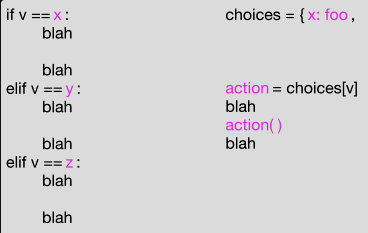
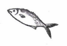
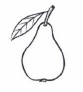

# Review / Preliminaries  
### Part I (CS 210)

## Review  
What for? Using ```for``` loops to iterate through lists of lists

# Chapters
### Week 1: 
    Objects  

### Week 2:  
    Part 1: Class Hierarchies and Inheritance  
    Part 2: Notifiers and Model-View-Controller  

### Week 3:  
    Part 1: Recursion the OO Way  
    Part 2: Refactoring Redundant Code  

### Week 4: 
    Aliasing on Purpose [Added] 

### Week 5: 
    Recursive Guess-and-Check  

### Week 6:  
    Part 1: Masking and Shifting Binary Values  
    Part 2: Negative Binary Numbers  
    Part 3: What the hex? Hexadecimal notation for binary values  

### Week 7: 
    A Little Bit of Functional Programming  

### Week 8:  
    Part 1: Two Pass Algorithms  
    Part 2: Regular expressions  


# Class notes for 10/14
when u have a ckass u can add a notimplemented error "istener"

a method in dog invokes the notification

define a concrete kustener
(subclassing the abstract listener)

```python
    def notify
```

a method spreak listener.notifies

you initialize the listeners in the dog class as a list

in dog class for listeners in listener_list

the reason to do this is dependance

a depends on b and vice versa

i want dog to notify (call) a listener 

dog shouldnt depend on speaksinstars

you can attach any subclass of listener to dog

thats what mvc is, listeners

model is the data

view is what u see, graphics and things moving on screen

controller is actions that can be taken

this type of model is used in many different areas

model shouldnt care about view

the project works heavily with the model part

children will inherit parents methods if the child does not have an
overiding 

recursiveness needs a base case, and progress towards that base case

linked lists -> need to study


# Recursion in Object-Oriented Programs
You’ve seen and written recursive functions before. The same basic concepts apply in object-oriented programs with classes and objects, but with a twist: The data structure often has the same “shape” as the recursive function, and the parts of the recursive function are often divided between methods in different subclasses.

# Review of Recursion
Recall that a recursive function is divided into one or more base cases and one or more recursive or inductive cases. Together these have a fairly standard structure. In pseudocode:

```python
def recursive_function(value): 
    """We always check base cases first"""
    if base case applies: 
       do the base case and return
    elif another base case applies: 
       do the base case and return
    else 
       """Recursive case(s) follow"""
       break value into pieces p1, p2, ...
       r1 = recursive_function(p1)
       r2 = recursive_function(p2)
       ...
       return combination of value, r1, r2, ...
```

For example, the classic factorial example can be written as

```python
def classic_factorial(value: int) -> int:
    """We always check base cases first"""
    if value < 2:
        return 1
    else:
       """Recursive case(s) follow"""
       p1 = value - 1
       r1 = classic_factorial(p1)
       return value * r1
```

which we would typically simplify to

```python
def fact(value: int) -> int:
    if value < 2:
        return 1
    return value * fact(value - 1)
```

We can see the same basic structure in a binary search. Suppose we have a sorted table of (key, value) pairs that looks like this:

```python
table = [(1, "alpha"), (3, "beta"), (4, "gamma"), (9, "delta"), (12, "epsilon")]
```

The table is sorted by key. We can search it like this:

```python
def bin_search(key: int, table: List[Tuple[int, str]]) -> str:
    return bin_search_range(key, table, 0, len(table) - 1)

def bin_search_range(key: int, table: List[Tuple[int, str]],
                    low: int, high: int) -> str:
    """Recursive binary search in range low..high inclusive"""

    """Base case 1: Key is not in table"""
    if low > high:
        return "No such value"

    mid = (high + low) // 2
    entry_key, entry_value = table[mid]

    """Base case 2: Key found at midpoint in table"""
    if entry_key == key:
        return entry_value

    if key < entry_key:
        """Recursive case 1: Key must be before midpoint, or absent"""
        return bin_search_range(key, table, low, mid - 1)

    else:
        """Recursive case 2: Key must be after midpoint, or absent"""
        return bin_search_range(key, table, mid + 1, high)
```

# Recursive Data Structures
A data structure can also have a recursive structure: Tuples can contain tuples, lists can contain lists, dicts can contain dicts, etc. Instead of a simple list, we could make the table have four elements:

Schema of nested list search structure

where smaller keys and larger keys are themselves tables with the same form, lists within lists, so that we get

Nested list form of search structure

In Python, the table could be represented as

```python
alpha_tree = [4, "gamma",
              [3, "beta",
               [1, "alpha", [], []],
               []],
              [12, "epsilon",
               [9, "delta", [], []],
               [15, "zeta", [], []]]
              ]
```

We would typically visualize this structure not by drawing list cells within list cells, but by drawing the “nested in” relation as lines. We call such a structure a tree, with the root of the tree at the top. Each entry in the tree is called a node. Every node except the root is connected to a single parent above it. A node may be connected to one or more children below it. A node without children is called a leaf, and other nodes are called internal nodes.

Table drawn as a tree

In this diagram key 4 is at the root. Keys 1, 9, and 15 are in leaves, and 4, 3, and 12 are internal nodes.

Now we can rewrite our binary search as a search in the nested list structure, or tree:

def nested_list_search(key: int, table: list) -> str:
    """Table is [key, value, smaller keys, larger keys]"""
    log.debug(f"Search for {key} in {table}")
    """Base case 1: There are no keys"""
    if table == []:
        return "No such value"

    entry_key, entry_value, smaller, larger = table
    """Base case 2: Key is found"""
    if key == entry_key:
        return entry_value

    if key < entry_key:
        """Recursive case 1: Must be in the smaller keys"""
        return nested_list_search(key, smaller)
    else:
        """Recursive case 2: Must be in the larger keys"""
        return nested_list_search(key, larger)
Notice that this is almost the same logic as our binary search in a list. The differences are that now the data is “shaped like the algorithm”.
When we searched a sorted list, we divided the list into a middle element, a sublist of smaller elements, and a sublist of larger elements. The nested list has already been divided up into a middle element (which appears in the first key and value), a sublist of smaller elements, and a sublist of larger elements. Instead of calculating a midpoint, our nested_search_list just follows the data structure.

Hierarchical Structure as Classes
We can implement the same logical structure using classes and objects. Note that when we represented the tree using nested lists, we used empty lists to represent empty sets of entries with larger or smaller keys. Using classes, we can instead create a distinct subclass for an empty table.

We’ll create an abstract base class for the tree structure, with a concrete subclass for a non-empty node and a concrete subclass for an empty node:

class GreekSearchTree:
    """An abstract base class for the table of Greek letters"""

    def __init__(self):
        raise NotImplementedError("Nope, can't do that")

class Node(GreekSearchTree):
    def __init__(self, key: int, value: str, smaller: GreekSearchTree, larger: GreekSearchTree):
        self.key = key
        self.value = value
        self.smaller = smaller
        self.larger = larger

class Empty(GreekSearchTree):
    def __init__(self):
        pass
With these classes we can build up the tree structure:

# The leaves
empty = Empty()  # I really only need one of these
alpha = Node(1, "alpha", empty, empty)
delta = Node(9, "delta", empty, empty)
zeta = Node(15, "zeta", empty, empty)
# The internal nodes
beta = Node(3, "beta", alpha, empty)
epsilon = Node(12, "epsilon", delta, zeta)
gamma = Node(4, "gamma", beta, epsilon)
# (4, gamma) is at the root
tree = gamma
What about a search method? In the abstract base class, we will give a method definition with the header for the search method.

class GreekSearchTree:
    """An abstract base class for the table of Greek letters"""

    def __init__(self):
        raise NotImplementedError("Nope, can't do that")
    
    def search(self, key: int) -> str:
        """Return associated string or 'No such value'"""
        raise NotImplementedError("Concrete classes must override the search method")
We’ll override that search method for the non-empty node class:

class Node(GreekSearchTree):
    def __init__(self, key: int, value: str, smaller: GreekSearchTree, larger: GreekSearchTree):
        self.key = key
        self.value = value
        self.smaller = smaller
        self.larger = larger

    def search(self, key) -> str:
        if self.key == key:
            return self.value
        if key < self.key:
            return self.smaller.search(key)
        else:
            return self.larger.search(key)
In this search method we see one of the base cases (when the key is found) and the recursive cases for searching in the subtree of smaller keys or the subtree of larger keys. But where is the other base case?

The other case is not in this class at all, but is rather in the search method of the other concrete class:

class Empty(GreekSearchTree):
    def __init__(self):
        pass

    def search(self, key) -> str:
        return "No such value"
Here we see the one big difference between recursive functions and recursion in methods in a recursive structure of objects. In the function, we always used some kind of decision (typically an if statement) to distinguish the base cases and recursive cases.
Typically the cases are distributed among different subclasses, and part or all of the choice of which cases to execute are controlled by which kind of object the method is called in.

Let’s consider an example search for key 10.
Initially we call the ‘search’ method on the root object, with key 4.

Start the search at the root

The key 10 is greater than the key in that node, so the recursive part of the search method is invoked on self.larger, which is the subtree with key 12 at its root.

Recursive search on subtree rooted at 12

Now key 10 is smaller than the key in the node, so it makes a recursive call to self.smaller.search(key).

Recursive search on subtree rooted at 9

Now key 10 is larger than the key in the node, so once again it makes a recursive call on self.larger.search(key).

Recursive search on empty subtree

This time we get the method search with class Empty. We don’t have to use an if statement to determine that this is a base case. We know it is a base case because that is the only case that this Empty node could be asked to handle!

Other Recursive Structures and Methods
Search trees like the table illustrated above are one important group of tree structures in software, but far from the only one. Often trees represent hierarchical “part-of” structures. Examples include geographic areas (country comprised of states or provinces, states made up of counties, counties further divided into precincts), graphics (a scene made up of shapes, with composite shapes and made up of simpler shapes, and simple line segments, points, and polygons as leaf nodes), documents (a book made up of chapters, chapters made up of sections, sections made up of paragraphs, paragraphs made up of lines) and so on. There is hardly an application domain in which tree structures do not find some use in software.

Wherever we find trees, we are likely to find some methods that walk or traverse the trees recursively. Sometimes these are some form of search, but not always. Many of the functions we might write for a list are also needed for a trees. With a list, we might have a choice between recursion and a simple loop. For example, the recursive binary search of a list could also be written without recursion, using a loop. The loop version of binary search is hardly more complex than the recursive version, and apt to execute a little faster. With tree structures, on the other hand, recursion is usually the better choice.

One widely used tree structure that you may have encountered already, and certainly will in the future, is the Document Object Model (DOM) of HTML. This is the data structure that a web browser constructs from the HTML source code of a web page, and it is the structure that style sheets and scripts consume and manipulate to support all the interactive effects of modern web applications.

Consider a very simplified version of the DOM structure. Each “…” segment would be represented by a node in the tree. Content that is plain text, with no tags, might be leaf nodes. We would begin with an abstract base class for DOM tree nodes:

class DOMNode:
    """Abstract base class, defines the interface
    that concrete DOM node classes must conform to.
    """
    def __init__(self):
        raise NotImplementedError("Abstract constructor of DOMNode")
We might define several other methods that all DOM nodes should implement, but for the example we’ll consider only the simple magic methods like __str__, which have default definitions already inherited from class object.

The internal nodes of the DOM have tags (like h1, h2 etc. for “header” elements and p for paragraphs). These tagged sections may be nested. This is represented by giving each node a list of children. (Contrast this to our search tree, in which each internal node had exactly two children.)

class Tagged(DOMNode):
    def __init__(self, tag: str, children: List[DOMNode] = []):
        self.tag = tag
        self.children = children

    def append(self, node:DOMNode):
        self.children.append(node)
How shall we define the __str__ method for a tagged node? Let’s make it look like html, in which begin-tags like <p> are paired with end-tags like </p>.

    def __str__(self) -> str:
        """Text form is like HTML source code"""
        parts = [str(part) for part in self.children]
        return f"<{self.tag}> {' '.join(parts)} </{self.tag}>\n"
Notice that the __str__ method uses f-strings that implicitly make calls on the __str__ methods of the children of a Tagged node. Thus producing the text for a DOM tree is recursive.

Plain text nodes, which will always be leaves of the DOM, will be simple:

class Plain(DOMNode):
    """Plain text content is essentially just a string"""

    def __init__(self, text: str):
        self.text = text

    def append(self, text: str):
        self.text += text

    def __str__(self):
        return self.text
Where we have a recursive tree traversal, leaf node classes usually handle a base case. For creating a string representation, the __str__ methods implement a recursive walk over the tree, and we can see that the simple __str__ method of Plain is a base case.

Now we can build a DOM tree with calls to the constructors of Tagged and Plain:

page = Tagged("html",
              [Tagged("head", [Tagged("title", [Plain("My Tremendous Novel")])]),
               Tagged("body", [Tagged("h1", [Plain("A Tail of Two Mice")]),
                               Tagged("h2", [Plain("By Little Charley Dickie")]),
                               Tagged("p", [Plain("It was the worst of cats."),
                                            Plain("Like, really bad.  Unbelievably bad.")]),
                               Tagged("h3", [Plain("Copyright 2020 by L.C.D.")])
                               ])  # End of body
                ]) # End of document
If we print page, its __str__ method will be called, and the recursive __str__ calls will produce the following output:

 <html> <head> <title> My Tremendous Novel </title>
 </head>
 <body> <h1> A Tail of Two Mice </h1>
 <h2> By Little Charley Dickie </h2>
 <p> It was the worst of cats. Like, really bad.  Unbelievably bad </p>
 <h3> Copyright 2020 by L.C.D. </h3>
 </body>
 </html>
Summary
The basic logic of recursion is the same for object-oriented programs as for recursive functions that do not involve classes and objects. Just as before, we must identify one or more base cases and one or more recursive cases that build up complete results from simpler cases.

The key difference is that with classes and objects, the recursive structure of the algorithms is often the same as the recursive structure of the objects. Often we will have the base case in one subclass and the recursive case in another subclass. Instead of writing an if statement to control which case applies, we simply let each class take care of the part of the logic that belongs to it. When a leaf node and an internal node both have a method m, usually the method m in the leaf node class will handle only the base case, and the method m in the internal node class will handle only the recursive case.

---------------------------------------------------------------------------------------

# Aliasing on Purpose
We say something is aliased when it has more than one name. Mark Twain is an alias of Samuel Clemens. Banksy is an alias of someone, but at the time of this writing I don’t know who. In software, we interpret “name” in a broad way to mean any way of designating some object. If x names the same object as elements[3], then we say that object is aliased and that x and elements[3] are aliases.

# When Aliasing Doesn’t Matter
One reason for making immutable objects is so that we can alias those objects without worry. This is why str objects in Python are immutable. If x refers to a string object, I can set y = x without any worry about the consequence of aliasing the string, because there is nothing I can do to x that will affect y. All the operations on strings, like strip and split, return new objects rather than changing the strings.

There is at least one way that we can observe aliasing with immutable objects: The comparison x is y checks whether x is an alias of y. It can yield some surprises. For example, Python sometimes aliases int values that are equal, and sometimes doesn’t:

```python
PyDev console: starting.
Python 3.8.0 (v3.8.0:fa919fdf25,...)
>>> w = 5
>>> x = 5
>>> w is x
True
>>> w = 1000
>>> x = 1000
>>> w is x
False
As long as we use == instead of is, we need not be concerned about whether int values or str values are aliased. When we define our own immutable classes, we aim for similar behavior: The == (that is __eq__) operation should define what we mean by “same”, and aliasing (is) should be irrelevant.
```

# When Aliasing is a Mistake
While immutable objects are often convenient, sometimes they are impractical. For example, the list class in Python is mutable because the append operation would be too expensive if it returned a new list object; it is much more efficient to modify (mutate) an existing list object. But this means we must be careful:

```python
m = [1, 2, 3]
k = m
k.append(4)
print(m)
[1, 2, 3, 4]
```

This behavior, in which the value designated by one alias of an object is changed by an operation through another alias of the object, may be fine or even useful, but it may also lead to bugs that are difficult to find and correct. This is one reason that our coding style guidelines require us to make it very clear and apparent when a method is a mutator.

We have already seen examples where aliasing a mutable object is a mistake. For example, if Point objects are mutable (if they have a move operation that changes a Point object, instead of returning a new Point object), then aliasing Point objects from different Rect rectangle objects is probably a mistake. At the very least it requires great care to do it correctly, without unanticipated side effects.

# When Aliasing is Helpful
While unanticipated side effects can make aliasing a problem, occasionally we alias objects intentionally because we want to access the same objects in more than one way.

Suppose, for example, that we have a list of complex objects storing information about students. Each object representing a student might include a given name, a family name, and a student identification number, among other pieces of information like favorite ice cream flavor. We might want to find student records quickly using binary search for given name, family name, or student number. But binary search only works if the objects are in sorted order, and each of these search keys requires a different order!

Database systems have a simple solution to the problem of searching for the same objects by multiple keys: They keep multiple indexes with aliased references to the records.



While search structures are the most common intentional use of aliasing, it is also useful sometimes for refactoring program logic.

Consider the simple game known as noughts and crosses or tic tac toe. Suppose the game board is represented by a list of lists of Tile objects, using letters a through i as position labels.

```python
class Board:
    """Simple 3x3 Tic Tac Toe board"""
    def __init__(self):
        self.tiles = [[Tile('a'), Tile('b'), Tile('c')],
                      [Tile('d'), Tile('e'), Tile('f')],
                      [Tile('g'), Tile('h'), Tile('i')]]
```

A game of noughts and crosses is won when there are three X or three O on tiles in any row, column, or diagonal. We might use an Enum to represent the X and O marks:

```python
class Mark(Enum):
    xmark = "X"
    omark = "O"
    unmarked = "."
```

The logic for checking for a win in a row might look something like this:

```python
def row_is_winner(self, row_index) -> bool:
    mark_0 = self.tiles[row_index][0].mark
    mark_1 = self.tiles[row_index][1].mark
    mark_2 = self.tiles[row_index][2].mark
    if mark_0 == Mark.unmarked: 
        return False
    return mark_0 == mark_1 and mark_1 == mark_2
```

The logic for checking for a win in a column might look very similar:

```python
def row_is_winner(self, col_index) -> bool:
    mark_0 = self.tiles[0][col_index].mark
    mark_1 = self.tiles[1][col_index].mark
    mark_2 = self.tiles[2][col_index].mark
    if mark_0 == Mark.unmarked: 
        return False
    return mark_0 == mark_1 and mark_1 == mark_2
```

Checking a diagonal would be yet again almost the same logic on different sets of tiles.

Similar as these functions are, it is difficult to combine them if the Tile objects are arranged only in the single list-of-lists structure by row and column. The logic can be factored easily, though, if we alias the same set of tiles from groups for rows, columns, and diagonals.



Now it is simple to write a single function to check whether a group is a winner:

```python
def is_winner(group: List[Tile]) -> bool:
    """True if a win for *either* X or O"""
    q, r, s = group
    return (q.mark != Mark.unmarked
            and q.mark == r.mark
            and r.mark == s.mark)
```

It is easy to check all the rows, columns, and diagonals with a single loop:

```python
    def has_winner(self) -> bool:
        """There is some winning row or column (for either X or O)"""
        for group in self.groups:
            if is_winner(group):
                return True
        return False
```

We have not really removed the complexity of traversing the board in three different orders, because we must traverse it to build the tile groups that represent those different orders.

```python
    def __init__(self):
        self.tiles = [[Tile('a'), Tile('b'), Tile('c')],
                      [Tile('d'), Tile('e'), Tile('f')],
                      [Tile('g'), Tile('h'), Tile('i')]]
        # 3-in-a-row can be horizontal, vertical, or diagonal
        self.groups = []
        # horizontal
        for row in self.tiles:
            self.groups.append(row)
        # vertical
        for col_i in range(3):
            group = []
            for row_i in range(3):
                group.append(self.tiles[row_i][col_i])
            self.groups.append(group)
        # diagonal left-to-right
        self.groups.append([self.tiles[i][i] for i in range(3)])
        # diagonal right-to-left
        self.groups.append([self.tiles[i][2-i] for i in range(3)])
```

However, we need do that only once, as we do here in the constructor. We can separate that logic from the logic of checking for a winner. The advantage becomes much larger if we use the groups in additional ways involving different logic. For example, we might write another function to choose a tile to mark with an X or O, selecting the best move by using the same groups.

```python
    def choose_for(self, mark: Mark) -> str:
        """Returns the most worthwhile position for
        mark to take, assuming it is the turn for
        mark and that there are open positions.
        """
        # We use the 'worth' field of the tiles to tally
        # how valuable each position is.
        for row in self.tiles:
            for col in row:
                col.worth = 0
        for group in self.groups:
            worth = calc_worth(group, mark)
            for tile in group:
                # No harm in granting worth to marked tiles
                tile.worth += worth
        # Pick open tile with max worth
        all_tiles = self.tiles[0] + self.tiles[1] + self.tiles[2]
        open_tiles = [tile for tile in all_tiles if tile.mark == Mark.unmarked]
        open_tiles.sort(key=lambda tile: tile.worth, reverse=True)
        return open_tiles[0].name
```

Notice that in the above method, we are looping through the same set of tiles in different ways. We first loop through by row and column to initialize the worth fields. Then we loop through them in multiple orders using the groups, which refer to the very same Tile objects ordered by row, column, and diagonal.

Note also that a single tile will be accessed multiple times in different groups, potentially accumulating worth each time it is accessed. On the initially empty board, a middle tile along one side will be accessed once in a row group and once in a column group, accumulating a total worth of 2.

n

A corner tile accumulates worth from a row group, a column group, and a diagonal group, because it can be used to form winning combinations in each of those groupings:


# Alternatives
The groups structure for aliasing groups of tiles in different orders is not the only way we could arrange different access orders for the tiles.
We could have written methods or functions to return lists of tiles in the desired order each time we needed them. Python also provides generators, which are identical to functions except they may return several results, one at a time. (The range function is actually a generator; it returns elements of the range one by one, not all together in a list.)

The main advantage of building the groups structure is that we only build it once, and then use it several times.

# Summary
If there is more than one way of designating (“naming”) the same object, we say the object is “aliased”. Aliasing immutable objects usually has no observable effect, and often we design objects to be immutable so that we can alias them freely. We must be careful when aliasing mutable objects, because a change to the object through one “name” will be observable as a change to the object through any other “names” it may have.

While aliasing can dangerous, it can also be useful. Sometimes we need different ways to designate the same set of objects, as when we traverse a collection repeatedly in different orders. And sometimes making a change to an object accessed through one name visible when the same object is accessed through other names is exactly what we want. We illustrated this by accumulating the “worth” of game tiles accessed in different orders.