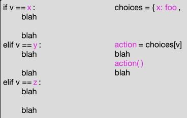

# Recusion
A recursive function is divided into one or more base cases and one or more recursive or inductive cases.  

Together these have a fairly standard structure.  

# In pseudocode:

```python
def recursive_function(value): 
    """We always check base cases first"""
    if base case applies: 
        do the base case and return
    elif another base case applies: 
        do the base case and return
    else 
        """Recursive case(s) follow"""
        break value into pieces p1, p2, ...
        r1 = recursive_function(p1)
        r2 = recursive_function(p2)
        ...
        return combination of value, r1, r2, ...
```

### the Classic Factorial example can be written as:

```python
def classic_factorial(value: int) -> int:
    """We always check base cases first"""
    if value < 2:
        return 1
    else:
       """Recursive case(s) follow"""
       p1 = value - 1
       r1 = classic_factorial(p1)
       return value * r1
```
which we would typically simplify to

```python
def fact(value: int) -> int:
    if value < 2:
        return 1
    return value * fact(value - 1)
```

### We can see the same basic structure in a binary search. 
Suppose we have a sorted table of (key, value) pairs that looks like this:

```python
table = [(1, "alpha"), (3, "beta"), (4, "gamma"), (9, "delta"), (12, "epsilon")]
```

The table is sorted by key. We can search it like this:

```python
def bin_search(key: int, table: List[Tuple[int, str]]) -> str:
    return bin_search_range(key, table, 0, len(table) - 1)
```
```python
def bin_search_range(key: int, table: List[Tuple[int, str]],
                    low: int, high: int) -> str:
    """Recursive binary search in range low..high inclusive"""

    """Base case 1: Key is not in table"""
    if low > high:
        return "No such value"

    mid = (high + low) // 2
    entry_key, entry_value = table[mid]

    """Base case 2: Key found at midpoint in table"""
    if entry_key == key:
        return entry_value

    if key < entry_key:
        """Recursive case 1: Key must be before midpoint, or absent"""
        return bin_search_range(key, table, low, mid - 1)

    else:
        """Recursive case 2: Key must be after midpoint, or absent"""
        return bin_search_range(key, table, mid + 1, high)
```

# Recursive Data Structures
### A data structure can also have a recursive structure: 
>Tuples can contain tuples,  
>lists can contain lists,  
>dicts can contain dicts, etc.  

### Instead of a simple list, we could make the table have four elements:

```python
alpha_tree = [4, "gamma",
              [3, "beta",
               [1, "alpha", [], []],
               []],
              [12, "epsilon",
               [9, "delta", [], []],
               [15, "zeta", [], []]]
              ]
```

```python
def nested_list_search(key: int, table: list) -> str:
    """Table is [key, value, smaller keys, larger keys]"""
    log.debug(f"Search for {key} in {table}")
    """Base case 1: There are no keys"""
    if table == []:
        return "No such value"

    entry_key, entry_value, smaller, larger = table
    """Base case 2: Key is found"""
    if key == entry_key:
        return entry_value

    if key < entry_key:
        """Recursive case 1: Must be in the smaller keys"""
        return nested_list_search(key, smaller)
    else:
        """Recursive case 2: Must be in the larger keys"""
        return nested_list_search(key, larger)
```

Notice that this is almost the same logic as our binary search in a list. The differences are that now the data is “shaped like the algorithm”.

When we searched a sorted list, we divided the list into  
a middle element,  
a sublist of smaller elements,  
and a sublist of larger elements. 

The nested list has already been divided up into  
a middle element (which appears in the first key and value),  
a sublist of smaller elements,  
and a sublist of larger elements.  
 
Instead of calculating a midpoint, our nested_search_list just follows the data structure.

# Hierarchical Structure as Classes
We can implement the same logical structure using classes and objects.  

Note that when we represented the tree using nested lists,  we used empty lists to represent empty sets of entries with larger or smaller keys.  

Using classes, we can instead create a distinct subclass for an empty table.  

### We’ll create an abstract base class for the tree structure, with a concrete subclass for a non-empty node and a concrete subclass for an empty node:

``` python
class GreekSearchTree:
    """An abstract base class for the table of Greek letters"""

    def __init__(self):
        raise NotImplementedError("Nope, can't do that")

class Node(GreekSearchTree):
    def __init__(self, key: int, value: str, smaller: GreekSearchTree, larger: GreekSearchTree):
        self.key = key
        self.value = value
        self.smaller = smaller
        self.larger = larger

class Empty(GreekSearchTree):
    def __init__(self):
        pass
```

# The leaves
```python
empty = Empty()  # I really only need one of these
alpha = Node(1, "alpha", empty, empty)
delta = Node(9, "delta", empty, empty)
zeta = Node(15, "zeta", empty, empty)
# The internal nodes
beta = Node(3, "beta", alpha, empty)
epsilon = Node(12, "epsilon", delta, zeta)
gamma = Node(4, "gamma", beta, epsilon)
# (4, gamma) is at the root
tree = gamma
```

### What about a search method? 

### In the abstract base class, we will give a method definition with the header for the search method.

```python
class GreekSearchTree:
    """An abstract base class for the table of Greek letters"""

    def __init__(self):
        raise NotImplementedError("Nope, can't do that")
    
    def search(self, key: int) -> str:
        """Return associated string or 'No such value'"""
        raise NotImplementedError("Concrete classes must override the search method")
    
class Node(GreekSearchTree):
    def __init__(self, key: int, value: str, smaller: GreekSearchTree, larger: GreekSearchTree):
        self.key = key
        self.value = value
        self.smaller = smaller
        self.larger = larger

    def search(self, key) -> str:
        if self.key == key:
            return self.value
        if key < self.key:
            return self.smaller.search(key)
        else:
            return self.larger.search(key)
```

In this search method we see one of the base cases (when the key is found) and the recursive cases for searching in the subtree of smaller keys or the subtree of larger keys. 

### But where is the other base case?

### The other case is not in this class at all, but is rather in the search method of the other concrete class:

```python
class Empty(GreekSearchTree):
    def __init__(self):
        pass

    def search(self, key) -> str:
        return "No such value"
```

Here we see the one big difference between recursive functions and recursion in methods in a recursive structure of objects. In the function, we always used some kind of decision (typically an if statement) to distinguish the base cases and recursive cases.

Typically the cases are distributed among different subclasses, and part or all of the choice of which cases to execute are controlled by which kind of object the method is called in.

Search trees like the table illustrated above are one important group of tree structures in software, but far from the only one. Often trees represent hierarchical “part-of” structures. 

Examples include geographic areas (country comprised of states or provinces, states made up of counties, 
counties further divided into precincts), 

graphics (a scene made up of shapes, with composite shapes and made up of simpler shapes, and simple line segments, points, and polygons as leaf nodes), documents (a book made up of chapters, chapters made up of sections, sections made up of paragraphs, paragraphs made up of lines) and so on. 

There is hardly an application domain in which tree structures do not find some use in software.
 
Wherever we find trees, we are likely to find some methods that walk or traverse the trees recursively. 
Sometimes these are some form of search, but not always. Many of the functions we might write for a list are also needed for a trees. With a list, we might have a choice between recursion and a simple loop. 
For example, the recursive binary search of a list could also be written without recursion, using a loop. 
The loop version of binary search is hardly more complex than the recursive version, and apt to execute a little faster. With tree structures, on the other hand, recursion is usually the better choice. 

One widely used tree structure that you may have encountered already, and certainly will in the future, is the Document Object Model (DOM) of HTML. This is the data structure that a web browser constructs from the HTML source code of a web page, and it is the structure that style sheets and scripts consume and manipulate to support all the interactive effects of modern web applications.

Consider a very simplified version of the DOM structure. 
Each “…” segment would be represented by a node in the tree. 
Content that is plain text, with no tags, might be leaf nodes. 
We would begin with an abstract base class for DOM tree nodes:

```python
class DOMNode:
    """Abstract base class, defines the interface
    that concrete DOM node classes must conform to.
    """
    def __init__(self):
        raise NotImplementedError("Abstract constructor of DOMNode")
```
    
We might define several other methods that all DOM nodes should implement, but for the example we’ll consider 
only the simple magic methods like __str__, which have default definitions already inherited from class object.

The internal nodes of the DOM have tags (like h1, h2 etc. for “header” elements and p for paragraphs). 
These tagged sections may be nested.
 
This is represented by giving each node a list of children. (Contrast this to our search tree, in which each internal node had exactly two children.)

```python
class Tagged(DOMNode):
    def __init__(self, tag: str, children: List[DOMNode] = []):
        self.tag = tag
        self.children = children

    def append(self, node:DOMNode):
        self.children.append(node)
```

How shall we define the __str__ method for a tagged node? Let’s make it look like html, 
in which begin-tags like ```<p>``` are paired with end-tags like ```</p>```.

```python
    def __str__(self) -> str:
        """Text form is like HTML source code"""
        parts = [str(part) for part in self.children]
        return f"<{self.tag}> {' '.join(parts)} </{self.tag}>\n"
```

Notice that the __str__ method uses f-strings that implicitly make calls on the __str__ methods of the children of a Tagged node. Thus producing the text for a DOM tree is recursive.

Plain text nodes, which will always be leaves of the DOM, will be simple:

```python
class Plain(DOMNode):
    """Plain text content is essentially just a string"""

    def __init__(self, text: str):
        self.text = text

    def append(self, text: str):
        self.text += text

    def __str__(self):
        return self.text
```

Where we have a recursive tree traversal, leaf node classes usually handle a base case. 
For creating a string representation, the __str__ methods implement a recursive walk over the tree, 
and we can see that the simple __str__ method of Plain is a base case.

Now we can build a DOM tree with calls to the constructors of Tagged and Plain:

```python    
page = Tagged("html",
              [Tagged("head", [Tagged("title", [Plain("My Tremendous Novel")])]),
               Tagged("body", [Tagged("h1", [Plain("A Tail of Two Mice")]),
                               Tagged("h2", [Plain("By Little Charley Dickie")]),
                               Tagged("p", [Plain("It was the worst of cats."),
                                            Plain("Like, really bad.  Unbelievably bad.")]),
                               Tagged("h3", [Plain("Copyright 2020 by L.C.D.")])
                               ])   End of body
                ])  End of document
```

If we print page, its __str__ method will be called, and the recursive __str__ calls will produce
the following output:

```html
<html> <head> <title> My Tremendous Novel </title>
</head>
<body> <h1> A Tail of Two Mice </h1>
<h2> By Little Charley Dickie </h2>
<p> It was the worst of cats. Like, really bad.  Unbelievably bad </p>
<h3> Copyright 2020 by L.C.D. </h3>
</body>
</html>
```

# Summary
The basic logic of recursion is the same for object-oriented programs as for recursive functions that do not involve classes and objects. 

Just as before, we must identify one or more base cases and one or more recursive cases that build up complete results from simpler cases.

The key difference is that with classes and objects, the recursive structure of the algorithms is often the same as the recursive structure of the objects. Often we will have the base case in one subclass and the recursive case in another subclass. 

Instead of writing an if statement to control which case applies, we simply let each class take care of the part of the logic that belongs to it. 

When a leaf node and an internal node both have a method m, usually the method m in the leaf node class will handle only the base case, and the method m in the internal node class will handle only the recursive case.

# Refactoring Repetitive Code

## DRYing out repetitive code
A key feature of classes and objects is the ability to reduce repetitive code, following the DRY (Don’t Repeat Yourself) principle. If several related classes need an identical method, we prefer to write it once in a common superclass and inherit it into multiple subclasses.

Identical methods is the easy case. What about almost identical methods, in which behavior of some method follows the same pattern in a group of related classes, but differs in some small, identifiable way?

## Factor it
The first step in reducing redundancy is to identify exactly what is the same and what differs between methods with repetitive code. Sometimes this is easy. Often it is not. We’ll have more to say about that below.

For the moment, we’ll assume you have identified a pattern of common code and variation among several methods in subclasses of a common parent class.

We’ll look at two approaches to factoring the redundant method, and then at refactoring code in conditionals that may or may not appear in a method.

## Factoring into a method
Sometimes the variation among the redundant methods can be factored out into a separate method that can be called from the redundant methods. The variations can be coded as a new method in each of the subclasses, while the common code is inherited from a single method in the superclass:

The inherited method appears only in the superclass and is inherited into each subclass, where it calls the appropriate factored method in each subclass.

## Refactoring into a variable
When we refactor redundant code, we often look for ways to move complexity from code to data. Sometimes we can find a way to write the code just once by introducing one or more variables and using different variable values in each subclass. Again the method can be written just once and inherited into each subclass, but each subclass sets the appropriate variable value(s):

## Refactoring branching logic
Sometimes the redundant code, whether in a method or not, is in a chain of if/elif/elif/… branches, or something equivalent. In this case, the particular code to execute does not vary depending on the class, but rather depending on the value of a variable, but it may not be as simple as, for example, using that value in a calculation or string. In such a case, we may be able to replace the chain of if/elif/elif/… with a table lookup. In Python, we would typically implement such a table as a dict:



In the diagram above, the redundant code has been refactored into three methods, foo, bar, and zot. In other cases, the table values might themselves be dict structures containing sets of variables, or complex objects, or keys to other tables.

## The real trick is isolating variation
We’ve illustrated three ways to refactor code when you have identified exactly what is the same and what the variations are between different blocks of code, either whole methods or branches in a complex branching structure. The good news is that Python provides lots of ways to refactor with dynamic dispatch of methods and with tables. The bad news is that the actual refactoring is the easy part. The hard part is recognizing and isolating the code to be refactored.

## Code can be beautiful. 
One of the ways in which code can surprise us with its beauty is by being much simpler and more compact than we expected, because the programmer has seen deep patterns that we didn’t anticipate.
Recognizing those patterns takes time and practice. Don’t be frustrated if they elude you at first. But start practicing, and never stop.

## How to import a json

Use the built-in json module.

From a file:
```python
import json

file_path = "data.json"
with open(file_path, "r", encoding="utf-8") as f:
    json_object = json.load(f)   # dict/list from the file
```

From a JSON string (not a file):
```python
import json

json_text = '{"a": 1, "b": 2}'
json_object = json.loads(json_text)
```

That’s it—you’ve “opened” (loaded) JSON into Python.