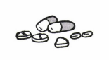

# 7과 가게에서 (At a Store)

## CONVERSATION 1

### Exercise A: Choose a word from the box and write it below the corresponding picture.
**Word Bank:** | 과일 | 귤 | 두부 | 배 | 사과 | 생선 |

1.   

2.   

3.   

4.   

5.   

6.   

**Answer Key:**
1. 생선 (fish)
2. 배 (pear) 
3. 귤 (tangerine)
4. 과일 (fruit - general term)
5. 사과 (apple)
6. 두부 (tofu)

### Exercise B: Choose a word from the box and write it below the corresponding picture.
**Word Bank:** 도둑 소리 약 우체부 자동차

1.   

2.   

3. 

4. 

5. 

**Answer Key:**
1. 약 (medicine)
2. 소리 (sound)
3. 자동차 (car)
4. 도둑 (thief)
5. 우체부 (postman)

### Exercise C: Match each word in the left column to the most closely related verb in the right column.

| Left Column | Right Column |
|-------------|--------------|
| 문이 • | • 잡히다 |
| 개한테 • | • 뺏기다 |
| 도둑이 • | • 팔리다 |
| 돈을 • | • 열리다 |
| 과일이 • | • 물리다 |

**Answer Key:**
- 문이 → 열리다 (door opens)
- 개한테 → 물리다 (bitten by dog)
- 도둑이 → 잡히다 (thief is caught)
- 돈을 → 뺏기다 (money is stolen)
- 과일이 → 팔리다 (fruit is sold)

### Exercise D: Fill in the blanks with the most appropriate words from the box below. Use each word ONLY ONCE. Conjugate if necessary.

**Word Bank:** | 깎다 | 멋있다 | 물다 | 행복하다 |

1. 어제 우리 집 개가 손님을 _____________ 손님이 좀 다쳤다.
2. 주인아저씨, 귤이 너무 비싼데 조금만 _____________ 주세요.
3. 내 룸메이트는 항상 제일 _____________ 옷만 입고 다녀요.
4. 내가 좋아하는 가수 노래가 인기가 아주 많아져서 요즘 아주 _____________.

**Answer Key:**
1. 물었어요 (bit)
2. 깎아 (reduce the price)
3. 멋있는 (stylish/cool)
4. 행복해요 (happy)

## BASE DIALOGUE 1

**주인:** 어서 오세요.
**우진:** 과일 좀 사려고 하는데요. 과일들이 아주 맛있어 보이네요.
**주인:** 요즘 사과하고 배가 맛있어요. 가격도 괜찮아요.

### Exercise E: Complete the table below.

| Dictionary Form | ~어/아요 | ~어/아 보여요 |
|----------------|----------|--------------|
| 멋있다 | 멋있어요 | 멋있어 보여요 |
| 행복하다 | 행복해요 | 행복해 보여요 |
| 지겹다 | 지겨워요 | 지겨워 보여요 |
| 밝다 | 밝아요 | 밝아 보여요 |
| 모자라다 | 모자라요 | 모자라 보여요 |
| 비슷하다 | 비슷해요 | 비슷해 보여요 |
| 외롭다 | 외로워요 | 외로워 보여요 |
| 위험하다 | 위험해요 | 위험해 보여요 |

### Exercise F: Using an adjective in E, provide an appropriate response for the given cue, as in 1. Use each word only ONCE.

1. [스티브가 시험 때문에 조금 힘들어 하는 거 같았는데 요즘은 기분이 좋아졌어요.]
   → **밝아 보여요**

2. [방학에 친구들이 다 집에 돌아가서 기숙사에 유미만 있어요.]
   → **외로워 보여요**

3. [마크하고 스티브가 같은 곳에서 머리를 짧게 잘랐어요.]
   → **비슷해 보여요**

4. [파티에 음식 주문을 많이 안 했어요.]
   → **모자라 보여요**

5. [운전하는데 길이 너무 좁아요.]
   → **위험해 보여요**

6. [룸메이트가 기숙사 방에 혼자 있는데 좀 심심해해요.]
   → **지겨워 보여요**

## BASE DIALOGUE 2

**우진:** 요즘 어떤 과일이 잘 팔려요?
**주인:** 저쪽에 있는 사과와 배 보이지요?
**주인:** 가을에는 사과하고 배가 잘 팔리는 편이에요.
**주인:** 값은 좀 비싼 편이지만 요즘 아주 맛있거든요.

### Exercise G: Complete the table with the appropriate verb forms.

| Active form (dictionary ending) | Active form (polite ending) | Passive form (dictionary ending) | Passive form (polite ending) |
|----------------------------------|------------------------------|-----------------------------------|------------------------------|
| 쓰다 | 써요 | 쓰이다 | 쓰여요 |
| 안다 | 안아요 | 안기다 | 안겨요 |
| 듣다 | 들어요 | 들리다 | 들려요 |
| 바꾸다 (to change) | 바꿔요 | 바뀌다 | 바뀌어요 |
| 잡다 | 잡아요 | 잡히다 | 잡혀요 |
| 뺏다 | 뺏어요 | 뺏기다 | 뺏겨요 |
| 물다 | 물어요 | 물리다 | 물려요 |
| 막다 (to block) | 막아요 | 막히다 | 막혀요 |
| 풀다 | 풀어요 | 풀리다 | 풀려요 |
| 쫓다 | 쫓아요 | 쫓기다 | 쫓겨요 |
| 놓다 | 놓아요 | 놓이다 | 놓여요 |

### Exercise H: Listen to the sentences and fill in the blanks.

1. 금요일이라서 길이 많이 **막혔어요**.
2. 옆집에서 텔레비전 소리가 크게 **들려요**.
3. 요즘 유행하는 신발이라서 다 **팔렸어요**.
4. 이 꽃들은 결혼식에 **쓰이는** 꽃들이에요.
5. 고양이가 개한테 **쫓겼어요**.
6. 저기 책상 위에 교과서들이 **놓여 있어요**?

### Exercise I: Based on the pictures and active forms given, complete the sentence using passive forms.

1. **BANK** 왼쪽에 백화점을 보세요.
   → 백화점이 왼쪽에 **보여요**.

2. 교실 문을 닫았어요.
   → 교실 문이 **닫혔어요**.

3. 도둑이 돈을 뺏어 갔어요.
   → 도둑한테 돈을 **뺏겼어요**.

4. 엄마가 아기를 안고 있어요.
   → 아기가 엄마한테 **안겨 있어요**.

5. 춤을 추면서 스트레스를 풀어요.
   → 춤을 추면서 스트레스가 **풀려요**.

6. 경찰이 도둑을 잡았어요.
   → 도둑이 **잡혔어요**.

7. 개가 우체부를 물었어요.
   → 우체부가 **물렸어요**.

### Exercise J: Choose one word from box A and B and write a sentence using a passive form. Each sentence needs to be composed of at least 5 words. Use each word only ONCE.

**Box A:** 경찰차 구두 다리 도서관 소리 신분증 신호등 음악
**Box B:** 닫다 듣다 막다 보다 뺏다 쓰다 열다 팔다 쫓다

**Example:** 밖에서 무슨 소리가 들리는 거 같지 않아요?

**Sample Answers:**
1. 도서관이 일요일에 일찍 닫혀요.
2. 옆집에서 음악이 크게 들려요.
3. 사고 때문에 다리가 막혔어요.
4. 신호등이 멀리서 잘 보여요.
5. 지갑과 함께 신분증이 뺏겼어요.
6. 구두가 백화점에서 많이 팔려요.

## BASE DIALOGUE 3

**우진:** 배 한 상자에 얼마예요?
**주인:** 이 사과는 좀 비싸서 3만원 주셔야 해요.
**우진:** 한 상자에 몇 개나 들어 있는데요?
**우진:** 12개 들어 있어요.

### Exercise K: Describe the following pictures using ~어/아 있다, as in 1.

1. 지난 겨울 방학 동안에는 롤메이트들이 모두 기숙사에 **남아있었다**.
2. 롤메이트 방 문이 하루 종일 **열려 있어요**.
3. 마이클은 지금 2시간 동안 의자에 **앉아 있어요**.
4. 과일이 바구니에 **들어있다**.
5. 집에 사람이 없는데 왜 문이 **열려 있어요**?
6. 의자가 모자라서 민지가 1시간 동안 **서 있어요**.

### Exercise L: Complete the dialogues with the most appropriate verbs from the box below, using ~어/아 있다. Use each verb only ONCE.

**Word Bank:** 가다 남다 놓이다 들다 쓰다 오다 켜다

1. (우체국에서)
   **직원:** 상자 안에 깨지는 물건이 **들어 있어요**?
   **유미:** 아니요, 깨지는 물건은 없어요.

2. **A:** 요즘 마크가 잘 안 보이는데 어디 갔어요?
   **B:** 이번 학기에 영국에 **가 있어요**.

3. **A:** 이 책상 위에 **놓여 있는** 책들 못 봤니?
   **B:** 아니, 못 봤는데.

4. **A:** 파티 시작하려면 시간이 많이 남았는데 벌써 왔어?
   **B:** 그냥 할 일이 없어서 일찍 **와 있어요**.

5. **A:** 열병에서 무슨 소리가 나는데 뭔지 알아?
   **B:** 라디오가 **켜져 있는** 거 같아.

6. **A:** 여기에 영어로 **써 있는** 말이 무슨 뜻인지 아니?
   **B:** 글쎄, 나도 잘 모르겠는데, 리사한테 물어봐.

### Exercise M: Listen to the conversation between Woojin and the owner of a grocery store and mark the following statements T(rue) or F(alse).

1. 우진은 이 가게에 자주 오는 편인 것 같다. **[T/F]**
2. 우진은 겨울 방학 동안 집에 갔다 왔다. **[T/F]**
3. 사과가 배보다 더 비싸다. **[T/F]**
4. 귤은 12개에 10000원이다. **[T/F]**
5. 사과는 한 상자에 모두 8개가 들어 있다. **[T/F]**
6. 우진은 사과와 귤을 샀다. **[T/F]**
7. 우진은 두부와 생선도 사야 한다. **[T/F]**

### Exercise N: Listen to the questions and write your own responses in full sentences.

1. ___________________________________________________
2. ___________________________________________________
3. ___________________________________________________
4. ___________________________________________________
5. ___________________________________________________

## CONVERSATION 2

### Exercise A: Choose a word from the box and write it below the corresponding picture.
**Word Bank:** 당근 시금치 야채 양파 파 호박

1. _______ 2. _______ 3. _______ 4. _______ 5. _______ 6. _______

**Answer Key:**
1. 당근 (carrot)
2. 시금치 (spinach) 
3. 야채 (vegetables - general)
4. 양파 (onion)
5. 파 (green onion/scallion)
6. 호박 (pumpkin/squash)

### Exercise B: Choose a word from the box and write it below the corresponding picture.
**Word Bank:** 게란 고기 떡 우유 잡채

1. _______ 2. _______ 3. _______ 4. _______ 5. _______

**Answer Key:**
1. 게란 (egg)
2. 고기 (meat)
3. 떡 (rice cake)
4. 우유 (milk)
5. 잡채 (mixed vegetables/noodles)

### Exercise C: Choose a word from the box and write it below the corresponding picture.
**Word Bank:** 비누 시장 지갑 첫솔 편의점 휴지

1. _______ 2. _______ 3. _______ 4. _______ 5. _______ 6. _______

**Answer Key:**
1. 비누 (soap)
2. 시장 (market)
3. 지갑 (wallet)
4. 첫솔 (toothbrush)
5. 편의점 (convenience store)
6. 휴지 (tissue/toilet paper)

### Exercise D: Fill in the blanks with the most appropriate words from the box below. Conjugate if necessary.

**Word Bank:** 끓이다 다양하다 들르다 싸우다 울다 웃다 넣다

1. 어제 영화를 봤는데 너무 슬퍼서 많이 **울었어요**.
2. 라면을 먹으려면 먼저 물을 **끓여야 해요**.
3. 냉장고에 야채가 많이 있어서 국에 다 **넣었어요**.
4. 새로 연 백화점에 **다양한** 물건들이 많아 요즘 자주 간다.
5. 지난 주에 룸메이트하고 **싸워서** 일주일 동안 서로 얘기 안 하고 있어요.
6. 수업 가는 길에 책을 들려주러 도서관에 잠간 **들렀어요**.
7. 교수님께서 너무 재미있으셔서 수업에서 학생들이 자주 **웃어요**.

## BASE DIALOGUE 4

**우진:** 뭐 사러 왔어?
**수빈:** 집에 먹을 게 없어서 장보러 왔어
**우진:** 이 가게에 자주 오니?
**수빈:** 응, 자주 오는 편이야. 집 냉장고가 작아 가지고 일주일에 한 두 번쯤은 장을 봐야 되거든.

### Exercise E: Based on the pictures, compose sentences using ~어/아 가지고, as in 1.

1. 어제 **아파 가지고** 수업에 못 갔다.
2. 지난 주말에 **바빠 가지고** 집이 많이 더러워요.
3. 오늘 너무 **피곤해 가지고** 수업에서 졸았다.

### Exercise E (continued): More ~어/아 가지고 Practice

4. **감기에 걸려 가지고** 약속에 못이 늦었다.
5. 길을 잘 **몰라 가지고** 지나가는 사람한테 물어봐야 했다.
6. 어제 친구하고 **늦게 가지고** 오늘 다리가 아파서 혼났다.

### Exercise F: Listen to the questions and write your own responses using ~어/아 가지고.

1. ___________________________________________________
2. ___________________________________________________
3. ___________________________________________________
4. ___________________________________________________
5. ___________________________________________________

### Exercise G: Complete the following dialogues using the verbs from the box below in the ~어/아 가지고 form, as in 1. Use each word only ONCE.

**Word Bank:** 감기에 걸리다 꾸이다 담하다 사다 싸우다 일하다

1. **A:** 왜 어제 수업에 안 왔니?
   **B:** 감기에 **걸려 가지고** 못 갔어

2. **A:** 국이 왜 이렇게 짜져요?
   **B:** 너무 오래 **끓여 가지고**

3. **A:** 민지 생일 파티에 케이크는 누가 사 거야?
   **B:** 스티브가 **사 가지고**

4. **A:** 이 비싼 자동차를 무슨 돈으로 샀 거야?
   **B:** 여름 방학 동안 **일해 가지고**

5. **A:** 어제 왜 그렇게 기분이 안 좋았니?
   **B:** 룸메이트하고 **싸워 가지고**

6. **A:** 어제는 왜 도서관에서 공부 안 했어?
   **B:** 도서관이 **닫혀 가지고**

## BASE DIALOGUE 5

**우진:** 수빈아, 잡채 만드는 데에 어떤 야채들이 들어가는지 알아?
**수빈:** 나도 음식은 잘 못 만드는데.
**우진:** 친구 생일 파티에 잡채를 만들어 가지고 가기로 해 가지고 잠 보러 가야 되거든.
**수빈:** 잘 모르겠지만, 아마 양파하고 당근, 시금치, 고기는 꼭 들어가야 될 거야.

### Exercise H: Complete the table below.

| ~어/아요 | ~는 데(에) | ~어/아요 | ~는 데(에) |
|----------|----------|----------|----------|
| 만들어요 | | 울겨요 | |
| 가르쳐요 | | 모여요 | |
| 구해요 | | 이용해요 | |
| 다녀요 | | 참이 들어요 | |

**Answer Key:**
| ~어/아요 | ~는 데(에) | ~어/아요 | ~는 데(에) |
|----------|----------|----------|----------|
| 만들어요 | 만드는 데 | 울겨요 | 웃는 데 |
| 가르쳐요 | 가르치는 데 | 모여요 | 모이는 데 |
| 구해요 | 구하는 데 | 이용해요 | 이용하는 데 |
| 다녀요 | 다니는 데 | 참이 들어요 | 참이 드는 데 |

### Exercise I: Choose a verb from H and write a sentence using ~는 데(에). Each sentence needs to be composed of at least 5 words. Use each verb only ONCE.

1. 한국어를 **가르치는 데** 시간이 많이 걸려요.
2. 아파트를 **구하는 데** 돈이 많이 필요해요.
3. 친구들과 **모이는 데** 좋은 장소를 찾고 있어요.
4. 컴퓨터를 **이용하는 데** 어려움이 없어요.
5. 학교에 **다니는 데** 버스를 타야 해요.

### Exercise J: Fill in the blanks as you listen to the questions.

1. 기숙사에서 _____________ 필요한 것들이 무엇입니까?
2. 스트레스 _____________ 좋은 방법들은 무엇이 있습니까?
3. 자동차를 _____________ 뭐가 필요합니까?
4. 라면을 _____________ 필요한 게 뭡니까?
5. 한국어를 _____________ 제일 중요한 것은 무엇입니까?

**Answer Key:**
1. 생활하는 데 (living)
2. 푸는 데 (relieving)
3. 운전하는 데 (driving)
4. 끓이는 데 (boiling)
5. 배우는 데 (learning)

### Exercise K: Answer the questions in J in full sentences.

1. ___________________________________________________
2. ___________________________________________________
3. ___________________________________________________
4. ___________________________________________________
5. ___________________________________________________

## WRAP-UP EXERCISES

### Exercise A: Shopping List Creation
You need to go to a supermarket. Make a shopping list of your own using the words provided in the box below. Include at least five food items and five non-food items.

**Word Bank:** 
게란 고기 귤 당근 두부 배 베터리 비누 빵 사과 생선 수저
시금치 약 양파 우유 지갑 지양 첫솔 파 휴지 호박 화장품

**음식 (Food):**
1. _____________
2. _____________
3. _____________
4. _____________
5. _____________

**Non-음식 (Non-food):**
1. _____________
2. _____________
3. _____________
4. _____________
5. _____________

### Exercise B: Listen to the passage about Lisa and mark the following statements T(rue) or F(alse).

1. Lisa came to Seoul last summer to study Korean. **[T/F]**
2. Lisa has been living in Seoul for five months. **[T/F]**
3. Lisa lived in the dormitory for about four months. **[T/F]**
4. Lisa cooks her own food since she came to Seoul. **[T/F]**
5. There is a big market in front of Lisa's place. **[T/F]**
6. There are a lot of clothing stores in the market. **[T/F]**
7. Lisa thinks that living in the dorm is more convenient. **[T/F]**

### Exercise C: Translate the following sentences into Korean using the expression given where provided.

1. Nowadays, my roommate looks very happy and healthy. (~어/아 보이다)
   ________________________________________________________________

2. Is there anything inconvenient in living at the dorm? (~는 데에)
   ________________________________________________________________

3. Since the pharmacy was closed early last night, I could not buy cold medicine. (~어/아 가지고)
   ________________________________________________________________

4. I had my favorite bag taken away by my younger sister.
   ________________________________________________________________

5. The thief was being chased by the police for an hour.
   ________________________________________________________________

6. I don't know what is inside this parcel. (~어/아 있다)
   ________________________________________________________________

### Exercise D: Listen to the questions and provide your own responses in full sentences.

1. ___________________________________________________
2. ___________________________________________________
3. ___________________________________________________
4. ___________________________________________________
5. ___________________________________________________
6. ___________________________________________________

### Exercise E: Read the following passage and mark the statements T(rue) or F(alse).

**Korean Food Passage:**
한국인들이 제일 좋아하는 한국 음식은 무엇일까요? 김치? 불고기? 비빔밥? 2019년 5월에 한 조사에 따르면 한국 사람들이 제일 좋아하는 음식은 김치찌개이고 두 번째로 좋아하는 음식이 된장찌개라고 합니다. 김치찌개와 된장찌개는 대체로 나이가 좀 많은 한국 사람들이 좋아하는 음식이라고 하네요. 여러분은 김치찌개와 된장찌개를 먹어 본 적이 있습니까?

1. The most popular Korean food among Korean people is soybean-paste stew. **[T/F]**
2. The Korean younger generation tends to like bulgogi more. **[T/F]**
3. The popularity of kimchi among Korean people tends to stay strong. **[T/F]**
4. One of the most popular Korean foods among foreigners is bibimbap. **[T/F]**
5. Bibimbap is often served on Korean airlines. **[T/F]**
6. The popular Korean dishes among Korean people and foreigners tend to differ. **[T/F]**

### Exercise F: Read the following passage and answer the questions in English.

**Online Shopping Passage:**
한국에서는 많은 사람들이 온라인으로 장을 본다. 배달 문화가 유달리 발달한 한국에서는 음식을 만드는 데에 필요한 재료들이나 생활에 필요한 물건들을 쉽게 주문해서 짧은 시간 안에 받아 볼 수 있다.

1. What can one order online in Korea?
   ________________________________________________________________

2. What are the two most popular online order systems in Korea nowadays?
   ________________________________________________________________

3. Why is it that online grocery shopping is becoming more popular in Korea?
   ________________________________________________________________

4. What is the downside of online shopping and the delivery culture in Korea?
   ________________________________________________________________

5. According to the passage, what is the author's argument about online grocery shopping?
   ________________________________________________________________

6. What do you think about the passage above? Write your own ideas in 2-3 short sentences in Korean.
   ________________________________________________________________
   ________________________________________________________________
   ________________________________________________________________

### Exercise G: Write a short recipe of your favorite food. If needed, you can use the nouns and verbs provided in the boxes below.

**Ingredients:** 게란 고기 귤 당근 두부 마늘(garlic) 배 빵 버섯(mushroom) 사과 생선 시금치 양파 우유 파 호박

**Cooking Verbs:** 가져 가다 끓다 굽이다 넣다 두다(to put aside) 볶다(to stir-fry) 사용하다 섞다(to mix) 썰다(to slice) 씻다 양념하다(to season) 자르다 접이넣다

**My Recipe:**
________________________________________________________________
________________________________________________________________
________________________________________________________________
________________________________________________________________
________________________________________________________________
________________________________________________________________
________________________________________________________________
________________________________________________________________
________________________________________________________________
________________________________________________________________

## Vocabulary (단어)

### Nouns
| Korean | English | Notes | Usage Example |
|--------|---------|-------|---------------|
| 게란 | egg | | 계란을 삶아 주세요. (Please boil the eggs.) |
| 경찰차 | police car | | 경찰차가 빨리 지나갔어요. (The police car passed by quickly.) |
| 고기 | meat | | 고기를 구워서 먹어요. (I grill and eat meat.) |
| 교수님 | professor | honorific form | 교수님께 질문이 있어요. (I have a question for the professor.) |
| 구두 | dress shoes | formal footwear | 정장에 구두를 신어요. (I wear dress shoes with a suit.) |
| 국 | soup | | 미역국이 맛있어요. (Seaweed soup is delicious.) |
| 귤 | tangerine/orange | citrus fruit | 겨울에 귤이 맛있어요. (Tangerines are delicious in winter.) |
| 과일 | fruit | general term | 과일을 많이 먹어야 해요. (You should eat a lot of fruit.) |
| 김치찌개 | kimchi stew | Korean dish | 김치찌개가 매워요. (Kimchi stew is spicy.) |
| 냉장고 | refrigerator | | 냉장고가 너무 작아요. (The refrigerator is too small.) |
| 다리 | bridge | also means leg | 한강에 다리가 많아요. (There are many bridges over the Han River.) |
| 당근 | carrot | vegetable | 당근을 잘게 썰어요. (I chop the carrots finely.) |
| 도둑 | thief | | 도둑이 집에 들어왔어요. (A thief entered the house.) |
| 도서관 | library | | 도서관에서 공부해요. (I study at the library.) |
| 된장찌개 | soybean paste stew | Korean dish | 된장찌개를 끓였어요. (I made soybean paste stew.) |
| 두부 | tofu | soybean curd | 두부찌개를 만들어요. (I'm making tofu stew.) |
| 떡 | rice cake | traditional food | 설날에 떡국을 먹어요. (We eat rice cake soup on New Year's Day.) |
| 라면 | ramen noodles | instant noodles | 라면을 끓여 먹었어요. (I boiled and ate ramen.) |
| 룸메이트 | roommate | | 룸메이트와 잘 지내요. (I get along well with my roommate.) |
| 마늘 | garlic | | 마늘을 넣으면 맛있어요. (It's delicious when you add garlic.) |
| 물건 | thing/object | | 비싼 물건을 샀어요. (I bought an expensive item.) |
| 문화 | culture | | 한국 문화를 배워요. (I'm learning Korean culture.) |
| 배 | pear | Korean pear | 배가 아주 달아요. (The pear is very sweet.) |
| 배달 | delivery | | 배달 음식을 시켰어요. (I ordered delivery food.) |
| 백화점 | department store | | 백화점에서 쇼핑해요. (I shop at the department store.) |
| 버섯 | mushroom | | 버섯볶음을 만들어요. (I'm making stir-fried mushrooms.) |
| 베터리 | battery | | 핸드폰 베터리가 없어요. (My phone battery is dead.) |
| 비누 | soap | | 손을 비누로 씻어요. (I wash my hands with soap.) |
| 비빔밥 | bibimbap | mixed rice dish | 비빔밥에 고추장을 넣어요. (I put gochujang in bibimbap.) |
| 빵 | bread | | 아침에 빵을 먹어요. (I eat bread in the morning.) |
| 불고기 | bulgogi | Korean barbecue | 불고기를 구워 먹어요. (I grill and eat bulgogi.) |
| 사과 | apple | | 사과 한 개 주세요. (Please give me one apple.) |
| 상자 | box | container | 상자 안에 뭐가 들어 있어요? (What's in the box?) |
| 생선 | fish | | 생선을 구워서 먹어요. (I grill and eat fish.) |
| 소리 | sound/noise | | 밖에서 이상한 소리가 나요. (There's a strange sound from outside.) |
| 수저 | chopsticks and spoon | eating utensils | 수저를 가져다 주세요. (Please bring chopsticks and spoons.) |
| 시금치 | spinach | leafy vegetable | 시금치가 몸에 좋아요. (Spinach is good for your body.) |
| 시장 | market | | 전통시장에서 장을 봐요. (I shop at the traditional market.) |
| 신분증 | ID card | identification | 신분증을 보여 주세요. (Please show your ID.) |
| 신호등 | traffic light | | 신호등이 빨간색이에요. (The traffic light is red.) |
| 약 | medicine | | 감기약을 사야 해요. (I need to buy cold medicine.) |
| 야채 | vegetables | general term | 야채를 많이 먹어요. (I eat a lot of vegetables.) |
| 양파 | onion | | 양파를 썰면 눈물이 나요. (I tear up when I cut onions.) |
| 우체부 | postman | mail carrier | 우체부가 편지를 가져왔어요. (The postman brought a letter.) |
| 우유 | milk | | 아침에 우유를 마셔요. (I drink milk in the morning.) |
| 음악 | music | | 클래식 음악을 좋아해요. (I like classical music.) |
| 자동차 | car | automobile | 새 자동차를 샀어요. (I bought a new car.) |
| 장 | shopping (for groceries) | 장을 보다 = to grocery shop | 주말에 장을 봐요. (I go grocery shopping on weekends.) |
| 잡채 | mixed vegetables/noodles | Korean dish | 잡채를 만들어 볼게요. (I'll try making japchae.) |
| 재료 | ingredients | | 요리 재료를 샀어요. (I bought cooking ingredients.) |
| 조사 | survey/research | | 조사 결과가 나왔어요. (The survey results came out.) |
| 지갑 | wallet | | 지갑을 잃어버렸어요. (I lost my wallet.) |
| 지양 | avoidance | | 지양해야 할 행동이에요. (It's behavior that should be avoided.) |
| 직원 | employee/staff | | 직원에게 물어보세요. (Ask the employee.) |
| 첫솔 | toothbrush | | 첫솔을 바꿔야 해요. (I need to change my toothbrush.) |
| 편 | side/tendency | used with 는 편이다 | 운동하는 편이에요. (I tend to exercise.) |
| 편의점 | convenience store | | 편의점에서 우유를 샀어요. (I bought milk at the convenience store.) |
| 파 | green onion/scallion | | 파를 넣으면 맛있어요. (It's delicious when you add green onions.) |
| 학생 | student | | 학생들이 열심히 공부해요. (The students study hard.) |
| 화장품 | cosmetics | | 화장품을 많이 써요. (I use a lot of cosmetics.) |
| 호박 | pumpkin/squash | | 호박죽을 끓였어요. (I made pumpkin porridge.) |
| 휴지 | tissue/toilet paper | | 휴지 좀 주세요. (Please give me some tissue.) |

### Adjectives
| Korean | English | Notes | Usage Example |
|--------|---------|-------|---------------|
| 다양하다 | to be various/diverse | | 메뉴가 다양해서 좋아요. (It's good that the menu is diverse.) |
| 밝다 | to be bright/cheerful | | 그 사람은 성격이 밝아요. (That person has a bright personality.) |
| 비슷하다 | to be similar | | 쌍둥이가 서로 비슷해요. (The twins are similar to each other.) |
| 외롭다 | to be lonely | | 혼자 있으면 외로워요. (I feel lonely when I'm alone.) |
| 위험하다 | to be dangerous | | 밤에 혼자 다니는 건 위험해요. (Walking alone at night is dangerous.) |
| 지겹다 | to be boring/tedious | | 매일 같은 일이 지겨워요. (The same work every day is boring.) |
| 짜다 | to be salty | | 국이 너무 짜요. (The soup is too salty.) |
| 멋있다 | to be cool/stylish | descriptive adjective | 그 옷이 정말 멋있어요. (Those clothes are really cool.) |
| 모자라다 | to be insufficient/lacking | | 돈이 모자라서 못 사요. (I can't buy it because I don't have enough money.) |
| 행복하다 | to be happy | emotional state | 가족과 함께 있으면 행복해요. (I'm happy when I'm with my family.) |

### Verbs
| Korean | English | Notes | Usage Example |
|--------|---------|-------|---------------|
| 감기에 걸리다 | to catch a cold | | 날씨가 추워서 감기에 걸렸어요. (I caught a cold because the weather is cold.) |
| 깎다 | to cut/reduce (price) | used for bargaining | 가격을 좀 깎아 주세요. (Please reduce the price a bit.) |
| 깨지다 | to break | | 컵이 깨졌어요. (The cup broke.) |
| 꾸이다 | to scold | | 부모님이 아이를 꾸짖었어요. (The parents scolded the child.) |
| 굽이다 | to bake/grill | | 빵을 구워요. (I bake bread.) |
| 넣다 | to put in | | 설탕을 커피에 넣어요. (I put sugar in my coffee.) |
| 놓다 | to put/place | | 책을 책상 위에 놓으세요. (Put the book on the desk.) |
| 들르다 | to stop by | | 집에 가는 길에 가게에 들렀어요. (I stopped by the store on my way home.) |
| 두다 | to put aside | | 책을 한쪽에 두세요. (Put the book aside.) |
| 막다 | to block | | 길이 막혀서 늦었어요. (I was late because the road was blocked.) |
| 물다 | to bite | | 개가 사람을 물었어요. (The dog bit a person.) |
| 발달하다 | to develop | | 기술이 빠르게 발달해요. (Technology develops rapidly.) |
| 바꾸다 | to change | | 돈을 바꿔야 해요. (I need to exchange money.) |
| 배우다 | to learn | | 한국어를 배우고 있어요. (I'm learning Korean.) |
| 볶다 | to stir-fry | | 야채를 볶아서 먹어요. (I stir-fry and eat vegetables.) |
| 사용하다 | to use | | 컴퓨터를 자주 사용해요. (I use the computer often.) |
| 생활하다 | to live/lifestyle | | 한국에서 생활하고 있어요. (I'm living in Korea.) |
| 섞다 | to mix | | 재료를 잘 섞어 주세요. (Please mix the ingredients well.) |
| 싸우다 | to fight | | 형제가 자주 싸워요. (The brothers fight often.) |
| 썰다 | to slice | | 양파를 얇게 썰어요. (I slice the onions thinly.) |
| 씻다 | to wash | | 손을 깨끗이 씻어요. (I wash my hands clean.) |
| 양념하다 | to season | | 고기에 양념을 해요. (I season the meat.) |
| 울다 | to cry | | 슬픈 영화를 보고 울었어요. (I cried watching a sad movie.) |
| 웃다 | to laugh | | 재미있는 농담에 웃었어요. (I laughed at the funny joke.) |
| 운전하다 | to drive | | 매일 차를 운전해요. (I drive a car every day.) |
| 일하다 | to work | | 회사에서 열심히 일해요. (I work hard at the company.) |
| 자르다 | to cut | | 종이를 가위로 잘라요. (I cut the paper with scissors.) |
| 접이넣다 | to fold and put in | | 옷을 접어서 넣어요. (I fold and put away the clothes.) |
| 주문하다 | to order | | 온라인으로 음식을 주문해요. (I order food online.) |
| 쫓다 | to chase | | 경찰이 도둑을 쫓았어요. (The police chased the thief.) |
| 풀다 | to untie/release | | 끈을 풀어 주세요. (Please untie the string.) |
| 푸다 | to relieve/solve | | 스트레스를 풀어야 해요. (I need to relieve stress.) |
| 끓이다 | to boil | | 물을 끓여서 라면을 만들어요. (I boil water to make ramen.) |

### Verbs and Passive Forms
| Active Form | English | Passive Form | English | Usage Example (Active) | Usage Example (Passive) |
|-------------|---------|--------------|---------|------------------------|-------------------------|
| 듣다 | to hear | 들리다 | to be heard | 음악을 들어요. (I listen to music.) | 음악이 들려요. (Music can be heard.) |
| 막다 | to block | 막히다 | to be blocked | 길을 막았어요. (They blocked the road.) | 길이 막혔어요. (The road is blocked.) |
| 물다 | to bite | 물리다 | to be bitten | 개가 사람을 물었어요. (The dog bit a person.) | 개한테 물렸어요. (I was bitten by a dog.) |
| 바꾸다 | to change | 바뀌다 | to be changed | 계획을 바꿨어요. (I changed the plan.) | 계획이 바뀌었어요. (The plan was changed.) |
| 뺏다 | to rob/take | 뺏기다 | to be robbed | 도둑이 지갑을 뺏었어요. (The thief stole the wallet.) | 지갑을 뺏겼어요. (My wallet was stolen.) |
| 안다 | to hold/hug | 안기다 | to be held | 아기를 안아요. (I hold the baby.) | 아기가 엄마에게 안겨요. (The baby is held by mom.) |
| 열다 | to open | 열리다 | to be opened | 문을 열어 주세요. (Please open the door.) | 문이 열렸어요. (The door opened.) |
| 잡다 | to catch | 잡히다 | to be caught | 경찰이 도둑을 잡았어요. (The police caught the thief.) | 도둑이 잡혔어요. (The thief was caught.) |
| 쫓다 | to chase | 쫓기다 | to be chased | 경찰이 범인을 쫓아요. (The police chase the criminal.) | 범인이 쫓기고 있어요. (The criminal is being chased.) |
| 쓰다 | to write/use | 쓰이다 | to be used | 편지를 써요. (I write a letter.) | 이 펜이 자주 쓰여요. (This pen is used often.) |
| 팔다 | to sell | 팔리다 | to be sold | 가게에서 사과를 팔아요. (The store sells apples.) | 사과가 잘 팔려요. (Apples sell well.) |
| 풀다 | to untie/release | 풀리다 | to be released | 끈을 풀어요. (I untie the string.) | 끈이 풀렸어요. (The string came untied.) |
| 놓다 | to put/place | 놓이다 | to be placed | 책을 책상에 놓아요. (I put the book on the desk.) | 책이 책상에 놓여 있어요. (The book is placed on the desk.) |

## Grammar Points

### 1. ~어/아 보이다 (to look/appear)
- **Structure:** Adjective stem + 어/아 보이다
- **Usage:** To express how something appears or looks to the speaker
- **Examples:**
  - 과일들이 아주 맛있어 보이네요. (The fruits look very delicious.)
  - 밝아 보여요. (You look bright/cheerful.)
  - 멋있어 보여요. (It looks cool/stylish.)

### 2. Passive Voice Formation
Korean passive voice is formed by adding specific endings to verb stems:
- **-이다:** 잡다 → 잡히다 (catch → be caught)
- **-히다:** 열다 → 열리다 (open → be opened)  
- **-리다:** 팔다 → 팔리다 (sell → be sold)
- **-기다:** 뺏다 → 뺏기다 (rob → be robbed)

### 3. ~는 편이다 (to tend to/be on the side of)
- **Structure:** Verb stem + 는 편이다 / Adjective stem + ㄴ/은 편이다
- **Usage:** To express general tendency or being relatively something
- **Examples:**
  - 가을에는 사과하고 배가 잘 팔리는 편이에요. (In fall, apples and pears tend to sell well.)
  - 값은 좀 비싼 편이지만... (The price is on the expensive side, but...)

### 4. Shopping Expressions
- **상자에 얼마예요?** (How much for a box?)
- **몇 개나 들어 있는데요?** (How many are in it?)
- **주셔야 해요** (You need to give/pay)

### 5. ~어/아 있다 (state of being)
- **Structure:** Verb stem + 어/아 있다
- **Usage:** To express a continuing state or condition resulting from a completed action
- **Examples:**
  - 문이 열려 있어요. (The door is open.)
  - 의자에 앉아 있어요. (I'm sitting on the chair.)
  - 가방에 책이 들어 있어요. (There are books in the bag.)

### 6. ~어/아 가지고 (because/so)
- **Structure:** Verb/Adjective stem + 어/아 가지고
- **Usage:** To express reason or cause (casual/informal)
- **Examples:**
  - 아파 가지고 수업에 못 갔다. (I couldn't go to class because I was sick.)
  - 바빠 가지고 집이 더러워요. (The house is dirty because I've been busy.)
  - 냉장고가 작아 가지고 자주 장을 봐야 해요. (The fridge is small so I have to shop often.)

### 7. Common Shopping/Daily Life Expressions
- **장을 보다** (to grocery shop)
- **먹을 게 없다** (there's nothing to eat)
- **자주 오는 편이다** (tend to come often)
- **~되거든** (because/you see - explanatory ending)

### 8. ~는 데(에) (for doing/in doing)
- **Structure:** Verb stem + 는 데(에)
- **Usage:** To express purpose, need, or what is required for doing something
- **Examples:**
  - 한국어를 배우는 데 시간이 많이 걸려요. (It takes a lot of time to learn Korean.)
  - 요리하는 데 필요한 재료가 뭐예요? (What ingredients are needed for cooking?)
  - 집을 사는 데 돈이 많이 들어요. (It costs a lot of money to buy a house.)

### Usage Examples
1. 도둑이 경찰한테 잡혔어요. (The thief was caught by the police.)
2. 문이 자동으로 열려요. (The door opens automatically.)
3. 이 과일이 잘 팔려요. (This fruit sells well.)
4. 지갑이 도둑한테 뺏겼어요. (The wallet was stolen by a thief.)
5. 개한테 물렸어요. (I was bitten by a dog.)

## Practice Notes
- Pay attention to which passive ending (-이/-히/-리/-기) goes with each verb
- Practice identifying subjects and objects in passive sentences
- Remember that passive voice changes the sentence structure and particle usage

---
*Study Date: October 19, 2025*
